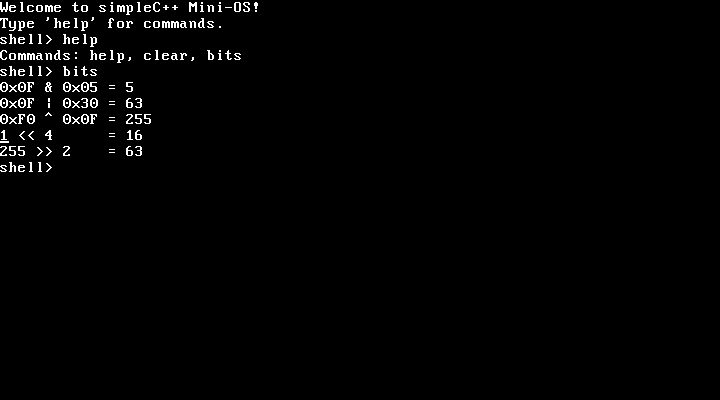

# nano_cc mini-OS — a bare-metal shell compiled by simpleC++

This directory boots a tiny interactive shell **on bare metal** (under QEMU),
where the shell itself is compiled by our own compiler, `nano_cc`. It proves
two things end to end:

1. `keyboard_getchar()` is a **real hardware read** — it polls the i8042 PS/2
   controller (status port `0x64`, data port `0x60`) for scancodes.
2. The **bitwise operators** added to the compiler generate correct machine
   code that runs correctly with no OS underneath it.



## Quick start

```sh
make          # build kernel.elf (a 32-bit Multiboot image)
make test     # headless self-test: types "help" then "bits" via emulated
              # keystrokes and checks the shell's serial output
make run      # boot with a graphical VGA window (needs a display)
make shot     # boot, type into it, save a VGA screenshot to vga.png
```

`make test` needs no display; it drives real keystrokes through QEMU's
emulated keyboard and confirms the shell echoed them and produced the right
output.

## How the boot works

`nano_cc` emits **64-bit** code, but a Multiboot loader (QEMU's `-kernel`)
hands control to a **32-bit** entry point. So the image is built in two layers:

```
  QEMU -kernel  ->  boot32 (32-bit)  ->  long_mode_start (64-bit)  ->  main()
                    |                     |                            (shell.c,
                    |                     |                             compiled
                    |                     |                             by nano_cc)
                    |                     +- set data segs + stack, call main
                    +- Multiboot header
                    +- identity-map first 1 GiB (2 MiB pages)
                    +- enable PAE + long mode (EFER.LME) + paging
                    +- load 64-bit GDT, far-jump to 0x101000
```

- **`boot32.s`** (`as --32`) — Multiboot header + the 32-bit → 64-bit long-mode
  bring-up. Page tables sit at fixed free low RAM (`0x1000/0x2000/0x3000`), the
  stack at `0x90000`.
- **`boot64.s`** (`as --64`) — `long_mode_start` (linked first, at `0x101000`)
  plus the `inb`/`outb` port-I/O primitives.
- **`shell.c`** — the shell, compiled by `nano_cc --kernel`.
- **`nano-kernel.h`** — freestanding runtime compiled by `nano_cc`: VGA text
  driver (writes cells at `0xB8000`), a COM1 serial mirror (so it's testable
  headlessly), `print_int`/`puts`/`strcmp`, and the PS/2 keyboard driver.
- The 64-bit half is linked at `0x101000`, flattened with `objcopy -O binary`,
  and embedded into the 32-bit Multiboot image via `.incbin` (`blob.s`). See
  `kernel64.ld` and `final.ld`.

Because `nano_cc --kernel` places globals in `.data` (zero-filled in the file)
rather than `.bss`, the flat image needs no separate zero-fill step.

## The `--kernel` flag

`nano_cc --kernel in.c out.s` differs from the hosted mode in two ways only:
it does **not** emit the Linux `_start`/`exit` stub (the boot stub provides the
entry and calls `main`), and it emits globals in `.data`. Everything else — the
full language subset — is identical.

## Shell commands

- `help`  — list commands
- `clear` — clear the VGA screen
- `bits`  — run a few bitwise operations and print the results (proves the
  new `& | ^ << >>` codegen works at runtime)

Note: `ld` may print `LOAD segment with RWX permissions` — that is a normal,
harmless note for a flat kernel image.
