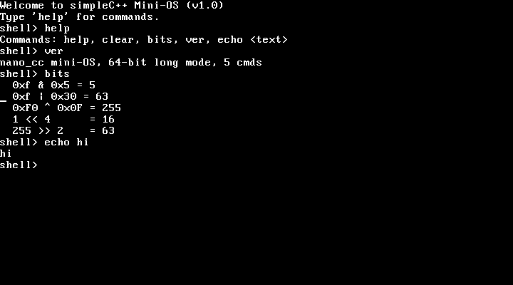

# nano_cc mini-OS — a bare-metal shell compiled by simpleC++

This directory boots a tiny interactive shell **on bare metal** (under QEMU),
where the shell itself is compiled by our own compiler, `nano_cc`. It proves
two things end to end:

1. `keyboard_getchar()` is a **real hardware read** — it polls the i8042 PS/2
   controller (status port `0x64`, data port `0x60`) for scancodes.
2. The **bitwise operators** and **variadic functions** added to the compiler
   generate correct machine code with no OS underneath it — the shell's output
   goes through a `printf()` that is itself compiled by `nano_cc`.



It also boots into a **real graphics mode** — 1024x768x32, with a framebuffer
console, a bitmap font and drawing primitives, all written pixel by pixel:


## Quick start

```sh
make            # build kernel.elf, the VGA-text shell
make test       # headless self-test of that shell
make run        # boot it with a window (needs a display)
make shot       # boot, type into it, save vga.png

make gshell     # build gshell.elf, the same shell in graphics mode
make gshelltest # headless: keyboard, PCI scan and drawing
make gshellrun  # boot it with a window
make gshellshot # boot, type into it, save gshell.png

make gfx        # a non-interactive framebuffer bring-up demo
make gfxtest    # headless check that a mode was set and pixels read back
make gfxshot    # save gfx.png

make intr       # interrupts: IDT, PIC, timer, idle, exception reporting
make intrtest   # headless: the timer ticks, the core halts, faults report
make acpi       # ACPI: find the tables, read the FADT/MADT, idle the CPU
make acpitest   # headless: tables read, PM timer runs, core idles

make mm         # memory: frame allocator, 4 KiB paging, kernel heap
make mmtest     # headless: frames, mapping, heap reuse, unmap really unmaps

make threads    # preemptive threads, locking, thread-safe heap
make threadstest # headless: preemption, joins, a real race, a mutex

make srv        # servers, heartbeats, a supervisor that restarts them
make srvtest    # headless: a crash and a hang, both recovered

make fs         # a RAM disk with a Unix-shaped filesystem
make fstest     # headless: indirect blocks, rename, delete, concurrency

make progs      # the user programs, compiled by nano_cc and linked at 512 GiB
make elf        # the ELF loader: processes in their own address spaces
make elftest    # headless: loading, syscalls, isolation, fault containment

make cc         # the C compiler, built as a program for this OS
make ccrun      # boot it and watch the compiler run inside the OS
make cctest     # headless: compile inside the OS, diff against the host

make chain      # the assembler too: source -> cc -> as -> a running process
make chainrun   # boot it and watch the whole chain
make chaintest  # headless: and byte-compare the binary against the host's
make check-miniasm MINIASM_SRC=...   # the vendored assembler has not drifted

make wm         # the compositor: windows, damage rectangles, clipped blits
make wmrun      # boot it and watch
make wmtest     # headless: count the pixels, and hash them against a full repaint
make wmshot     # save wm.png
```

`make test` needs no display; it drives real keystrokes through QEMU's
emulated keyboard and confirms the shell echoed them and produced the right
output.

## How the boot works

`nano_cc` emits **64-bit** code, but a Multiboot loader (QEMU's `-kernel`)
hands control to a **32-bit** entry point. So the image is built in two layers:

```
  QEMU -kernel  ->  boot32 (32-bit)  ->  long_mode_start (64-bit)  ->  main()
                    |                     |                            (shell.c,
                    |                     |                             compiled
                    |                     |                             by nano_cc)
                    |                     +- set data segs + stack, call main
                    +- Multiboot header
                    +- identity-map first 1 GiB (2 MiB pages)
                    +- enable PAE + long mode (EFER.LME) + paging
                    +- load 64-bit GDT, far-jump to 0x101000
```

- **`boot32.s`** (`as --32`) — Multiboot header + the 32-bit → 64-bit long-mode
  bring-up. Page tables sit at fixed free low RAM (`0x1000/0x2000/0x3000`), the
  stack at `0x90000`.
- **`boot64.s`** (`as --64`) — `long_mode_start` (linked first, at `0x101000`)
  plus the `inb`/`outb` port-I/O primitives.
- **`shell.c`** — the shell, compiled by `nano_cc --kernel`.
- **`nano-kernel.h`** — freestanding runtime compiled by `nano_cc`: VGA text
  driver (writes cells at `0xB8000`), a COM1 serial mirror (so it's testable
  headlessly), `print_int`/`puts`/`strcmp`, and the PS/2 keyboard driver.
- The 64-bit half is linked at `0x101000`, flattened with `objcopy -O binary`,
  and embedded into the 32-bit Multiboot image via `.incbin` (`blob.s`). See
  `kernel64.ld` and `final.ld`.

Because `nano_cc --kernel` places globals in `.data` (zero-filled in the file)
rather than `.bss`, the flat image needs no separate zero-fill step.

## The `--kernel` flag

`nano_cc --kernel in.c out.s` differs from the hosted mode in two ways only:
it does **not** emit the Linux `_start`/`exit` stub (the boot stub provides the
entry and calls `main`), it emits globals in `.data` rather than `.bss` (a flat
image has nothing to zero-fill it), and it marks those globals `.globl` so the
hand-written assembly can reach them. Everything else — the full language
subset — is identical, and hosted output is untouched.

## Shell commands

- `help`  — list commands
- `clear` — clear the VGA screen
- `ver`   — print a version line (via `printf`)
- `bits`  — run a few bitwise operations and print the results with `printf`
  (proves the `& | ^ << >>` codegen works at runtime)
- `echo <text>` — print the rest of the line back

Note: `ld` may print `LOAD segment with RWX permissions` — that is a normal,
harmless note for a flat kernel image.

---

## Graphics mode

There is no BIOS left to call once the CPU is in long mode, and QEMU's
Multiboot 1 `-kernel` path does not hand a kernel a framebuffer. So the mode is
set, and the framebuffer found, entirely by hand:

1. **Set the mode.** QEMU's default `-vga std` is the Bochs adapter, whose
   registers sit behind an index/data pair at ports `0x1CE`/`0x1CF`. Writing
   width, height and depth there — with the adapter disabled while they change
   — gives a linear 32-bit framebuffer.

2. **Find it.** The adapter reports its own base address in PCI configuration
   space, so `pci_find_framebuffer()` walks bus 0 through the configuration
   ports at `0xCF8`/`0xCFC`, looks for class `0x03` (display controller), and
   reads BAR0. Hard-coding `0xFD000000` would work on this QEMU build and
   quietly draw into nothing on the next one.

Three things had to be right, and each fails in a way that does not say so:

* **The identity map had to grow from 1 GiB to 4 GiB.** The framebuffer
  aperture is around `0xFD000000`, far outside the original mapping, so the
  first pixel write would page-fault — and with no IDT installed a page fault
  is a triple fault, which shows up as a silent reboot loop rather than an
  error.
* **The geometry is read back, not assumed.** The adapter clamps what it was
  asked for to what its video memory can hold. Drawing at the requested size
  rather than the granted size runs off the end of every scanline.
* **The pitch is the adapter's virtual width, not the visible width.** They are
  usually equal and occasionally not; using the visible width shears the whole
  image diagonally.

`fbinfo` prints all of it, so the values are visible rather than assumed:

```
> fbinfo
resolution 1024x768 at 32 bpp
pitch      4096 bytes per scanline
base       0xfd000000 (from PCI BAR0)
console    31x35 characters
```

### The font

`nano-font.h` is an 8x8 bitmap font covering ASCII 32..126, **designed for this
project** rather than lifted from an existing font file, so there is no licence
to carry around. It is generated by `tools/genfont.py`, which holds the glyphs
as readable ASCII art — edit that, not the header.

Glyph rows 0..6 hold the character and row 7 is the descender line, used by
`g j p q y` and the underscore. The console adds two pixels of leading per row
so those tails do not land on the next line.

### Drawing

`nano-fb.h` provides `fb_pixel`, `fb_fill`, `fb_rect`, `fb_line` (Bresenham),
`fb_circle` (midpoint), `fb_glyph`, `fb_text`, and a scrolling console confined
to a rectangle so it can sit beside artwork without disturbing it. All integer
arithmetic — this compiler has no floating point, and there would be no FPU
state set up for it if it did.

`shell` commands: `help clear ver fbinfo pci demo bars grad lines circles font`
and `echo <text>`.

### 32-bit stores

`nano_cc` has no 32-bit integer type, so it cannot express a 32-bit store: an
8-byte store would write the neighbouring pixel too, and four 1-byte stores are
four times the bus traffic. `mmio_write32` and `mmio_read32` in `boot64.s` are
the two instructions that gap needs, alongside `inw`/`outw` for the VBE
registers and `inl`/`outl` for PCI configuration space, which are word and
dword ports respectively and do not work a byte at a time.

---

## Interrupts

Before this existed, every fault was a **triple fault**: the CPU could not find
a handler, could not fault on that either, and reset. Under QEMU that looks
like the machine silently rebooting — no message, no register dump, nothing to
go on. Turning that into a page of text is most of the value here.

```
> fault
touching unmapped memory on purpose...

*** EXCEPTION 14: page fault
error 0x2  rip 0x109728  cs 0x8
rflags 0x246  rsp 0x8ff40  ss 0x10
faulting address 0x7ffffffff000
cause: page not present, on a write, from kernel mode
rax 0x1  rbx 0x6003  rcx 0x7ffffffff000
...
halted.
```

`isr.s` holds 256 stubs, because the CPU arrives at a handler with a stack
frame it expects to leave with `iretq`, which no C function can do. Two things
the stubs exist to even out:

* **Only some vectors push an error code** — 8, 10–14, 17, 21, 29, 30. The rest
  do not. Without a zero pushed in its place, the stack layout differs by eight
  bytes depending on which fault happened, and every field in the report is
  off by one.
* **The vector number is nowhere in the hardware frame.** The only thing that
  knows which interrupt fired is the stub that was entered.

Dispatch is by **number**, not through a table of function pointers, because
`nano_cc` does not have function pointers. `isr_table` is a plain array of
addresses that C reads to fill in the IDT.

The 8259 PICs are remapped off vectors 8–15, where they collide with the CPU's
own exception numbers — unremapped, a timer tick arrives looking exactly like a
double fault. IRQ0 is the PIT at 100 Hz and IRQ1 is the keyboard, which now
fills a ring buffer instead of being polled.

Two details that are easy to get wrong and produce a hang rather than an error:

* `cpu_idle` is `sti` then `hlt`, in that order. `sti` does not take effect
  until after the *next* instruction, which is what makes the pair atomic —
  written the other way round an interrupt can slip between them and leave the
  core halted with nothing left to wake it.
* IRQ7 and IRQ15 can fire with no device behind them. The primary PIC's
  spurious interrupt must **not** be acknowledged, or a real interrupt later
  has its EOI consumed by this one.

## ACPI

`make acpitest` reads the firmware's tables and uses what they describe:

```
RSDP  at 0xf5290, revision 0
root  at 0x7fe1c52 (RSDT), 4 tables
tables: FACP APIC HPET WAET
MADT  at 0x7fe1b7a, 1 usable CPUs
PM timer port 0x608, 24-bit
P_LVL2 latency 4095 us, P_LVL3 latency 4095 us
idle state chosen: C1 (hlt)
  C2 not offered by this firmware (latency > 100us)
PM timer moved 692924 counts in ~200ms
over 100 ticks (1s): 100 idle entries
  C1 100, C2 0
idle ok: the core stopped between interrupts
```

**What this does and does not do.** It reads the *static* tables — the RSDP,
the RSDT/XSDT directory, the FADT and the MADT. Those are plain structures at
fixed offsets and can be read honestly.

It does **not** interpret AML. Most of what ACPI can tell you, including the
`_CST` method that describes a processor's real C-states, is bytecode in the
DSDT, and running it needs an interpreter — a project, not a feature. The one
AML thing done here is scanning the DSDT for the fixed-form `Processor`
declaration (opcode `5B 83`), which carries the P_BLK address at a known offset
inside it. That is a byte scan of a known encoding, and the result is
sanity-checked as an I/O port before it is believed.

So the C-state actually entered is decided from what the firmware says, not
from what would sound impressive:

| state | how | condition |
|---|---|---|
| C1 | `hlt` | always available |
| C2 | a read from `P_BLK+4` | FADT `P_LVL2_LAT` ≤ 100 µs **and** a P_BLK was found |
| C3 | `P_BLK+5` | `P_LVL3_LAT` ≤ 1000 µs — detected and reported, not entered, because it also needs bus-master traffic quiesced |

Under QEMU both latencies read 4095 µs, which is the specification's way of
saying the state does not exist, and no P_BLK is declared — so what you get is
C1, and the shell says so rather than claiming otherwise.

**The idle measurement is real.** The ACPI power-management timer runs at
3.579545 MHz regardless of what the core is doing, which is exactly why it can
measure a halted core when a CPU-driven clock cannot. Over one second it
advances about 3.55 million counts while the core wakes 101 times — once per
timer tick. A spinning loop would show millions of wake-ups.

---

## Memory

```
$ make mmtest
RAM: 130559 KiB usable, top 0x7fe0000
kernel ends at 0x10b000, bitmap at 0x10b000 (4092 bytes)
frames: 32450 free, 286 used, 32736 total
distinct ok / accounting ok / free ok
64 frames allocated, 0 overlapped the kernel or bitmap
before: 0xc0000000 resolves to 0xc0000000 (identity)
after:  0xc0000000 resolves to 0x161000 (frame 0x161000)
map ok / write-through ok / split ok: neighbours untouched
kmalloc distinct ok / contents ok / kfree returned memory ok
reuse ok: the freed block came back
coalesce ok / heap growth ok
unmap ok: no translation
*** EXCEPTION 14: page fault at 0xc0000000
```

Three layers, each built on the one below.

**Which RAM exists** comes from the Multiboot memory map, not from a guess.
The loader is the only thing that knows, and assuming "128 MiB, probably" is
how a kernel comes to write into a memory hole. `boot32.s` parks the info
pointer at a fixed address before its own page-table setup can clobber EBX.

**The frame allocator** is a bitmap, one bit per 4 KiB page, placed just past
the kernel image — and it marks itself used, because an allocator that can hand
out the memory it is stored in does not last long. It starts with **everything
marked used** and then frees what the map called available. The other way round
— start free, mark the holes — hands out anything the map does not mention, and
firmware tables live in exactly those gaps.

**Paging at 4 KiB** means splitting what `boot32.s` built. That map is made of
2 MiB pages, which cannot express a single 4 KiB mapping at all. `vmm_map`
finds the 2 MiB page covering the address and replaces it with a page table of
512 entries that say the same thing, and only then changes the one entry it
came for. Without the split, mapping one page would silently unmap the other
511. The test checks that explicitly — after mapping `0xC0000000`, the page
below it must still resolve to itself.

`tlb_invlpg` after every change is not optional. The CPU caches page-table
walks, so an edited table keeps using the **old** mapping until something else
happens to evict it, which makes the change appear to work intermittently.

**The heap** is a first-fit free list with coalescing, on pages mapped at
4 GiB — one byte past the identity map, so using it exercises the mapping code
rather than quietly living in memory that was already there. Unlike the
compiler's allocator, this one really frees: a kernel runs forever, and an
allocator that only moves forward runs out. The test proves that rather than
asserting it — free a block, ask for the same size, and require the **same
address** back.

Every block carries a magic number, so `kfree` on something that is not a heap
block says so instead of corrupting the list silently.

### The bug this work found in the compiler

`kmalloc` returns `(char *)block + sizeof(struct Block)` and `kfree` computes
`(char *)ptr - sizeof(struct Block)`. Those disagreed, and the reason was in
the compiler: a cast was parsed with the full expression parser, so

```c
(char *)b + 40
```

became `(char *)(b + 40)`. The addition scaled by `sizeof(*b)` instead of by
one, and the pointer landed forty times too far in. A cast binds to a
*unary-expression*, not to whatever follows it.

It had been there all along and never showed, because the common case is
`(char *)p - 16` on a `void *`, where the element size is 0 or 1 and scaling by
it changes nothing. See `casts.c` in the parent directory — every value there
is checked against gcc.

---

## Threads

```
$ make threadstest
run order: 1 2 3 1 2 3 1 2 3 1 2 3 1 2 3 1 2 3 1 2 3 1 2 3
interleave ok: threads share the CPU
join returned 100 200 300
join ok: return values came back
unlocked: counter 100, expected 200
race ok: the unlocked version lost updates
locked:   counter 300, expected 300
mutex ok: every update landed
concurrent heap: 0 corruptions, 1 blocks in use (was 1)
heap ok: no overlap and nothing leaked
30 ticks with a non-yielding thread: 60 switches
preemption ok: the timer took the CPU back
```

**The whole context switch is one instruction.** By the time the dispatcher
runs, `isr_common` has already pushed every register onto the current thread's
stack — so the entire machine state *is* that stack. The scheduler's only job
is to decide which stack to return, and `mov %rax, %rsp` in `isr.s` does the
rest.

That is also why a brand-new thread is indistinguishable from a preempted one.
`thread_create` builds a stack that looks exactly like a thread caught
mid-interrupt: the fifteen registers `isr_common` pushes, then a vector and
error code, then the five words the CPU pushes for `iretq`. Get that order
wrong and a new thread starts with garbage in its registers and jumps
somewhere arbitrary.

A voluntary `thread_yield` is a software interrupt on a vector of its own, not
a direct call into the scheduler — so a yield and a timer preemption arrive by
exactly the same path with exactly the same stack layout. One code path to get
right instead of two.

### The test that would otherwise prove nothing

The counter test runs the same increment twice, once without a lock and once
with, and **requires the unlocked version to lose updates**. A concurrency test
that only checks the locked case passes just as happily on a kernel where the
threads never actually interleave. Each increment opens a deliberate window
between the read and the write, so the race is forced rather than hoped for —
200 increments produce 100.

There is a matching test for preemption itself: a thread that never yields at
all, which only the timer can take the CPU away from.

### Locking, and what is honest about it

**One CPU.** The MADT reports one processor and there is no local APIC bring-up
here, so this is concurrency, not parallelism.

That has a consequence worth stating rather than hiding: with preemption
arriving only from the timer, **masking interrupts is mutual exclusion** —
nothing else can be running to contend. It is both correct and cheaper than any
spin loop. On more than one core it stops being true and each lock needs a real
atomic test-and-set; those places are marked in `nano-thread.h`, and the `held`
field is already there for it.

Two kinds of lock, because they are not interchangeable:

* `spin_lock` masks interrupts. Short critical sections only — nothing can run,
  including the timer.
* `mutex_lock` can be held across a yield, so interrupts stay on and the holder
  can be preempted. When it is contended it **yields rather than spins**: on one
  core, spinning burns the rest of a slice that the holder needs in order to
  release the lock.

The frame allocator, the page-table walker and the heap all take a lock now.
Each had a window where it was half-updated — the bitmap between testing a bit
and setting it, the tables between allocating a page table and installing it,
the free list between unlinking a block and relinking it.

### Two details that bite

**A thread cannot free the stack it is standing on.** `thread_exit` leaves the
stack alone and `thread_join` reclaims it, because the joiner is the first
point at which the stack is provably idle. The consequence is that a thread
which is never joined leaks its stack — the same bargain pthreads makes, and
the reason `detach` exists.

**The EOI has to happen before the context switch.** Acknowledge the timer
after switching away and this interrupt is never acknowledged at all, so the
timer never fires again and the machine freezes with the scheduler apparently
working perfectly.

Each stack carries a canary at its low end, checked on every switch, so a
thread that runs off the bottom is named rather than corrupting whatever the
heap put there and failing somewhere else entirely.

### In the shell

`spawn` starts a box bouncing around the drawing panel from its own thread, and
the prompt stays usable while it runs — the two know nothing about each other.
`ps` lists the threads with their slice counts, `stopall` ends them.

```
> ps
id state   slices name
0  running 367 shell
1  ready   368 anim
2  ready   230 anim
3  ready    92 anim
1076 context switches so far
```

### pthreads

`pthread_create`, `pthread_join`, `pthread_self`, `pthread_exit`,
`pthread_mutex_init/lock/trylock/unlock` are there with their usual meanings.
That is the core of the API and **not** the whole of it — detach,
cancellation, condition variables, barriers, thread-local storage and
attributes are not implemented, and calling this "pthreads" without saying so
would be a lie.

---

## Servers and supervision

```
$ make srvtest
-- all three servers up --
name      state    thr restarts faults hangs beats
ticker    running  2   0        0      0     11
crasher   running  3   0        0      0     11
hanger    running  4   0        0      0     11

-- making the crasher dereference a null pointer --
*** EXCEPTION 14: page fault ... faulting address 0x0
thread 3 (crasher) faulted
thread killed; the rest of the system continues
supervisor: crasher died, restarting

ticker    running  2   0        0      0     40      <- kept counting
crasher   running  3   1        1      0     28      <- back up

-- making the hanger stop answering (still scheduled) --
supervisor: hanger stopped answering, restarting
```

Named services with their own threads, a registry, heartbeats, and a
supervisor that restarts anything which dies or goes quiet. A fault inside a
server now kills **that server**, not the machine.

### What this contains, and what it does not

| failure | contained? | how |
|---|---|---|
| a server crashes | yes | the exception handler kills the thread and the supervisor restarts it |
| a server hangs | yes | its heartbeat goes stale and the supervisor restarts it |
| a server **corrupts another's memory** | **no** | it keeps answering its health check perfectly while the damage is already done |

That third row is the whole reason real microkernels give each server its own
address space and run them unprivileged. Everything here is ring 0 in one
address space, so a wild pointer in one service lands in another's data and
nothing detects it. **Health checks catch crashes and hangs; only address
spaces catch corruption.** Calling this fault-tolerant without saying which of
the three it handles would be a lie.

There is also a dependency nobody can design away: **a supervisor cannot
restart the thing it needs in order to restart anything.** This one allocates a
stack from the heap, so it can restart a filesystem or a driver, and it could
not restart the memory manager. MINIX 3 has the same problem and handles its VM
server specially for exactly that reason. Restarting the HAL is worse again —
it owns the interrupt controller, so during the restart there is no timer to
run the supervisor with.

### Two things that make the test worth running

**A healthy server has to keep counting throughout.** A recovery test with
nothing else running proves the machine survived; it does not prove the *rest
of the system* did. The ticker's count going from 11 to 40 across the crash is
the actual claim.

**The hang case is separate from the crash case on purpose.** The hanging
server has not crashed — its thread is alive and being scheduled normally.
Only the missing heartbeat gives it away, and a supervisor that only watches
for dead threads misses it entirely.

### Null now faults

`mm_protect_null()` unmaps the first page at boot. Without it, writing through
a null pointer lands in the interrupt vector table and **succeeds** — the whole
first 4 GiB is identity-mapped. The most common bug in C silently corrupting
low memory and surfacing later as something unrelated is not a good default.

It has to be called *after* anything that reads the BIOS data area, because the
ACPI RSDP search reads the EBDA segment from `0x40E`, which is in that page.

### In the shell

`srv` lists the services; `crash` asks one to dereference a null pointer so the
recovery can be watched rather than described. The green square in the title
bar is a supervised service blinking — if it stops, you can see that it
stopped.

### A trap in the kernel printf

The kernel's `printf` handles `%d %x %c %s %%` and **nothing else** — no flags,
no field width. Writing `"%-9s"` does not pad: it prints `%-9s` literally and
then reads the *next* argument for the following conversion, so every column
after it is one argument out. It looks like a formatting problem and is
actually a wrong-data problem. Pad by hand, or use `nano-libc.h`, which has the
full formatter.

---

## Filesystem

```
$ make fstest
formatted: 2048 blocks, 128 inodes, data starts at 35
read/write ok
big file: wrote 6000, size 6000, used 13 blocks
indirect block ok
/src contains: . .. kernel main.c util.c
deleting big.bin returned 13 blocks
unlink freed the blocks ok / reused space ok
inode before 2, after 2 -> rename moved the name, not the data
refused to remove a non-empty directory ok
three concurrent writers: 0 errors
```

The classic Unix layout on a RAM disk — superblock, inode bitmap, block
bitmap, inode table, then data. **Not FAT16**, deliberately: FAT is the
interoperable choice and it is three times the code for the same
demonstration (BPB parsing, cluster chains, 8.3 names, long-name entries, two
copies of the table to keep in step). This one supports real directories and
hard links naturally and can be read top to bottom.

Every on-disk field is 8 bytes wide, which is wasteful and worth explaining:
`nano_cc` has no 16- or 32-bit integer type, so a struct with mixed field
widths cannot be declared correctly at all. That is the same limit that blocks
uACPI, seen from the other side.

### The tests that a plausible-but-wrong implementation would fail

* **A file past the direct blocks.** Eight direct pointers reach 4 KiB, so the
  test writes 6000 bytes — the indirect block is genuinely used rather than
  merely present. A 1 KiB test file leaves that path completely unexercised.
* **Deleting has to give the blocks back**, and the space has to be *reusable*,
  not merely counted. The test frees a file, writes another over the same
  blocks and reads it back.
* **Rename must not copy.** The inode number is checked before and after: it
  has to be the same one, because a rename that copies is a rename that takes
  a second per megabyte and runs out of disk halfway.
* **Removing a non-empty directory must be refused**, or its contents are
  orphaned and their blocks are lost with no way to find them again.
* **Three threads writing at once.** Before the filesystem took a lock, two of
  them inside `balloc` at the same time walked away with the same block.

### Shell tools

`ls cat mkdir rm touch cp mv write append cd pwd df`, with a working directory
in the prompt.

`cp` reads and writes every byte. `mv` does not: it is a directory operation,
so a large file renames in the time it takes to rewrite two 32-byte entries.
That difference is the reason both exist.

### The keyboard grew punctuation

The map had letters, digits, space, enter and backspace — and no `/`. A shell
that cannot type a path can only name things in the current directory, so the
symbol row and a shift table are in now. Shift is handled as *state*: its
release matters as much as its press, which is why the release codes are
checked before the "is this a press" test.

### A compiler bug this found

`(char)129` is `-127`. Until this work, the cast was a **no-op** — it relabelled
the value without converting it — so

```c
buf[0] = (char)((i * 7 + 3) & 255);
buf[0] == (char)((i * 7 + 3) & 255)     // false
```

The stored byte came back sign-extended as `-127`; the cast produced `129`. It
surfaced here as a filesystem test reporting corruption when the data on disk
was perfectly correct — the comparison was wrong, not the bytes. A cast has to
*convert*. See `casts.c` in the parent directory.

### What this is not, yet

The filesystem is a **library the shell calls directly**, not a server reached
by message passing. Its state and locking are arranged so it can become one,
but a genuine server needs IPC, and IPC only buys anything once each server has
its own address space. Registering it as a supervised heartbeat thread that
does no actual serving would look like progress and would be theatre.

## Processes: an ELF loader, address spaces and a syscall boundary

`make elf && make elftest`, and in the graphics shell `exec`, `run`, `procs`.

Until this point a "program" was a thread. It shared one set of page tables
with everything else, which meant a stray pointer in one task could land in
another and the symptom would appear somewhere unrelated, much later. The
supervisor in `nano-srv.h` could restart a service that *crashed*; nothing
could contain a service that *scribbled*.

Now a program is a file. `proc_spawn` reads it off the filesystem, parses the
ELF64 header, maps its PT_LOAD segments into a fresh address space, builds a
stack, and hands it to the scheduler as an ordinary thread.

```
/> ls /bin
hello  14408
twin   18256
wild   14128
/> exec /bin/hello
[pid 1]
hello from a user program
  pid 1, started with argument 0
  /doc/readme is 221 bytes
  read 221 bytes back through the syscall boundary
  wrote /hello.out
[pid 1 exited with 7]
/> cat /hello.out
written by a user process
```

### Where user memory lives

PML4 entry 1: virtual addresses 512 GiB to 1 TiB. Entry 0 — everything below
512 GiB, which is the identity map and the kernel heap — is shared by every
address space. Entry 1 is the only thing `as_create` gives a process of its
own.

Putting user space in its own top-level slot rather than at the traditional
0x400000 is what makes the private/shared split one word wide. At 0x400000 it
would sit inside the identity map, and every process would have to carve a hole
in the mapping the kernel is running out of.

Every program is linked at exactly the same address, on purpose. That is what
makes two running copies a test of isolation rather than a test of the linker.

### The context switch had to grow one instruction, in the right place

`sched_switch` cannot install the new CR3 itself. It runs on the *outgoing*
thread's stack, and changing CR3 unmaps that stack out from under the function
still standing on it.

So it writes the new root into `g_switch_cr3` and `isr_common` installs it, in
the one window where that is safe:

```asm
    call isr_dispatch           /* returns the new rsp in %rax */

    mov g_switch_cr3(%rip), %rcx
    test %rcx, %rcx
    jz .Lsame_space
    mov %rcx, %cr3
.Lsame_space:
    mov %rax, %rsp              /* the context switch itself */
```

Between the call returning and the `mov`, nothing touches memory at all: the
new stack pointer is in a register, the new root is in a register, and the
instructions themselves are in the kernel image, which every address space maps
identically.

`isr.s` is shared by images that have no scheduler at all, so it carries a
`.weak` definition of `g_switch_cr3` for them — in `.data`, not `.bss`, because
these images are flattened with `objcopy -O binary` and nothing zeroes `.bss`.
A `.bss` variable would come up holding whatever was in memory, and this one is
loaded straight into CR3.

### The test that would otherwise prove nothing

Two processes, the same binary, the same virtual address, different bytes:

```
twin 1: pid 2, buffer at 0x8000002000, filled with 'A'
twin 2: pid 3, buffer at 0x8000002000, filled with 'B'
twin 1: 0 of 122880 bytes wrong after 30 rounds
twin 2: 0 of 122880 bytes wrong after 30 rounds
```

It reports how many bytes were wrong rather than "ok", because a test that can
only say ok cannot tell "isolated" from "never ran".

It was checked the other way round too. Forcing both processes to share one
address space does not produce a slightly worse number — the second program's
segments load straight over the first one's, and both die immediately:

```
twin results: -1 and -1 bytes wrong
FRAMES LEAKED
FAIL
```

### CR0.WP, or the permission bits would have been decoration

`wild.c` fails three different ways on purpose: a null pointer, a store into
its own read-only text, and a store far above anything mapped.

The middle one is the one worth having. Before CR0.WP was set, that store
**succeeded**. The CPU only enforces a read-only page against ring 3, and these
programs run in ring 0 — so the mapping said read-only and the hardware ignored
it. A test running only the other two cases would have passed while the segment
permissions did nothing at all.

### What this buys, and what it does not

Programs still run in **ring 0**. The address space is private, so a process
cannot *accidentally* reach another one. It can still deliberately reach
anything it likes: at CPL 0 it may write CR3, execute `cli`, and address the
whole kernel through the identity map.

Isolation from accident: yes. Isolation from malice: no.

Ring 3 needs a TSS, a kernel stack per process, a user GDT selector, and a
range check on every pointer that crosses the syscall boundary. That is its own
milestone, not a footnote to this one.

### The syscall boundary

Vector `0x80`. Number in `rax`, arguments in `rdi`/`rsi`/`rdx`, result back in
`rax`: exit, write, read, open, close, seek, size, sbrk, getpid, yield, ticks,
unlink. The numbers are written out in both `kernel/nano-proc.h` and
`kernel/user/nano-user.h` rather than shared through a header, because if the
two ever disagree the calls do the wrong thing silently rather than failing to
compile — and that is worth having in front of you in both files.

`exit` and `yield` must not return to their caller: one has no caller left, the
other asked to be moved off the CPU. Both set a flag the dispatcher reads and
go through the same scheduler path a timer tick would, rather than having a
second context-switch path to keep correct.

### Frames have to come back

Six processes are created and destroyed in `elftest`, and the free-frame count
is compared before and after. An address space that leaks looks perfect until
the twentieth program. `as_destroy` walks the user PDPT tree, frees every frame
it maps and then the tables themselves, and refuses outright to destroy the
address space it is currently standing in.

The reaping cannot happen where a process ends — `thread_exit` runs on the
dying process's own stack, inside the address space it would be destroying. A
`reaper` thread does it, which is the first point at which the space is
provably not in use.

### A compiler change this needed

Kernel-mode `nano_cc` now emits `.globl` for its globals. A kernel is C plus
hand-written assembly, and the assembly regularly needs a variable the C side
owns; without this the symbol is local to the object and the link fails on
something the source plainly defines. Hosted output is unchanged, so the
three-stage bootstrap is still byte-identical.

### What this is not, yet

There is no `fork` and no `exec` that replaces the calling image. The programs
are still built on the host and embedded in the kernel image by `progs.s`,
because there is no disk to have put them on. A real block device is the next
piece.

---

## K8 — the compiler, running inside the OS

```
/> ls /bin
hello  9856
twin  9696
wild  9664
cc  131552
/> cd /src
/src> ls
hello.c  62
demo.c  1710
util.h  700
/src> cc demo.c demo.s
[pid 1]
Compiled demo.c -> demo.s
[pid 1 exited with 0]
[150 ms]
/src> ls
demo.s  7393
```

`/bin/cc` is nano_cc. Same source as the compiler that built this kernel, same
C library, loaded off the RAM disk into its own address space like any other
program, reaching its files through `open`/`read`/`write`/`close`.

### The test is a comparison, not a smoke test

"It printed something and exited 0" would also be true of a compiler that
emitted an empty file. `make cctest` dumps the assembly produced **inside the
OS** over the serial line and diffs it byte for byte against the assembly the
same compiler produces **on Linux** from the same input file:

```
host: 468 lines, in the OS: 468 lines
PASS: the compiler ran inside the OS and produced byte-identical assembly
```

The input is a real file in the tree (`src/demo.c`) embedded in the image, so
both sides are definitely compiling the same bytes. It includes a header by a
**relative** name, which only resolves because a process now has a working
directory — the second file the compiler has to open through the syscall
boundary, and the one that would fail quietly if path resolution were wrong.

Both of those were checked by breaking them on purpose. With `proc_path`
returning the path unresolved, the test fails with `cannot open demo.c`. With
the `O_TRUNC` handling removed, it fails with `THE OUTPUT FILE WAS NOT
TRUNCATED` — a 339-byte program producing a 7393-byte output file, because the
tail of the previous run survived underneath it.

### 19.6 MB → 131 KB: uninitialised globals

The compiler has about 19 MB of uninitialised globals — `toks` alone is 17 MB.
Kernel-mode `nano_cc` wrote them into `.data` as explicit zero bytes, because a
bare-metal image is flattened with `objcopy -O binary`, which drops `.bss`, and
nothing zeroes it afterwards. That is right for a flat image and wrong for a
program an ELF loader will load, where `p_memsz - p_filesz` is zeroed for free.

The first link of the compiler as a user program came out at **19,625,384
bytes**: bigger than the loader's limit, bigger than the filesystem's largest
file, and bigger than the kernel image it has to be embedded in.

`--bss` puts them where a loader can zero them. Same binary, **131,552 bytes**,
19,497,480 bytes of it memory the file does not carry. It is off by default and
orthogonal to `--kernel`, and old and new compilers were checked to produce
identical output on 15 programs across 4 flag combinations.

The same flag emits NASM's `resb` on the `--nasm` path, which is the other half
of it: `nano_cc --minimal --nasm` on its own source produced a **61,180,857
byte** `.asm` file, which the bootstrap assembler quite correctly refused. With
`--bss` that is **871,603 bytes**. The assembler still has to honour `resb` —
define the label, advance the location counter, and emit `p_memsz > p_filesz` —
but the input is no longer absurd.

### A 36 KiB filesystem and a 131 KB file

`/bin/cc` did not fit. Eight direct blocks and one indirect block reach 36,864
bytes, and that was the whole filesystem's maximum file size. A double-indirect
block — 64 pointers to 64 pointers — takes the ceiling to a little over 2 MiB.

The block size stayed at 512. Growing it is the cheaper-looking fix that wastes
half a block on every small file and does not change the *shape* of the limit;
one more indirection level does.

`fs_format` now refuses `nblocks > 4096` rather than accepting it. The block
bitmap is one 512-byte block: 4096 bits. Ask for more and `balloc` hands out
block 4097 while `bitmap_set` writes its bit past the end of the bitmap and into
the inode table — a formatted, mountable filesystem that corrupts an inode the
first time a big file is written.

### One C library, two kernels

`nano-libc.h` is the C library the compiler is written against, and it reaches
the outside world through exactly one file: `nano-base.h`. The OS build swaps
that file for `user/os-base.h` and uses `nano-libc.h` and `simpleC++.c`
completely unmodified.

What differs is about sixty lines: the trap (`int $0x80` through `ustart.s`
rather than `syscall`), the open flags, and `brk`. `brk` is deliberately the
Linux shape — absolute address in, new break out, 0 meaning "just tell me" —
because that is what the allocator up in `nano-libc.h` was written against, and
the kernel is the side with a choice.

### The frames, and honest accounting

Six compiler runs, each mapping 19 MB. The free-frame count is taken **after**
the first run, not before, and the difference is explained rather than tolerated:

```
130181 frames free before the first run, 130148 after all six
the kernel heap grew from 529 pages to 562 to hold a 131552 byte ELF image
every frame came back
```

33 frames = 33 pages of kernel heap growth to hold the 131 KB ELF image, once.
A heap never gives its pages back, by design. That is not an address-space leak,
and the way to tell them apart is that it does not happen again — so the test is
"no frames move across runs 2 to 6", which still fails loudly if a single
address space is not reclaimed.

### What else this needed

* **argv.** A process used to get a single integer. It now gets `argc` and a
  real `argv`, built in its own address space at the top of its stack — the
  kernel's copies live in the kernel heap and would be a dangling pointer the
  moment anything freed them.
* **A working directory per process,** so `#include "util.h"` means the same
  thing here as on Linux. It deliberately does not understand `.` or `..`; the
  shell normalises those, and a second implementation of path cleanup is how two
  parts of a system come to disagree about which file a name means.
* **`O_TRUNC`,** so a shorter second output does not leave the tail of the first
  one in place.
* **`lseek` with a whence,** and 16 file descriptors instead of 8 — a compiler
  holds its source, its output and every header it is nested inside open at once.

### What this is not, yet

There is no assembler in the OS. `cc` produces `.s` and stops; turning that into
a runnable binary still needs `as` and `ld` on the host. The bootstrap assembler
is the obvious candidate for the missing half, and `resb` is what stands between
it and assembling this compiler.


---

## K9 — the assembler, and a machine that builds its own programs

```
/> ls /bin
hello  9856
twin  9696
wild  9664
cc  131552
as  24952
/> cd /src
/src> cc --minimal --nasm --bss --kernel prog.c prog.asm
[pid 1]
Compiled prog.c -> prog.asm (kernel mode)
[pid 1 exited with 0]
[160 ms]
/src> as prog.asm /bin/prog
[pid 2]
[pid 2 exited with 0]
[20 ms]
/src> exec /bin/prog
[pid 3]
hello from a program this machine compiled and assembled itself
ok
[pid 3 exited with 33]
```

`/bin/as` is the bootstrap assembler from
[SelfHostedAssembler-audit](https://github.com/anirudhatalmale6-alt/SelfHostedAssembler-audit),
running as a program on this OS. With it and `/bin/cc` on the RAM disk, a C file
on that disk becomes an ELF file on that disk and then a process, and nothing
outside the machine is involved at any step.

### The test is a byte comparison, again

`make chaintest` dumps the binary the OS assembled over the serial line as hex
and compares it against the binary the **same assembler**, retargeted back to
Linux and built from the same vendored source, produces from the same input:

```
host: 60 lines, in the OS: 60 lines
the OS and the host assembled the same bytes
PASS: the machine compiled, assembled and ran a program by itself
```

The exit code carries the other half. 33 is computed at run time — 1..10 summed,
minus 22 — rather than sitting in the file as a constant, so a loader that
transferred control to the wrong place cannot produce it by accident.

### One assembler, two targets

Everything the assembler needs from the OS it *runs on* lives between two marker
lines in its source, and `tools/retarget.py` swaps that block. `user/as/` holds
the nano-os-targeted source plus the Linux block; the body underneath is the
same assembler either way. Retargeting the vendored source back to Linux
reproduces the audit repository's file **exactly**, which is the tightest check
available that the two have not drifted, and `make check-miniasm` runs it.

Two copies of a 2,300-line assembler would drift, and a divergence between them
shows up as a miscompilation on one platform and not the other.

### Two axes, deliberately independent

Which OS the assembler *runs on* has nothing to do with which base address it
*emits for*. The second is a `-b` flag, and separating them is what makes
building a nano-os assembler on Linux possible at all: the Linux build, told
`-b 0x8000000000`, produces the nano-os binary.

### The bug that only appears above 2 GiB

`_start` called `main` and landed **fifteen bytes short of it**, in the middle of
an instruction — `EXCEPTION 6: invalid opcode`.

`mov reg, imm` is seven bytes when the value fits in a signed 32-bit field and
ten when it does not. A forward reference is unknown during the sizing pass, so
the assembler used **zero** as a placeholder and sized the short form; the emit
pass then knew the real address and emitted the long one. Every label after that
point was off by three bytes per occurrence.

It had never happened at `0x400000`, because there the placeholder and the real
address are both in the same size class. At 512 GiB neither is. The placeholder
is now `out_base` — the lowest address any symbol in the output can have, and so
in the same size class as all of them.

**And the assembler now checks that the two passes agree**, which is the fix
that matters more than the fix:

```
Error: the two passes disagree about the size of the output
```

That divergence did not produce a broken-looking binary. It produced a plausible
one, of the right size, that ran until it jumped into the middle of an
instruction. Nothing was watching for it.

### Five smaller things it needed

* **`int N`.** The assembler could emit `syscall` and not `int 0x80`, so it
  could build programs for exactly one of the two operating systems it now runs
  on. Encoded `CD ib`, byte-identical to GNU as, and an operand outside 0..255
  is refused rather than truncated.
* **argv, and `-b`.** `mini_asm [input [output]] [-b BASE]`. With no arguments it
  behaves exactly as it always did — `selfHosted.asm` in, `a.out` out, linked at
  `0x400000` — which is how every existing test still passes unchanged.
* **RIP-relative addressing throughout.** `mov rsi, in_buf` encodes the symbol
  as a 32-bit absolute; ld refuses that at 512 GiB. Thirty-four of those became
  `lea rsi, [rip + in_buf]`, and six `[symbol + register]` forms became a
  RIP-relative `lea` plus an `add`.
* **A store of an immediate to memory carries 32 bits.**
  `mov qword [out_base], def_base` is right at `0x400000` and quietly a
  different number at `0x8000000000`. GNU as refuses it — but only because it
  was asked.
* **A no-C-library program.** `src/prog.c` is written for the `--minimal --nasm`
  path, which has no library behind it at all. `_start` must be the first
  function in the file, because the assembler makes the first byte it emits the
  entry point.

### What this is not, yet

There is no linker, so a program is one translation unit. `cc` and `as` are two
commands rather than one driver. And the OS still cannot rebuild *itself*: the
compiler's own assembly is 872 KB and the RAM disk is 2 MiB, so it would fit,
but `/bin/cc` is 131 KB of that and the arithmetic gets tight — a real block
device is the honest answer to that rather than a bigger RAM disk.


---

## K10 — W^X, NX, and three rules about the file

The loader now refuses binaries rather than running them and hoping:

```
refused /wx.elf: segment is both writable and executable
refused /zx.elf: executable segment wants zero-filled pages
refused /ne.elf: entry point is not in an executable segment
```

These are properties of the **file**, checkable before a byte of it is mapped,
and they cannot be worked around by choosing different contents. That is why
they are worth more than inspecting the bytes: a scanner looks for a shape
somebody chose, and a shape can be changed.

The three test files are valid ELF in every other respect — right magic, right
class, right machine, a segment in the right place — so nothing but the rule
under test can be what refuses them. They are built by hand because the
toolchain cannot produce them, which is exactly why a test using only the
toolchain's output would never reach these paths.

### NX, and a test that passed for the wrong reason

`EFER.NXE` is on, so bit 63 of a page-table entry means *no execute* rather than
*reserved*. Every segment the file did not mark executable is mapped with it,
and so are the stack and the heap — neither is ever code, and saying so removes
the two places a program is most likely to be talked into executing something it
was handed rather than something it was built from.

Bit 63 is a **reserved** bit until NXE is set, and a reserved bit that is set
faults on *every* access to the page, reads included. So it only ever goes in
through `nx_bit()`, which returns zero when the CPU says it does not have NX.
The CPUID check before writing the MSR is not ceremony either: writing a
reserved `EFER` bit is a `#GP`, and a triple fault during bring-up looks like a
bad page table rather than a bad MSR write.

`wild.c` gained a fourth deliberate fault: write a `ret` into a global and jump
to it. **The first version of that test passed with NX turned off**, which is
the only reason the bug in it was noticed — a `ret` reached by a `jmp` pops
whatever happens to be on the stack and faults on that, whether the page was
executable or not. It uses `call` now, and with `nx_bit()` forced to zero the
test reports `STILL RUNNING -- the data page was executable` and fails. The gate
was checked in both directions, which is the same lesson CR0.WP taught in K7.

### The toolchain had to change to satisfy the rule

The bootstrap assembler emitted **one** segment, and one segment holding both
code and data has to be RWX. W^X refused every binary the OS's own assembler
produced — which is the right outcome for the rule and the wrong outcome for the
machine.

So the assembler emits two. A `section .data` in the source splits the image:
everything before it is read+execute, everything after is read+write, and
nothing is both. `nano_cc --nasm` emits that marker between the last function
and the string pool, which is exactly where code stops and data starts.

The split is padded to a page boundary, because a loader maps a segment at
`p_vaddr` from `p_offset` and the two must be congruent modulo the page size.
Splitting mid-page would put one page in two segments with different
permissions, and whichever was mapped second would win — silently.

A source with no `section .data` still gets one RWX segment, because its code and
data are interleaved and there is nowhere to cut. `e_phnum` is patched to 1 in
that case rather than leaving a header describing a segment that does not exist.
Such a binary will not load here, and that is the rule working.

### What this is and is not

W^X is enforced **at load time**, and that part is absolute: a segment marked
both cannot be mapped. NX makes the file's declared permissions real **at run
time** as well, so a page that is not code cannot be executed even by the
program itself.

Neither is a defence against a program that means harm, because programs still
run in **ring 0** and can rewrite CR3 or clear CR0.WP whenever they like. These
are defences against a program that is *wrong*, and against a file that is not
what it claims. Ring 3 is still its own milestone.

## K11 — the compositor: only repaint what changed

Until now everything drew straight to the screen. `nano-fb.h` writes each pixel
with an `mmio_write32` to video memory across the PCI bus, and at 1024x768 a
full repaint is 786,432 of them. Doing that because one window moved four pixels
is the difference between a machine that feels alive and one that does not.

`nano-wm.h` puts a layer in between. Each window owns a backing buffer in
ordinary RAM; programs draw into that as fast as memory allows and nothing
reaches the screen. They then say which rectangle changed, and `wm_present`
copies out only those rectangles.

### Damage is not enough on its own

Painting a damaged rectangle back to front — the painter's algorithm — is always
correct, and it was the first thing this did. It also wrote 137% of the screen
on a full repaint of four overlapping windows: the desktop background painted
first and then covered entirely, lower windows painted and then painted over.
Three hundred thousand pixels pushed across the bus purely to be hidden.

So the paint runs **front to back**, carrying a region — a list of rectangles —
of what is still unpainted. Each window draws only where the region says nothing
has been drawn yet, then subtracts itself from it. Whatever survives to the end
is desktop. Every pixel on screen is written exactly once, and a window behind a
covering window is never read, never blitted, and never considered again.

When a split would need more rectangles than the region holds, the original is
kept whole. That over-paints, which is the safe direction: dropping the
rectangle instead would leave a patch of screen that no later frame repairs.
The damage list has the same rule — overflow falls back to a full repaint.

### What `make wmtest` measures

A compositor that repaints everything looks *identical* to one that repaints
only what changed. The picture is the same. Only the number of bus writes
differs, and that is invisible unless you count it. So every pixel that reaches
video memory goes through one of two functions, both of which increment a
counter.

Counting alone would not be enough either, because skipping work you should have
done is the cheapest way to make a counter look good, and the result is usually
still plausible — one stale rectangle in a corner. So after every incremental
frame the framebuffer is read back and hashed, the same scene is repainted in
full, and the two hashes must be equal.

```
first full paint      786,432 pixels = 100.0%   no pixel written twice
move a 320x240 window   79,056 pixels =  10.0%   by four pixels
  the same move, damage tracking off             786,432 = 100.0%  (9x more work)
80x16 update inside a window   1,280 pixels = 0.1%   exactly 80x16
raise a window          66,000 pixels =   8.3%
hide / show             93,600 pixels =  11.9%
drag, 40 frames         58,683 pixels per frame = 7.4%
```

Every one of those frames hashes identically to a full repaint of the same
scene.

### Proving the tests can fail

Three sabotage runs, each caught by a different check:

| broken on purpose | what happened | which check caught it |
|---|---|---|
| `wm_move` stops damaging the old rectangle | move got **cheaper** — 9.7% — and left ghosts | the framebuffer hash |
| `region_subtract` made a no-op | picture stayed correct, cost went to 137% | the pixel count |
| `wm_no_damage` ignored | the "off" run cost the same as the "on" run | the off-switch comparison |

The first is the one worth keeping in mind. Dropping the old-position damage
made the frame measurably *faster* while making it wrong. A pixel counter alone
would have recorded that as an improvement. Only the comparison against a full
repaint caught it.

### What this is for

This is the layer that would hand TinyGL a window's backing buffer to render
into, and then blit that one rectangle. TinyGL cannot do this job itself: it is
a triangle rasterizer with no concept of a damaged region — `ZB_clear` clears
the whole buffer and `ZB_copyFrameBuffer` copies the whole buffer, and there is
nowhere in its API to say which part changed.

It is also entirely integer work. A compositor is coordinates, widths and
copies, so none of it waits on floating point, which nano_cc still does not
have.
