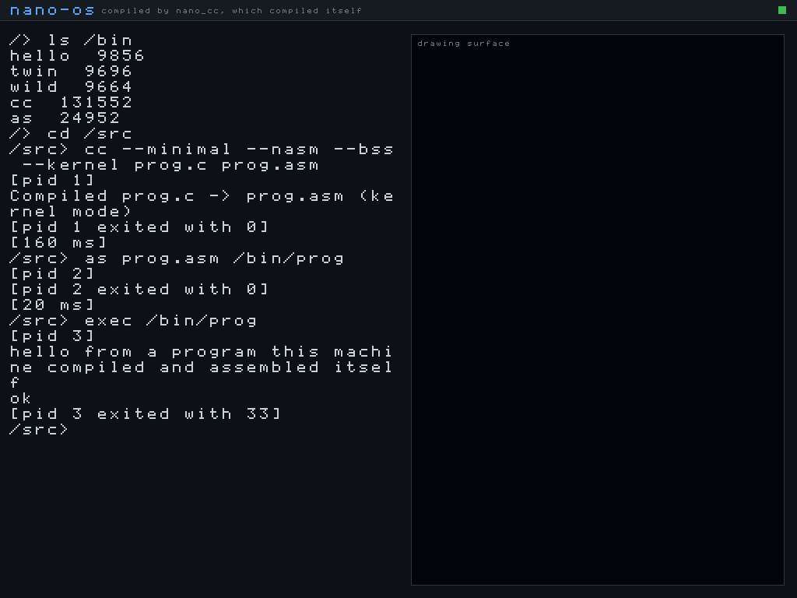
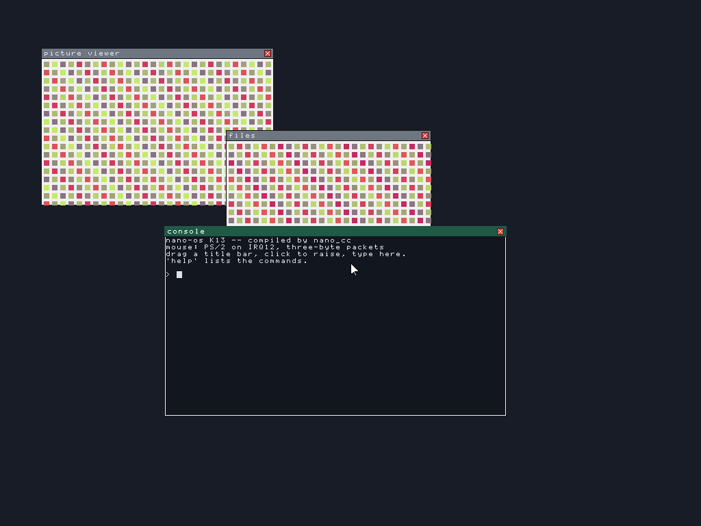
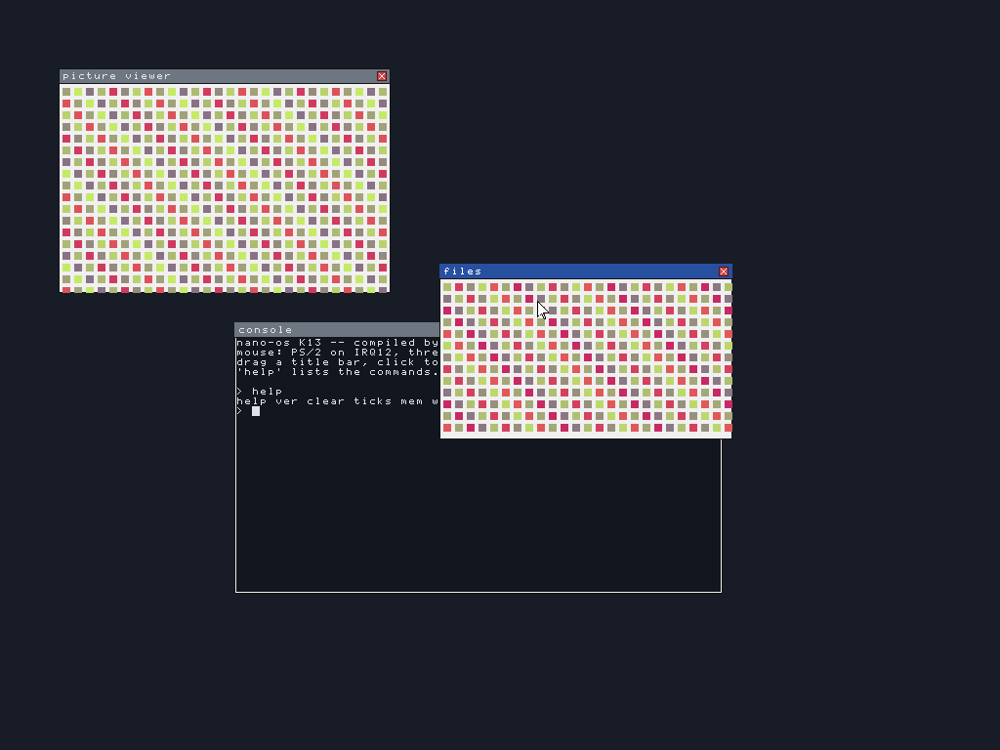
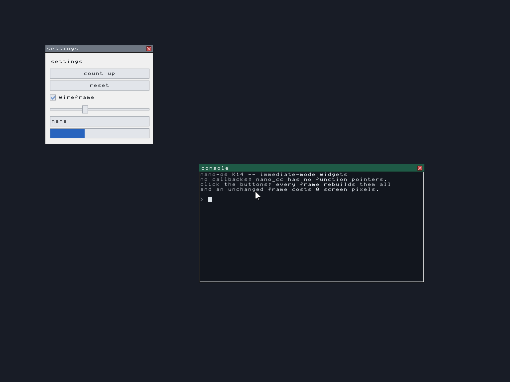
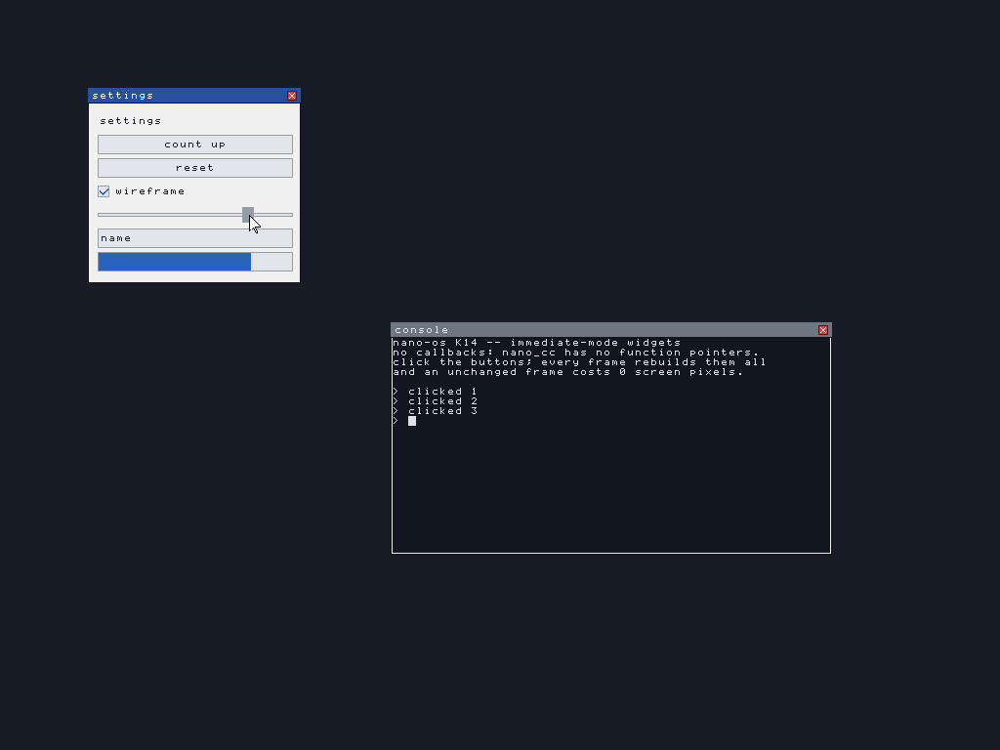
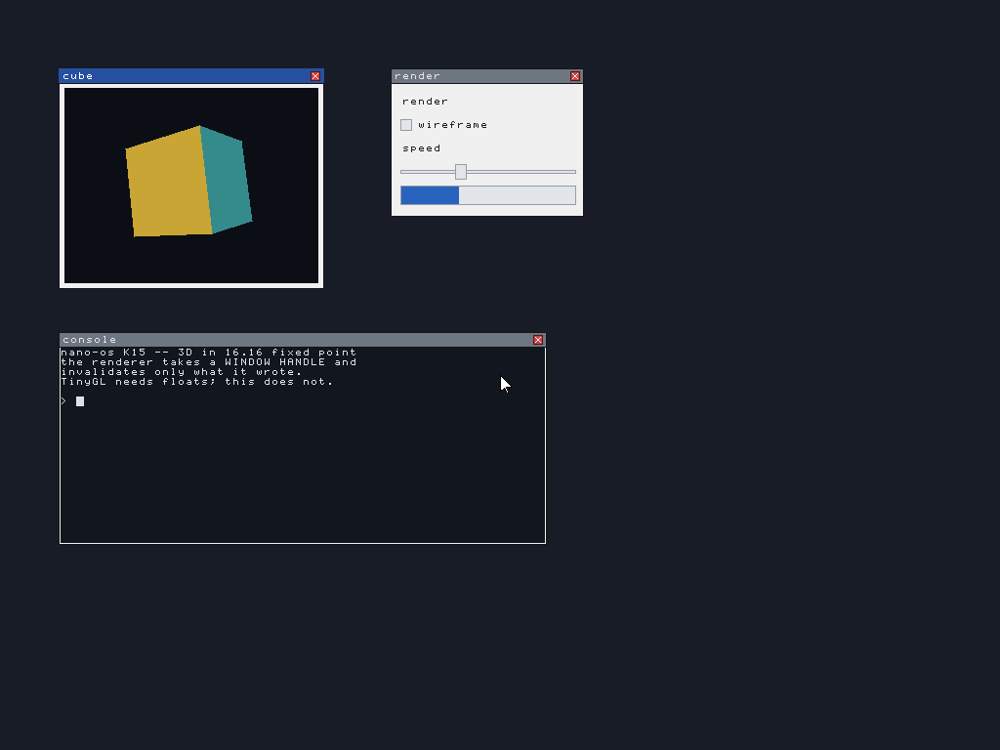
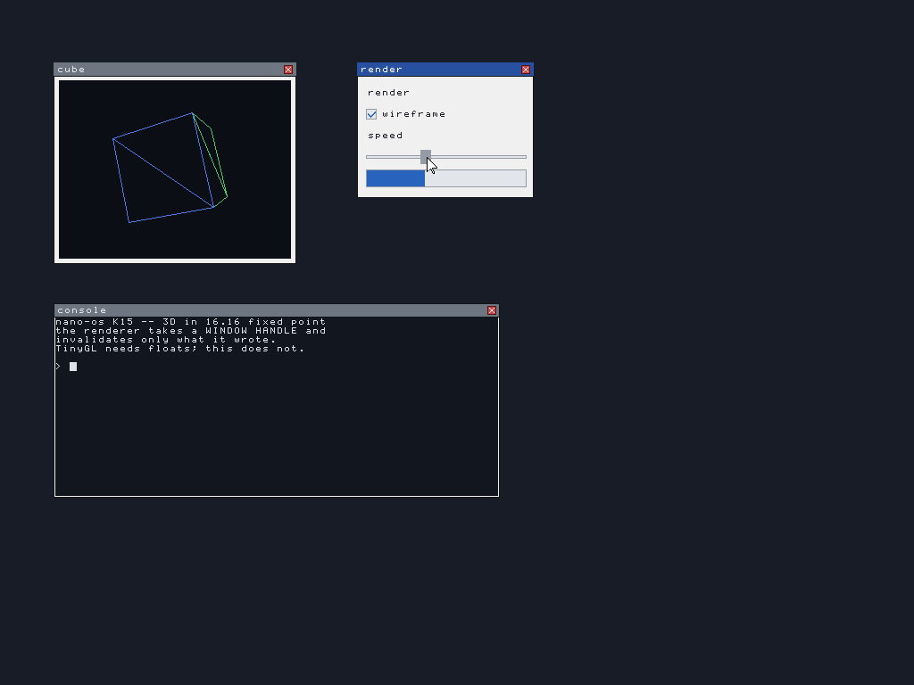
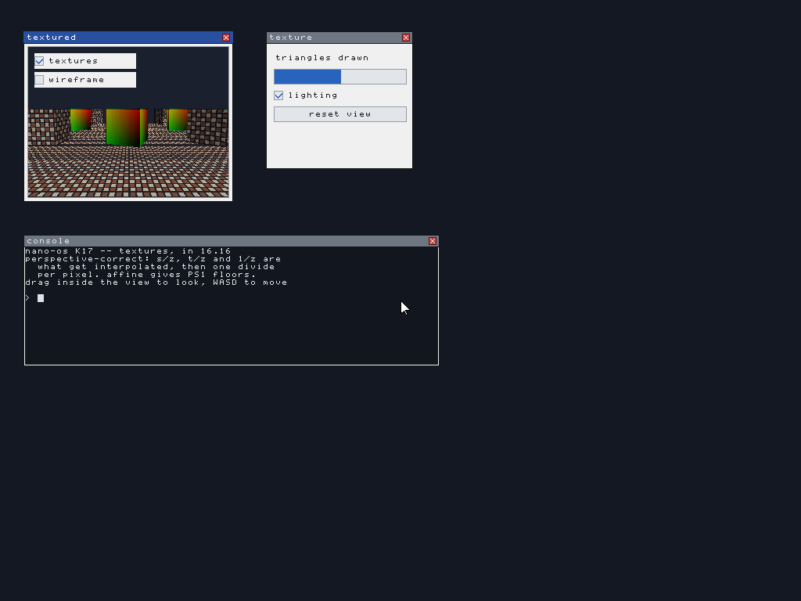
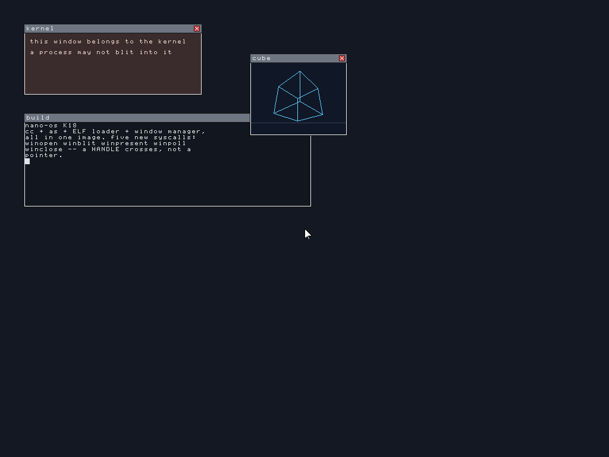

# nano_cc mini-OS — a bare-metal shell compiled by simpleC++

This directory boots a tiny interactive shell **on bare metal** (under QEMU),
where the shell itself is compiled by our own compiler, `nano_cc`. It proves
two things end to end:

1. `keyboard_getchar()` is a **real hardware read** — it polls the i8042 PS/2
   controller (status port `0x64`, data port `0x60`) for scancodes.
2. The **bitwise operators** and **variadic functions** added to the compiler
   generate correct machine code with no OS underneath it — the shell's output
   goes through a `printf()` that is itself compiled by `nano_cc`.


It also boots into a **real graphics mode** — 1024x768x32, with a framebuffer
console, a bitmap font and drawing primitives, all written pixel by pixel:



## Quick start

```sh
make            # build kernel.elf, the VGA-text shell
make test       # headless self-test of that shell
make run        # boot it with a window (needs a display)
make shot       # boot, type into it, save vga.png

make gshell     # build gshell.elf, the same shell in graphics mode
make gshelltest # headless: keyboard, PCI scan and drawing
make gshellrun  # boot it with a window
make gshellshot # boot, type into it, save gshell.png

make gfx        # a non-interactive framebuffer bring-up demo
make gfxtest    # headless check that a mode was set and pixels read back
make gfxshot    # save gfx.png

make intr       # interrupts: IDT, PIC, timer, idle, exception reporting
make intrtest   # headless: the timer ticks, the core halts, faults report
make acpi       # ACPI: find the tables, read the FADT/MADT, idle the CPU
make acpitest   # headless: tables read, PM timer runs, core idles

make mm         # memory: frame allocator, 4 KiB paging, kernel heap
make mmtest     # headless: frames, mapping, heap reuse, unmap really unmaps

make threads    # preemptive threads, locking, thread-safe heap
make threadstest # headless: preemption, joins, a real race, a mutex

make srv        # servers, heartbeats, a supervisor that restarts them
make srvtest    # headless: a crash and a hang, both recovered

make fs         # a RAM disk with a Unix-shaped filesystem
make fstest     # headless: indirect blocks, rename, delete, concurrency

make progs      # the user programs, compiled by nano_cc and linked at 512 GiB
make elf        # the ELF loader: processes in their own address spaces
make elftest    # headless: loading, syscalls, isolation, fault containment

make cc         # the C compiler, built as a program for this OS
make ccrun      # boot it and watch the compiler run inside the OS
make cctest     # headless: compile inside the OS, diff against the host

make chain      # the assembler too: source -> cc -> as -> a running process
make chainrun   # boot it and watch the whole chain
make chaintest  # headless: and byte-compare the binary against the host's
make check-miniasm MINIASM_SRC=...   # the vendored assembler has not drifted

make wm         # the compositor: windows, damage rectangles, clipped blits
make wmrun      # boot it and watch
make wmtest     # headless: count the pixels, and hash them against a full repaint
make wmshot     # save wm.png

make sse        # floating point, measured: is a soft-float library needed?
make sserun     # boot it and watch
make ssetest    # headless: provoke the fault, enable SSE, check the bit patterns

make wmin       # the mouse: a pointer, drag, click-to-raise, a console window
make wminrun    # boot it and use it -- this one is interactive
make wmintest   # headless: inject mouse packets, count pixels, hash the screen
make wminshot   # save wmin.png
sh tools/sabotage-wmin.sh    # break it on purpose; check the tests notice

make ui         # immediate-mode widgets: buttons, checkbox, slider, text field
make uirun      # boot it and click things
make uitest     # headless: and prove an unchanged frame costs 0 pixels
make uilive     # drive the real emulated mouse; save ui-live.png
sh tools/sabotage-ui.sh      # eleven deliberate bugs; the suite must see them

make gl         # 3D in 16.16 fixed point, rendering into a window handle
make glrun      # boot it: a shaded cube, with the widget panel driving it
make gltest     # headless: maths, culling, depth, clipping, and what it costs
make gllive     # drive the real emulated mouse; save gl-live.png
```

`make test` needs no display; it drives real keystrokes through QEMU's
emulated keyboard and confirms the shell echoed them and produced the right
output.

## How the boot works

`nano_cc` emits **64-bit** code, but a Multiboot loader (QEMU's `-kernel`)
hands control to a **32-bit** entry point. So the image is built in two layers:

```
  QEMU -kernel  ->  boot32 (32-bit)  ->  long_mode_start (64-bit)  ->  main()
                    |                     |                            (shell.c,
                    |                     |                             compiled
                    |                     |                             by nano_cc)
                    |                     +- set data segs + stack, call main
                    +- Multiboot header
                    +- identity-map first 1 GiB (2 MiB pages)
                    +- enable PAE + long mode (EFER.LME) + paging
                    +- load 64-bit GDT, far-jump to 0x101000
```

- **`boot32.s`** (`as --32`) — Multiboot header + the 32-bit → 64-bit long-mode
  bring-up. Page tables sit at fixed free low RAM (`0x1000/0x2000/0x3000`), the
  stack at `0x90000`.
- **`boot64.s`** (`as --64`) — `long_mode_start` (linked first, at `0x101000`)
  plus the `inb`/`outb` port-I/O primitives.
- **`shell.c`** — the shell, compiled by `nano_cc --kernel`.
- **`nano-kernel.h`** — freestanding runtime compiled by `nano_cc`: VGA text
  driver (writes cells at `0xB8000`), a COM1 serial mirror (so it's testable
  headlessly), `print_int`/`puts`/`strcmp`, and the PS/2 keyboard driver.
- The 64-bit half is linked at `0x101000`, flattened with `objcopy -O binary`,
  and embedded into the 32-bit Multiboot image via `.incbin` (`blob.s`). See
  `kernel64.ld` and `final.ld`.

Because `nano_cc --kernel` places globals in `.data` (zero-filled in the file)
rather than `.bss`, the flat image needs no separate zero-fill step.

## The `--kernel` flag

`nano_cc --kernel in.c out.s` differs from the hosted mode in two ways only:
it does **not** emit the Linux `_start`/`exit` stub (the boot stub provides the
entry and calls `main`), it emits globals in `.data` rather than `.bss` (a flat
image has nothing to zero-fill it), and it marks those globals `.globl` so the
hand-written assembly can reach them. Everything else — the full language
subset — is identical, and hosted output is untouched.

## Shell commands

- `help`  — list commands
- `clear` — clear the VGA screen
- `ver`   — print a version line (via `printf`)
- `bits`  — run a few bitwise operations and print the results with `printf`
  (proves the `& | ^ << >>` codegen works at runtime)
- `echo <text>` — print the rest of the line back

Note: `ld` may print `LOAD segment with RWX permissions` — that is a normal,
harmless note for a flat kernel image.

---

## Graphics mode

There is no BIOS left to call once the CPU is in long mode, and QEMU's
Multiboot 1 `-kernel` path does not hand a kernel a framebuffer. So the mode is
set, and the framebuffer found, entirely by hand:

1. **Set the mode.** QEMU's default `-vga std` is the Bochs adapter, whose
   registers sit behind an index/data pair at ports `0x1CE`/`0x1CF`. Writing
   width, height and depth there — with the adapter disabled while they change
   — gives a linear 32-bit framebuffer.

2. **Find it.** The adapter reports its own base address in PCI configuration
   space, so `pci_find_framebuffer()` walks bus 0 through the configuration
   ports at `0xCF8`/`0xCFC`, looks for class `0x03` (display controller), and
   reads BAR0. Hard-coding `0xFD000000` would work on this QEMU build and
   quietly draw into nothing on the next one.

Three things had to be right, and each fails in a way that does not say so:

* **The identity map had to grow from 1 GiB to 4 GiB.** The framebuffer
  aperture is around `0xFD000000`, far outside the original mapping, so the
  first pixel write would page-fault — and with no IDT installed a page fault
  is a triple fault, which shows up as a silent reboot loop rather than an
  error.
* **The geometry is read back, not assumed.** The adapter clamps what it was
  asked for to what its video memory can hold. Drawing at the requested size
  rather than the granted size runs off the end of every scanline.
* **The pitch is the adapter's virtual width, not the visible width.** They are
  usually equal and occasionally not; using the visible width shears the whole
  image diagonally.

`fbinfo` prints all of it, so the values are visible rather than assumed:

```
> fbinfo
resolution 1024x768 at 32 bpp
pitch      4096 bytes per scanline
base       0xfd000000 (from PCI BAR0)
console    31x35 characters
```

### The font

`nano-font.h` is an 8x8 bitmap font covering ASCII 32..126, **designed for this
project** rather than lifted from an existing font file, so there is no licence
to carry around. It is generated by `tools/genfont.py`, which holds the glyphs
as readable ASCII art — edit that, not the header.

Glyph rows 0..6 hold the character and row 7 is the descender line, used by
`g j p q y` and the underscore. The console adds two pixels of leading per row
so those tails do not land on the next line.

### Drawing

`nano-fb.h` provides `fb_pixel`, `fb_fill`, `fb_rect`, `fb_line` (Bresenham),
`fb_circle` (midpoint), `fb_glyph`, `fb_text`, and a scrolling console confined
to a rectangle so it can sit beside artwork without disturbing it. All integer
arithmetic — this compiler has no floating point, and there would be no FPU
state set up for it if it did.

`shell` commands: `help clear ver fbinfo pci demo bars grad lines circles font`
and `echo <text>`.

### 32-bit stores

`nano_cc` has no 32-bit integer type, so it cannot express a 32-bit store: an
8-byte store would write the neighbouring pixel too, and four 1-byte stores are
four times the bus traffic. `mmio_write32` and `mmio_read32` in `boot64.s` are
the two instructions that gap needs, alongside `inw`/`outw` for the VBE
registers and `inl`/`outl` for PCI configuration space, which are word and
dword ports respectively and do not work a byte at a time.

---

## Interrupts

Before this existed, every fault was a **triple fault**: the CPU could not find
a handler, could not fault on that either, and reset. Under QEMU that looks
like the machine silently rebooting — no message, no register dump, nothing to
go on. Turning that into a page of text is most of the value here.

```
> fault
touching unmapped memory on purpose...

*** EXCEPTION 14: page fault
error 0x2  rip 0x109728  cs 0x8
rflags 0x246  rsp 0x8ff40  ss 0x10
faulting address 0x7ffffffff000
cause: page not present, on a write, from kernel mode
rax 0x1  rbx 0x6003  rcx 0x7ffffffff000
...
halted.
```

`isr.s` holds 256 stubs, because the CPU arrives at a handler with a stack
frame it expects to leave with `iretq`, which no C function can do. Two things
the stubs exist to even out:

* **Only some vectors push an error code** — 8, 10–14, 17, 21, 29, 30. The rest
  do not. Without a zero pushed in its place, the stack layout differs by eight
  bytes depending on which fault happened, and every field in the report is
  off by one.
* **The vector number is nowhere in the hardware frame.** The only thing that
  knows which interrupt fired is the stub that was entered.

Dispatch is by **number**, not through a table of function pointers, because
`nano_cc` does not have function pointers. `isr_table` is a plain array of
addresses that C reads to fill in the IDT.

The 8259 PICs are remapped off vectors 8–15, where they collide with the CPU's
own exception numbers — unremapped, a timer tick arrives looking exactly like a
double fault. IRQ0 is the PIT at 100 Hz and IRQ1 is the keyboard, which now
fills a ring buffer instead of being polled.

Two details that are easy to get wrong and produce a hang rather than an error:

* `cpu_idle` is `sti` then `hlt`, in that order. `sti` does not take effect
  until after the *next* instruction, which is what makes the pair atomic —
  written the other way round an interrupt can slip between them and leave the
  core halted with nothing left to wake it.
* IRQ7 and IRQ15 can fire with no device behind them. The primary PIC's
  spurious interrupt must **not** be acknowledged, or a real interrupt later
  has its EOI consumed by this one.

## ACPI

`make acpitest` reads the firmware's tables and uses what they describe:

```
RSDP  at 0xf5290, revision 0
root  at 0x7fe1c52 (RSDT), 4 tables
tables: FACP APIC HPET WAET
MADT  at 0x7fe1b7a, 1 usable CPUs
PM timer port 0x608, 24-bit
P_LVL2 latency 4095 us, P_LVL3 latency 4095 us
idle state chosen: C1 (hlt)
  C2 not offered by this firmware (latency > 100us)
PM timer moved 692924 counts in ~200ms
over 100 ticks (1s): 100 idle entries
  C1 100, C2 0
idle ok: the core stopped between interrupts
```

**What this does and does not do.** It reads the *static* tables — the RSDP,
the RSDT/XSDT directory, the FADT and the MADT. Those are plain structures at
fixed offsets and can be read honestly.

It does **not** interpret AML. Most of what ACPI can tell you, including the
`_CST` method that describes a processor's real C-states, is bytecode in the
DSDT, and running it needs an interpreter — a project, not a feature. The one
AML thing done here is scanning the DSDT for the fixed-form `Processor`
declaration (opcode `5B 83`), which carries the P_BLK address at a known offset
inside it. That is a byte scan of a known encoding, and the result is
sanity-checked as an I/O port before it is believed.

So the C-state actually entered is decided from what the firmware says, not
from what would sound impressive:

| state | how | condition |
|---|---|---|
| C1 | `hlt` | always available |
| C2 | a read from `P_BLK+4` | FADT `P_LVL2_LAT` ≤ 100 µs **and** a P_BLK was found |
| C3 | `P_BLK+5` | `P_LVL3_LAT` ≤ 1000 µs — detected and reported, not entered, because it also needs bus-master traffic quiesced |

Under QEMU both latencies read 4095 µs, which is the specification's way of
saying the state does not exist, and no P_BLK is declared — so what you get is
C1, and the shell says so rather than claiming otherwise.

**The idle measurement is real.** The ACPI power-management timer runs at
3.579545 MHz regardless of what the core is doing, which is exactly why it can
measure a halted core when a CPU-driven clock cannot. Over one second it
advances about 3.55 million counts while the core wakes 101 times — once per
timer tick. A spinning loop would show millions of wake-ups.

---

## Memory

```
$ make mmtest
RAM: 130559 KiB usable, top 0x7fe0000
kernel ends at 0x10b000, bitmap at 0x10b000 (4092 bytes)
frames: 32450 free, 286 used, 32736 total
distinct ok / accounting ok / free ok
64 frames allocated, 0 overlapped the kernel or bitmap
before: 0xc0000000 resolves to 0xc0000000 (identity)
after:  0xc0000000 resolves to 0x161000 (frame 0x161000)
map ok / write-through ok / split ok: neighbours untouched
kmalloc distinct ok / contents ok / kfree returned memory ok
reuse ok: the freed block came back
coalesce ok / heap growth ok
unmap ok: no translation
*** EXCEPTION 14: page fault at 0xc0000000
```

Three layers, each built on the one below.

**Which RAM exists** comes from the Multiboot memory map, not from a guess.
The loader is the only thing that knows, and assuming "128 MiB, probably" is
how a kernel comes to write into a memory hole. `boot32.s` parks the info
pointer at a fixed address before its own page-table setup can clobber EBX.

**The frame allocator** is a bitmap, one bit per 4 KiB page, placed just past
the kernel image — and it marks itself used, because an allocator that can hand
out the memory it is stored in does not last long. It starts with **everything
marked used** and then frees what the map called available. The other way round
— start free, mark the holes — hands out anything the map does not mention, and
firmware tables live in exactly those gaps.

**Paging at 4 KiB** means splitting what `boot32.s` built. That map is made of
2 MiB pages, which cannot express a single 4 KiB mapping at all. `vmm_map`
finds the 2 MiB page covering the address and replaces it with a page table of
512 entries that say the same thing, and only then changes the one entry it
came for. Without the split, mapping one page would silently unmap the other
511. The test checks that explicitly — after mapping `0xC0000000`, the page
below it must still resolve to itself.

`tlb_invlpg` after every change is not optional. The CPU caches page-table
walks, so an edited table keeps using the **old** mapping until something else
happens to evict it, which makes the change appear to work intermittently.

**The heap** is a first-fit free list with coalescing, on pages mapped at
4 GiB — one byte past the identity map, so using it exercises the mapping code
rather than quietly living in memory that was already there. Unlike the
compiler's allocator, this one really frees: a kernel runs forever, and an
allocator that only moves forward runs out. The test proves that rather than
asserting it — free a block, ask for the same size, and require the **same
address** back.

Every block carries a magic number, so `kfree` on something that is not a heap
block says so instead of corrupting the list silently.

### The bug this work found in the compiler

`kmalloc` returns `(char *)block + sizeof(struct Block)` and `kfree` computes
`(char *)ptr - sizeof(struct Block)`. Those disagreed, and the reason was in
the compiler: a cast was parsed with the full expression parser, so

```c
(char *)b + 40
```

became `(char *)(b + 40)`. The addition scaled by `sizeof(*b)` instead of by
one, and the pointer landed forty times too far in. A cast binds to a
*unary-expression*, not to whatever follows it.

It had been there all along and never showed, because the common case is
`(char *)p - 16` on a `void *`, where the element size is 0 or 1 and scaling by
it changes nothing. See `casts.c` in the parent directory — every value there
is checked against gcc.

---

## Threads

```
$ make threadstest
run order: 1 2 3 1 2 3 1 2 3 1 2 3 1 2 3 1 2 3 1 2 3 1 2 3
interleave ok: threads share the CPU
join returned 100 200 300
join ok: return values came back
unlocked: counter 100, expected 200
race ok: the unlocked version lost updates
locked:   counter 300, expected 300
mutex ok: every update landed
concurrent heap: 0 corruptions, 1 blocks in use (was 1)
heap ok: no overlap and nothing leaked
30 ticks with a non-yielding thread: 60 switches
preemption ok: the timer took the CPU back
```

**The whole context switch is one instruction.** By the time the dispatcher
runs, `isr_common` has already pushed every register onto the current thread's
stack — so the entire machine state *is* that stack. The scheduler's only job
is to decide which stack to return, and `mov %rax, %rsp` in `isr.s` does the
rest.

That is also why a brand-new thread is indistinguishable from a preempted one.
`thread_create` builds a stack that looks exactly like a thread caught
mid-interrupt: the fifteen registers `isr_common` pushes, then a vector and
error code, then the five words the CPU pushes for `iretq`. Get that order
wrong and a new thread starts with garbage in its registers and jumps
somewhere arbitrary.

A voluntary `thread_yield` is a software interrupt on a vector of its own, not
a direct call into the scheduler — so a yield and a timer preemption arrive by
exactly the same path with exactly the same stack layout. One code path to get
right instead of two.

### The test that would otherwise prove nothing

The counter test runs the same increment twice, once without a lock and once
with, and **requires the unlocked version to lose updates**. A concurrency test
that only checks the locked case passes just as happily on a kernel where the
threads never actually interleave. Each increment opens a deliberate window
between the read and the write, so the race is forced rather than hoped for —
200 increments produce 100.

There is a matching test for preemption itself: a thread that never yields at
all, which only the timer can take the CPU away from.

### Locking, and what is honest about it

**One CPU.** The MADT reports one processor and there is no local APIC bring-up
here, so this is concurrency, not parallelism.

That has a consequence worth stating rather than hiding: with preemption
arriving only from the timer, **masking interrupts is mutual exclusion** —
nothing else can be running to contend. It is both correct and cheaper than any
spin loop. On more than one core it stops being true and each lock needs a real
atomic test-and-set; those places are marked in `nano-thread.h`, and the `held`
field is already there for it.

Two kinds of lock, because they are not interchangeable:

* `spin_lock` masks interrupts. Short critical sections only — nothing can run,
  including the timer.
* `mutex_lock` can be held across a yield, so interrupts stay on and the holder
  can be preempted. When it is contended it **yields rather than spins**: on one
  core, spinning burns the rest of a slice that the holder needs in order to
  release the lock.

The frame allocator, the page-table walker and the heap all take a lock now.
Each had a window where it was half-updated — the bitmap between testing a bit
and setting it, the tables between allocating a page table and installing it,
the free list between unlinking a block and relinking it.

### Two details that bite

**A thread cannot free the stack it is standing on.** `thread_exit` leaves the
stack alone and `thread_join` reclaims it, because the joiner is the first
point at which the stack is provably idle. The consequence is that a thread
which is never joined leaks its stack — the same bargain pthreads makes, and
the reason `detach` exists.

**The EOI has to happen before the context switch.** Acknowledge the timer
after switching away and this interrupt is never acknowledged at all, so the
timer never fires again and the machine freezes with the scheduler apparently
working perfectly.

Each stack carries a canary at its low end, checked on every switch, so a
thread that runs off the bottom is named rather than corrupting whatever the
heap put there and failing somewhere else entirely.

### In the shell

`spawn` starts a box bouncing around the drawing panel from its own thread, and
the prompt stays usable while it runs — the two know nothing about each other.
`ps` lists the threads with their slice counts, `stopall` ends them.

```
> ps
id state   slices name
0  running 367 shell
1  ready   368 anim
2  ready   230 anim
3  ready    92 anim
1076 context switches so far
```

### pthreads

`pthread_create`, `pthread_join`, `pthread_self`, `pthread_exit`,
`pthread_mutex_init/lock/trylock/unlock` are there with their usual meanings.
That is the core of the API and **not** the whole of it — detach,
cancellation, condition variables, barriers, thread-local storage and
attributes are not implemented, and calling this "pthreads" without saying so
would be a lie.

---

## Servers and supervision

```
$ make srvtest
-- all three servers up --
name      state    thr restarts faults hangs beats
ticker    running  2   0        0      0     11
crasher   running  3   0        0      0     11
hanger    running  4   0        0      0     11

-- making the crasher dereference a null pointer --
*** EXCEPTION 14: page fault ... faulting address 0x0
thread 3 (crasher) faulted
thread killed; the rest of the system continues
supervisor: crasher died, restarting

ticker    running  2   0        0      0     40      <- kept counting
crasher   running  3   1        1      0     28      <- back up

-- making the hanger stop answering (still scheduled) --
supervisor: hanger stopped answering, restarting
```

Named services with their own threads, a registry, heartbeats, and a
supervisor that restarts anything which dies or goes quiet. A fault inside a
server now kills **that server**, not the machine.

### What this contains, and what it does not

| failure | contained? | how |
|---|---|---|
| a server crashes | yes | the exception handler kills the thread and the supervisor restarts it |
| a server hangs | yes | its heartbeat goes stale and the supervisor restarts it |
| a server **corrupts another's memory** | **no** | it keeps answering its health check perfectly while the damage is already done |

That third row is the whole reason real microkernels give each server its own
address space and run them unprivileged. Everything here is ring 0 in one
address space, so a wild pointer in one service lands in another's data and
nothing detects it. **Health checks catch crashes and hangs; only address
spaces catch corruption.** Calling this fault-tolerant without saying which of
the three it handles would be a lie.

There is also a dependency nobody can design away: **a supervisor cannot
restart the thing it needs in order to restart anything.** This one allocates a
stack from the heap, so it can restart a filesystem or a driver, and it could
not restart the memory manager. MINIX 3 has the same problem and handles its VM
server specially for exactly that reason. Restarting the HAL is worse again —
it owns the interrupt controller, so during the restart there is no timer to
run the supervisor with.

### Two things that make the test worth running

**A healthy server has to keep counting throughout.** A recovery test with
nothing else running proves the machine survived; it does not prove the *rest
of the system* did. The ticker's count going from 11 to 40 across the crash is
the actual claim.

**The hang case is separate from the crash case on purpose.** The hanging
server has not crashed — its thread is alive and being scheduled normally.
Only the missing heartbeat gives it away, and a supervisor that only watches
for dead threads misses it entirely.

### Null now faults

`mm_protect_null()` unmaps the first page at boot. Without it, writing through
a null pointer lands in the interrupt vector table and **succeeds** — the whole
first 4 GiB is identity-mapped. The most common bug in C silently corrupting
low memory and surfacing later as something unrelated is not a good default.

It has to be called *after* anything that reads the BIOS data area, because the
ACPI RSDP search reads the EBDA segment from `0x40E`, which is in that page.

### In the shell

`srv` lists the services; `crash` asks one to dereference a null pointer so the
recovery can be watched rather than described. The green square in the title
bar is a supervised service blinking — if it stops, you can see that it
stopped.

### A trap in the kernel printf

The kernel's `printf` handles `%d %x %c %s %%` and **nothing else** — no flags,
no field width. Writing `"%-9s"` does not pad: it prints `%-9s` literally and
then reads the *next* argument for the following conversion, so every column
after it is one argument out. It looks like a formatting problem and is
actually a wrong-data problem. Pad by hand, or use `nano-libc.h`, which has the
full formatter.

---

## Filesystem

```
$ make fstest
formatted: 2048 blocks, 128 inodes, data starts at 35
read/write ok
big file: wrote 6000, size 6000, used 13 blocks
indirect block ok
/src contains: . .. kernel main.c util.c
deleting big.bin returned 13 blocks
unlink freed the blocks ok / reused space ok
inode before 2, after 2 -> rename moved the name, not the data
refused to remove a non-empty directory ok
three concurrent writers: 0 errors
```

The classic Unix layout on a RAM disk — superblock, inode bitmap, block
bitmap, inode table, then data. **Not FAT16**, deliberately: FAT is the
interoperable choice and it is three times the code for the same
demonstration (BPB parsing, cluster chains, 8.3 names, long-name entries, two
copies of the table to keep in step). This one supports real directories and
hard links naturally and can be read top to bottom.

Every on-disk field is 8 bytes wide, which is wasteful and worth explaining:
`nano_cc` has no 16- or 32-bit integer type, so a struct with mixed field
widths cannot be declared correctly at all. That is the same limit that blocks
uACPI, seen from the other side.

### The tests that a plausible-but-wrong implementation would fail

* **A file past the direct blocks.** Eight direct pointers reach 4 KiB, so the
  test writes 6000 bytes — the indirect block is genuinely used rather than
  merely present. A 1 KiB test file leaves that path completely unexercised.
* **Deleting has to give the blocks back**, and the space has to be *reusable*,
  not merely counted. The test frees a file, writes another over the same
  blocks and reads it back.
* **Rename must not copy.** The inode number is checked before and after: it
  has to be the same one, because a rename that copies is a rename that takes
  a second per megabyte and runs out of disk halfway.
* **Removing a non-empty directory must be refused**, or its contents are
  orphaned and their blocks are lost with no way to find them again.
* **Three threads writing at once.** Before the filesystem took a lock, two of
  them inside `balloc` at the same time walked away with the same block.

### Shell tools

`ls cat mkdir rm touch cp mv write append cd pwd df`, with a working directory
in the prompt.

`cp` reads and writes every byte. `mv` does not: it is a directory operation,
so a large file renames in the time it takes to rewrite two 32-byte entries.
That difference is the reason both exist.

### The keyboard grew punctuation

The map had letters, digits, space, enter and backspace — and no `/`. A shell
that cannot type a path can only name things in the current directory, so the
symbol row and a shift table are in now. Shift is handled as *state*: its
release matters as much as its press, which is why the release codes are
checked before the "is this a press" test.

### A compiler bug this found

`(char)129` is `-127`. Until this work, the cast was a **no-op** — it relabelled
the value without converting it — so

```c
buf[0] = (char)((i * 7 + 3) & 255);
buf[0] == (char)((i * 7 + 3) & 255)     // false
```

The stored byte came back sign-extended as `-127`; the cast produced `129`. It
surfaced here as a filesystem test reporting corruption when the data on disk
was perfectly correct — the comparison was wrong, not the bytes. A cast has to
*convert*. See `casts.c` in the parent directory.

### What this is not, yet

The filesystem is a **library the shell calls directly**, not a server reached
by message passing. Its state and locking are arranged so it can become one,
but a genuine server needs IPC, and IPC only buys anything once each server has
its own address space. Registering it as a supervised heartbeat thread that
does no actual serving would look like progress and would be theatre.

## Processes: an ELF loader, address spaces and a syscall boundary

`make elf && make elftest`, and in the graphics shell `exec`, `run`, `procs`.

Until this point a "program" was a thread. It shared one set of page tables
with everything else, which meant a stray pointer in one task could land in
another and the symptom would appear somewhere unrelated, much later. The
supervisor in `nano-srv.h` could restart a service that *crashed*; nothing
could contain a service that *scribbled*.

Now a program is a file. `proc_spawn` reads it off the filesystem, parses the
ELF64 header, maps its PT_LOAD segments into a fresh address space, builds a
stack, and hands it to the scheduler as an ordinary thread.

```
/> ls /bin
hello  14408
twin   18256
wild   14128
/> exec /bin/hello
[pid 1]
hello from a user program
  pid 1, started with argument 0
  /doc/readme is 221 bytes
  read 221 bytes back through the syscall boundary
  wrote /hello.out
[pid 1 exited with 7]
/> cat /hello.out
written by a user process
```

### Where user memory lives

PML4 entry 1: virtual addresses 512 GiB to 1 TiB. Entry 0 — everything below
512 GiB, which is the identity map and the kernel heap — is shared by every
address space. Entry 1 is the only thing `as_create` gives a process of its
own.

Putting user space in its own top-level slot rather than at the traditional
0x400000 is what makes the private/shared split one word wide. At 0x400000 it
would sit inside the identity map, and every process would have to carve a hole
in the mapping the kernel is running out of.

Every program is linked at exactly the same address, on purpose. That is what
makes two running copies a test of isolation rather than a test of the linker.

### The context switch had to grow one instruction, in the right place

`sched_switch` cannot install the new CR3 itself. It runs on the *outgoing*
thread's stack, and changing CR3 unmaps that stack out from under the function
still standing on it.

So it writes the new root into `g_switch_cr3` and `isr_common` installs it, in
the one window where that is safe:

```asm
    call isr_dispatch           /* returns the new rsp in %rax */

    mov g_switch_cr3(%rip), %rcx
    test %rcx, %rcx
    jz .Lsame_space
    mov %rcx, %cr3
.Lsame_space:
    mov %rax, %rsp              /* the context switch itself */
```

Between the call returning and the `mov`, nothing touches memory at all: the
new stack pointer is in a register, the new root is in a register, and the
instructions themselves are in the kernel image, which every address space maps
identically.

`isr.s` is shared by images that have no scheduler at all, so it carries a
`.weak` definition of `g_switch_cr3` for them — in `.data`, not `.bss`, because
these images are flattened with `objcopy -O binary` and nothing zeroes `.bss`.
A `.bss` variable would come up holding whatever was in memory, and this one is
loaded straight into CR3.

### The test that would otherwise prove nothing

Two processes, the same binary, the same virtual address, different bytes:

```
twin 1: pid 2, buffer at 0x8000002000, filled with 'A'
twin 2: pid 3, buffer at 0x8000002000, filled with 'B'
twin 1: 0 of 122880 bytes wrong after 30 rounds
twin 2: 0 of 122880 bytes wrong after 30 rounds
```

It reports how many bytes were wrong rather than "ok", because a test that can
only say ok cannot tell "isolated" from "never ran".

It was checked the other way round too. Forcing both processes to share one
address space does not produce a slightly worse number — the second program's
segments load straight over the first one's, and both die immediately:

```
twin results: -1 and -1 bytes wrong
FRAMES LEAKED
FAIL
```

### CR0.WP, or the permission bits would have been decoration

`wild.c` fails three different ways on purpose: a null pointer, a store into
its own read-only text, and a store far above anything mapped.

The middle one is the one worth having. Before CR0.WP was set, that store
**succeeded**. The CPU only enforces a read-only page against ring 3, and these
programs run in ring 0 — so the mapping said read-only and the hardware ignored
it. A test running only the other two cases would have passed while the segment
permissions did nothing at all.

### What this buys, and what it does not

Programs still run in **ring 0**. The address space is private, so a process
cannot *accidentally* reach another one. It can still deliberately reach
anything it likes: at CPL 0 it may write CR3, execute `cli`, and address the
whole kernel through the identity map.

Isolation from accident: yes. Isolation from malice: no.

Ring 3 needs a TSS, a kernel stack per process, a user GDT selector, and a
range check on every pointer that crosses the syscall boundary. That is its own
milestone, not a footnote to this one.

### The syscall boundary

Vector `0x80`. Number in `rax`, arguments in `rdi`/`rsi`/`rdx`, result back in
`rax`: exit, write, read, open, close, seek, size, sbrk, getpid, yield, ticks,
unlink. The numbers are written out in both `kernel/nano-proc.h` and
`kernel/user/nano-user.h` rather than shared through a header, because if the
two ever disagree the calls do the wrong thing silently rather than failing to
compile — and that is worth having in front of you in both files.

`exit` and `yield` must not return to their caller: one has no caller left, the
other asked to be moved off the CPU. Both set a flag the dispatcher reads and
go through the same scheduler path a timer tick would, rather than having a
second context-switch path to keep correct.

### Frames have to come back

Six processes are created and destroyed in `elftest`, and the free-frame count
is compared before and after. An address space that leaks looks perfect until
the twentieth program. `as_destroy` walks the user PDPT tree, frees every frame
it maps and then the tables themselves, and refuses outright to destroy the
address space it is currently standing in.

The reaping cannot happen where a process ends — `thread_exit` runs on the
dying process's own stack, inside the address space it would be destroying. A
`reaper` thread does it, which is the first point at which the space is
provably not in use.

### A compiler change this needed

Kernel-mode `nano_cc` now emits `.globl` for its globals. A kernel is C plus
hand-written assembly, and the assembly regularly needs a variable the C side
owns; without this the symbol is local to the object and the link fails on
something the source plainly defines. Hosted output is unchanged, so the
three-stage bootstrap is still byte-identical.

### What this is not, yet

There is no `fork` and no `exec` that replaces the calling image. The programs
are still built on the host and embedded in the kernel image by `progs.s`,
because there is no disk to have put them on. A real block device is the next
piece.

---

## K8 — the compiler, running inside the OS

```
/> ls /bin
hello  9856
twin  9696
wild  9664
cc  131552
/> cd /src
/src> ls
hello.c  62
demo.c  1710
util.h  700
/src> cc demo.c demo.s
[pid 1]
Compiled demo.c -> demo.s
[pid 1 exited with 0]
[150 ms]
/src> ls
demo.s  7393
```

`/bin/cc` is nano_cc. Same source as the compiler that built this kernel, same
C library, loaded off the RAM disk into its own address space like any other
program, reaching its files through `open`/`read`/`write`/`close`.

### The test is a comparison, not a smoke test

"It printed something and exited 0" would also be true of a compiler that
emitted an empty file. `make cctest` dumps the assembly produced **inside the
OS** over the serial line and diffs it byte for byte against the assembly the
same compiler produces **on Linux** from the same input file:

```
host: 468 lines, in the OS: 468 lines
PASS: the compiler ran inside the OS and produced byte-identical assembly
```

The input is a real file in the tree (`src/demo.c`) embedded in the image, so
both sides are definitely compiling the same bytes. It includes a header by a
**relative** name, which only resolves because a process now has a working
directory — the second file the compiler has to open through the syscall
boundary, and the one that would fail quietly if path resolution were wrong.

Both of those were checked by breaking them on purpose. With `proc_path`
returning the path unresolved, the test fails with `cannot open demo.c`. With
the `O_TRUNC` handling removed, it fails with `THE OUTPUT FILE WAS NOT
TRUNCATED` — a 339-byte program producing a 7393-byte output file, because the
tail of the previous run survived underneath it.

### 19.6 MB → 131 KB: uninitialised globals

The compiler has about 19 MB of uninitialised globals — `toks` alone is 17 MB.
Kernel-mode `nano_cc` wrote them into `.data` as explicit zero bytes, because a
bare-metal image is flattened with `objcopy -O binary`, which drops `.bss`, and
nothing zeroes it afterwards. That is right for a flat image and wrong for a
program an ELF loader will load, where `p_memsz - p_filesz` is zeroed for free.

The first link of the compiler as a user program came out at **19,625,384
bytes**: bigger than the loader's limit, bigger than the filesystem's largest
file, and bigger than the kernel image it has to be embedded in.

`--bss` puts them where a loader can zero them. Same binary, **131,552 bytes**,
19,497,480 bytes of it memory the file does not carry. It is off by default and
orthogonal to `--kernel`, and old and new compilers were checked to produce
identical output on 15 programs across 4 flag combinations.

The same flag emits NASM's `resb` on the `--nasm` path, which is the other half
of it: `nano_cc --minimal --nasm` on its own source produced a **61,180,857
byte** `.asm` file, which the bootstrap assembler quite correctly refused. With
`--bss` that is **871,603 bytes**. The assembler still has to honour `resb` —
define the label, advance the location counter, and emit `p_memsz > p_filesz` —
but the input is no longer absurd.

### A 36 KiB filesystem and a 131 KB file

`/bin/cc` did not fit. Eight direct blocks and one indirect block reach 36,864
bytes, and that was the whole filesystem's maximum file size. A double-indirect
block — 64 pointers to 64 pointers — takes the ceiling to a little over 2 MiB.

The block size stayed at 512. Growing it is the cheaper-looking fix that wastes
half a block on every small file and does not change the *shape* of the limit;
one more indirection level does.

`fs_format` now refuses `nblocks > 4096` rather than accepting it. The block
bitmap is one 512-byte block: 4096 bits. Ask for more and `balloc` hands out
block 4097 while `bitmap_set` writes its bit past the end of the bitmap and into
the inode table — a formatted, mountable filesystem that corrupts an inode the
first time a big file is written.

### One C library, two kernels

`nano-libc.h` is the C library the compiler is written against, and it reaches
the outside world through exactly one file: `nano-base.h`. The OS build swaps
that file for `user/os-base.h` and uses `nano-libc.h` and `simpleC++.c`
completely unmodified.

What differs is about sixty lines: the trap (`int $0x80` through `ustart.s`
rather than `syscall`), the open flags, and `brk`. `brk` is deliberately the
Linux shape — absolute address in, new break out, 0 meaning "just tell me" —
because that is what the allocator up in `nano-libc.h` was written against, and
the kernel is the side with a choice.

### The frames, and honest accounting

Six compiler runs, each mapping 19 MB. The free-frame count is taken **after**
the first run, not before, and the difference is explained rather than tolerated:

```
130181 frames free before the first run, 130148 after all six
the kernel heap grew from 529 pages to 562 to hold a 131552 byte ELF image
every frame came back
```

33 frames = 33 pages of kernel heap growth to hold the 131 KB ELF image, once.
A heap never gives its pages back, by design. That is not an address-space leak,
and the way to tell them apart is that it does not happen again — so the test is
"no frames move across runs 2 to 6", which still fails loudly if a single
address space is not reclaimed.

### What else this needed

* **argv.** A process used to get a single integer. It now gets `argc` and a
  real `argv`, built in its own address space at the top of its stack — the
  kernel's copies live in the kernel heap and would be a dangling pointer the
  moment anything freed them.
* **A working directory per process,** so `#include "util.h"` means the same
  thing here as on Linux. It deliberately does not understand `.` or `..`; the
  shell normalises those, and a second implementation of path cleanup is how two
  parts of a system come to disagree about which file a name means.
* **`O_TRUNC`,** so a shorter second output does not leave the tail of the first
  one in place.
* **`lseek` with a whence,** and 16 file descriptors instead of 8 — a compiler
  holds its source, its output and every header it is nested inside open at once.

### What this is not, yet

There is no assembler in the OS. `cc` produces `.s` and stops; turning that into
a runnable binary still needs `as` and `ld` on the host. The bootstrap assembler
is the obvious candidate for the missing half, and `resb` is what stands between
it and assembling this compiler.


---

## K9 — the assembler, and a machine that builds its own programs

```
/> ls /bin
hello  9856
twin  9696
wild  9664
cc  131552
as  24952
/> cd /src
/src> cc --minimal --nasm --bss --kernel prog.c prog.asm
[pid 1]
Compiled prog.c -> prog.asm (kernel mode)
[pid 1 exited with 0]
[160 ms]
/src> as prog.asm /bin/prog
[pid 2]
[pid 2 exited with 0]
[20 ms]
/src> exec /bin/prog
[pid 3]
hello from a program this machine compiled and assembled itself
ok
[pid 3 exited with 33]
```

`/bin/as` is the bootstrap assembler from
[SelfHostedAssembler-audit](https://github.com/anirudhatalmale6-alt/SelfHostedAssembler-audit),
running as a program on this OS. With it and `/bin/cc` on the RAM disk, a C file
on that disk becomes an ELF file on that disk and then a process, and nothing
outside the machine is involved at any step.

### The test is a byte comparison, again

`make chaintest` dumps the binary the OS assembled over the serial line as hex
and compares it against the binary the **same assembler**, retargeted back to
Linux and built from the same vendored source, produces from the same input:

```
host: 60 lines, in the OS: 60 lines
the OS and the host assembled the same bytes
PASS: the machine compiled, assembled and ran a program by itself
```

The exit code carries the other half. 33 is computed at run time — 1..10 summed,
minus 22 — rather than sitting in the file as a constant, so a loader that
transferred control to the wrong place cannot produce it by accident.

### One assembler, two targets

Everything the assembler needs from the OS it *runs on* lives between two marker
lines in its source, and `tools/retarget.py` swaps that block. `user/as/` holds
the nano-os-targeted source plus the Linux block; the body underneath is the
same assembler either way. Retargeting the vendored source back to Linux
reproduces the audit repository's file **exactly**, which is the tightest check
available that the two have not drifted, and `make check-miniasm` runs it.

Two copies of a 2,300-line assembler would drift, and a divergence between them
shows up as a miscompilation on one platform and not the other.

### Two axes, deliberately independent

Which OS the assembler *runs on* has nothing to do with which base address it
*emits for*. The second is a `-b` flag, and separating them is what makes
building a nano-os assembler on Linux possible at all: the Linux build, told
`-b 0x8000000000`, produces the nano-os binary.

### The bug that only appears above 2 GiB

`_start` called `main` and landed **fifteen bytes short of it**, in the middle of
an instruction — `EXCEPTION 6: invalid opcode`.

`mov reg, imm` is seven bytes when the value fits in a signed 32-bit field and
ten when it does not. A forward reference is unknown during the sizing pass, so
the assembler used **zero** as a placeholder and sized the short form; the emit
pass then knew the real address and emitted the long one. Every label after that
point was off by three bytes per occurrence.

It had never happened at `0x400000`, because there the placeholder and the real
address are both in the same size class. At 512 GiB neither is. The placeholder
is now `out_base` — the lowest address any symbol in the output can have, and so
in the same size class as all of them.

**And the assembler now checks that the two passes agree**, which is the fix
that matters more than the fix:

```
Error: the two passes disagree about the size of the output
```

That divergence did not produce a broken-looking binary. It produced a plausible
one, of the right size, that ran until it jumped into the middle of an
instruction. Nothing was watching for it.

### Five smaller things it needed

* **`int N`.** The assembler could emit `syscall` and not `int 0x80`, so it
  could build programs for exactly one of the two operating systems it now runs
  on. Encoded `CD ib`, byte-identical to GNU as, and an operand outside 0..255
  is refused rather than truncated.
* **argv, and `-b`.** `mini_asm [input [output]] [-b BASE]`. With no arguments it
  behaves exactly as it always did — `selfHosted.asm` in, `a.out` out, linked at
  `0x400000` — which is how every existing test still passes unchanged.
* **RIP-relative addressing throughout.** `mov rsi, in_buf` encodes the symbol
  as a 32-bit absolute; ld refuses that at 512 GiB. Thirty-four of those became
  `lea rsi, [rip + in_buf]`, and six `[symbol + register]` forms became a
  RIP-relative `lea` plus an `add`.
* **A store of an immediate to memory carries 32 bits.**
  `mov qword [out_base], def_base` is right at `0x400000` and quietly a
  different number at `0x8000000000`. GNU as refuses it — but only because it
  was asked.
* **A no-C-library program.** `src/prog.c` is written for the `--minimal --nasm`
  path, which has no library behind it at all. `_start` must be the first
  function in the file, because the assembler makes the first byte it emits the
  entry point.

### What this is not, yet

There is no linker, so a program is one translation unit. `cc` and `as` are two
commands rather than one driver. And the OS still cannot rebuild *itself*: the
compiler's own assembly is 872 KB and the RAM disk is 2 MiB, so it would fit,
but `/bin/cc` is 131 KB of that and the arithmetic gets tight — a real block
device is the honest answer to that rather than a bigger RAM disk.


---

## K10 — W^X, NX, and three rules about the file

The loader now refuses binaries rather than running them and hoping:

```
refused /wx.elf: segment is both writable and executable
refused /zx.elf: executable segment wants zero-filled pages
refused /ne.elf: entry point is not in an executable segment
```

These are properties of the **file**, checkable before a byte of it is mapped,
and they cannot be worked around by choosing different contents. That is why
they are worth more than inspecting the bytes: a scanner looks for a shape
somebody chose, and a shape can be changed.

The three test files are valid ELF in every other respect — right magic, right
class, right machine, a segment in the right place — so nothing but the rule
under test can be what refuses them. They are built by hand because the
toolchain cannot produce them, which is exactly why a test using only the
toolchain's output would never reach these paths.

### NX, and a test that passed for the wrong reason

`EFER.NXE` is on, so bit 63 of a page-table entry means *no execute* rather than
*reserved*. Every segment the file did not mark executable is mapped with it,
and so are the stack and the heap — neither is ever code, and saying so removes
the two places a program is most likely to be talked into executing something it
was handed rather than something it was built from.

Bit 63 is a **reserved** bit until NXE is set, and a reserved bit that is set
faults on *every* access to the page, reads included. So it only ever goes in
through `nx_bit()`, which returns zero when the CPU says it does not have NX.
The CPUID check before writing the MSR is not ceremony either: writing a
reserved `EFER` bit is a `#GP`, and a triple fault during bring-up looks like a
bad page table rather than a bad MSR write.

`wild.c` gained a fourth deliberate fault: write a `ret` into a global and jump
to it. **The first version of that test passed with NX turned off**, which is
the only reason the bug in it was noticed — a `ret` reached by a `jmp` pops
whatever happens to be on the stack and faults on that, whether the page was
executable or not. It uses `call` now, and with `nx_bit()` forced to zero the
test reports `STILL RUNNING -- the data page was executable` and fails. The gate
was checked in both directions, which is the same lesson CR0.WP taught in K7.

### The toolchain had to change to satisfy the rule

The bootstrap assembler emitted **one** segment, and one segment holding both
code and data has to be RWX. W^X refused every binary the OS's own assembler
produced — which is the right outcome for the rule and the wrong outcome for the
machine.

So the assembler emits two. A `section .data` in the source splits the image:
everything before it is read+execute, everything after is read+write, and
nothing is both. `nano_cc --nasm` emits that marker between the last function
and the string pool, which is exactly where code stops and data starts.

The split is padded to a page boundary, because a loader maps a segment at
`p_vaddr` from `p_offset` and the two must be congruent modulo the page size.
Splitting mid-page would put one page in two segments with different
permissions, and whichever was mapped second would win — silently.

A source with no `section .data` still gets one RWX segment, because its code and
data are interleaved and there is nowhere to cut. `e_phnum` is patched to 1 in
that case rather than leaving a header describing a segment that does not exist.
Such a binary will not load here, and that is the rule working.

### What this is and is not

W^X is enforced **at load time**, and that part is absolute: a segment marked
both cannot be mapped. NX makes the file's declared permissions real **at run
time** as well, so a page that is not code cannot be executed even by the
program itself.

Neither is a defence against a program that means harm, because programs still
run in **ring 0** and can rewrite CR3 or clear CR0.WP whenever they like. These
are defences against a program that is *wrong*, and against a file that is not
what it claims. Ring 3 is still its own milestone.

## K11 — the compositor: only repaint what changed

Until now everything drew straight to the screen. `nano-fb.h` writes each pixel
with an `mmio_write32` to video memory across the PCI bus, and at 1024x768 a
full repaint is 786,432 of them. Doing that because one window moved four pixels
is the difference between a machine that feels alive and one that does not.

`nano-wm.h` puts a layer in between. Each window owns a backing buffer in
ordinary RAM; programs draw into that as fast as memory allows and nothing
reaches the screen. They then say which rectangle changed, and `wm_present`
copies out only those rectangles.

### Damage is not enough on its own

Painting a damaged rectangle back to front — the painter's algorithm — is always
correct, and it was the first thing this did. It also wrote 137% of the screen
on a full repaint of four overlapping windows: the desktop background painted
first and then covered entirely, lower windows painted and then painted over.
Three hundred thousand pixels pushed across the bus purely to be hidden.

So the paint runs **front to back**, carrying a region — a list of rectangles —
of what is still unpainted. Each window draws only where the region says nothing
has been drawn yet, then subtracts itself from it. Whatever survives to the end
is desktop. Every pixel on screen is written exactly once, and a window behind a
covering window is never read, never blitted, and never considered again.

When a split would need more rectangles than the region holds, the original is
kept whole. That over-paints, which is the safe direction: dropping the
rectangle instead would leave a patch of screen that no later frame repairs.
The damage list has the same rule — overflow falls back to a full repaint.

### What `make wmtest` measures

A compositor that repaints everything looks *identical* to one that repaints
only what changed. The picture is the same. Only the number of bus writes
differs, and that is invisible unless you count it. So every pixel that reaches
video memory goes through one of two functions, both of which increment a
counter.

Counting alone would not be enough either, because skipping work you should have
done is the cheapest way to make a counter look good, and the result is usually
still plausible — one stale rectangle in a corner. So after every incremental
frame the framebuffer is read back and hashed, the same scene is repainted in
full, and the two hashes must be equal.

```
first full paint      786,432 pixels = 100.0%   no pixel written twice
move a 320x240 window   79,056 pixels =  10.0%   by four pixels
  the same move, damage tracking off             786,432 = 100.0%  (9x more work)
80x16 update inside a window   1,280 pixels = 0.1%   exactly 80x16
raise a window          66,000 pixels =   8.3%
hide / show             93,600 pixels =  11.9%
drag, 40 frames         58,683 pixels per frame = 7.4%
```

Every one of those frames hashes identically to a full repaint of the same
scene.

### Proving the tests can fail

Three sabotage runs, each caught by a different check:

| broken on purpose | what happened | which check caught it |
|---|---|---|
| `wm_move` stops damaging the old rectangle | move got **cheaper** — 9.7% — and left ghosts | the framebuffer hash |
| `region_subtract` made a no-op | picture stayed correct, cost went to 137% | the pixel count |
| `wm_no_damage` ignored | the "off" run cost the same as the "on" run | the off-switch comparison |

The first is the one worth keeping in mind. Dropping the old-position damage
made the frame measurably *faster* while making it wrong. A pixel counter alone
would have recorded that as an improvement. Only the comparison against a full
repaint caught it.

### What this is for

This is the layer that would hand TinyGL a window's backing buffer to render
into, and then blit that one rectangle. TinyGL cannot do this job itself: it is
a triangle rasterizer with no concept of a damaged region — `ZB_clear` clears
the whole buffer and `ZB_copyFrameBuffer` copies the whole buffer, and there is
nowhere in its API to say which part changed.

It is also entirely integer work. A compositor is coordinates, widths and
copies, so none of it waits on floating point, which nano_cc still does not
have.

---

## K12 — floating point: what is actually missing

The recurring question when a graphics or maths library comes up is whether we
need a software floating-point library, of which Berkeley SoftFloat is the
canonical one. `make ssetest` answers it by measurement rather than by opinion.

### The answer

A soft-float library exists for CPUs that cannot add two reals. x86-64 is not
one of them: SSE2 is part of the architecture definition, not an optional
extension, so `addsd` and `mulsd` are present on every CPU that can run this
kernel at all.

What is missing is not a library. It is two control-register bits and the
front half of a compiler.

### The two bits

The CPU boots with SSE switched off. `make ssetest` reads the actual registers
this kernel boots with:

```
  at boot: CR0 = 80000011  CR4 = 20
    CR0.MP(1)=0  CR0.EM(2)=0  CR0.TS(3)=0
    CR4.OSFXSR(9)=0  CR4.OSXMMEXCPT(10)=0
    CR4.OSFXSR is clear: SSE opcodes trap for a second, separate reason.
```

`CR4.OSFXSR` clear means "this OS has not agreed to save the SSE registers on a
context switch", and the CPU refuses to run SSE instructions until it does. So
the image executes `addsd xmm0, xmm1` and reports what happens:

```
  faulted: #UD, invalid opcode. The hardware is there; permission is not.
```

Then it sets `CR0.MP`, clears `CR0.EM`, sets `CR4.OSFXSR` and `CR4.OSXMMEXCPT`
— six instructions — and runs the same instruction again:

```
  after: CR0 = 80000013  CR4 = 620
  addsd executes. Same instruction, same silicon, different two bits.
```

Provoking the fault deliberately needs a handler that survives it, because
`nano-int.h` halts the machine on any CPU exception. Vectors 6 and 7 are
pointed at handlers of our own for the length of the experiment, which step the
saved instruction pointer over the faulting instruction. That is only safe
because `addsd xmm0, xmm1` is exactly four bytes, so `make check-addsd-len`
asserts that against `objdump` rather than against this paragraph — a comment
drifting from an encoding would turn the handler into a jump into the middle of
an instruction. The default halt-and-report handlers are reinstalled the moment
the experiment ends; a recovery handler left in place past its purpose turns
every later bug into a wrong answer instead of a crash.

### Arithmetic, or something that resembles arithmetic

"The number printed looks about right" is how you ship an FPU that rounds
wrongly in the last place, so the checks are bit-exact:

| expression | pattern | why this one |
|---|---|---|
| `0.1 + 0.2` | `3fd3333333333334` | one ulp **above** the double nearest 0.3 |
| `0.3` | `3fd3333333333333` | and it must differ from the line above |
| `0.1f` | `3dcccccd` | single precision really is a different format |
| `0.1` | `3fb999999999999a` | round-to-nearest-even, not truncation |

Plus `355/113 = 3.1415929` and `sqrt(2) = 1.4142135` to seven places, printed
by scaling and integer division since there is nothing to print doubles with
yet. `sqrtsd` is one instruction and correctly rounded by the hardware; in a
soft-float world it is a few hundred lines and a table.

Three sabotage runs, to check the checks bite:

| sabotage | what happened | which check caught it |
|---|---|---|
| never call `enable_sse` | `addsd` still faulted, then the default handler dumped registers and halted | the CR4 assertion *and* the second `addsd` |
| enable SSE before the fault test | no fault to observe | "expected a fault before enabling SSE and did not get one" |
| expect `...3333` for `0.1 + 0.2` | got `...3334` | the bit-exact comparison |

### Why SoftFloat would not help here anyway

Berkeley SoftFloat 2c is 5,165 lines in `softfloat.c`, 713 in
`softfloat-macros` and 457 in `softfloat-specialize` for the 64-bit build. Set
aside that it duplicates silicon we already have — it cannot be compiled by
`nano_cc` as it stands, and the reasons are worth writing down because two of
them are the interesting kind.

The loud ones stop the build:

- 31 uses of `short`, which `nano_cc` has no such type for
- `#define LIT64(a) a##LL`, and `nano_cc` has no `##` token pasting
- 136 declarations passing or returning `float128` / `floatx80` by value, and
  `nano_cc` has no struct-by-value parameters
- 37 `extern inline` definitions

The quiet one does not. `nano_cc` parses `unsigned` and ignores it, so every
`bits32` and `bits64` in SoftFloat — which is every mantissa, exponent and
sign field in the library — becomes signed. SoftFloat extracts fields by right
shifting. Compiled with `nano_cc`:

```c
unsigned long a; long b;
a = 0 - 1;        /* all 64 bits set */
b = a >> 60;      /* C says 15 */
```

prints **-1**, because the shift is emitted as `sar`. The library would build
and run and give wrong answers on negative-looking mantissas. That is a much
worse failure than not compiling.

### So what floats would actually take

Not a library — compiler work, in this order:

1. **Lexer**: recognise `3.14`, `1e-3`, `1.0f`. Today the number scanner stops
   at the decimal point.
2. **Types**: `float` and `double` as real types, 4 and 8 bytes, with the usual
   arithmetic conversions.
3. **Register classes**: values currently live in `rax` and an integer stack.
   Floats live in `xmm0`, which means every expression node has to carry which
   class it is in, and every spill has to know which register file to spill.
4. **Calling convention**: SysV passes floats in `xmm0`–`xmm7` counted
   separately from the integer registers, returns in `xmm0`, and for varargs
   requires `al` to hold the number of vector registers used. That last one is
   exactly what breaks `printf("%f")` if it is missed.
5. **Boot**: the six instructions above, which is the only part already done.
6. **`printf("%f")`**: a correct double-to-decimal is its own piece of work.
   A fixed-precision path is fine for a kernel and much smaller.

Real `unsigned` arithmetic is worth doing before any of it, since it is a
prerequisite for handling `float` bit patterns at all — and, as above, it is
currently wrong rather than absent.

`libm` — `sin`, `cos`, `pow` — sits **above** all of this and assumes the
compiler already has floats, so it is not an alternative to the work, it is
what comes after. When we get there, musl's `math/` is MIT and derives from
FreeBSD's `msun` under BSD-2; `sqrt` needs nothing at all, being one
instruction. The `tlibc` libm is GPL-3.0, so it is not the permissive option it
looked like.

---

## K13 — the mouse, the pointer, and a console in a window

K11 gave windows that repaint only what changed. K13 gives a way to touch them:
a PS/2 mouse on IRQ12, a pointer composited on top of everything, hit testing
that respects the z-order, draggable title bars, a close button, focus, and a
terminal that lives inside a window instead of owning the screen.



```
make wminrun     # boot it and use it
make wmintest    # headless: inject packets, count pixels, hash the screen
make wminlive    # drive QEMU's real emulated mouse and photograph the result
sh tools/sabotage-wmin.sh   # break it on purpose and check the tests notice
```

### The decoder is deliberately not an interrupt handler

`mouse_byte()` takes one byte and advances a state machine. It does no I/O,
touches no hardware and acknowledges nothing. The handler in `nano-int.h` reads
port 0x60, hands the byte over, and sends the EOI. That is the entire coupling.

The reason is that the byte stream is where the bugs are, and a pure function of
a byte stream can be fed byte streams by a test. Wire the decoder into the IRQ
and the only way to exercise it is to move a real mouse and look at the screen,
which is not a test.

So `make wmintest` injects packets, and three of the checks are the classic PS/2
mouse bugs:

- **Sign extension.** `dx` arrives as a magnitude byte whose sign lives in a bit
  of the *first* byte. Without extending it, `0xF6` is 246 and the pointer jumps
  right when the mouse moves left.
- **The axis flip.** The mouse's Y grows away from the user; the screen's grows
  downward. Copy `dy` straight through and the pointer goes up when you push the
  mouse forward — everybody notices and nobody can immediately say why.
- **Resynchronisation.** Bit 3 of byte 0 is always set, and it is the only thing
  in the protocol marking where a packet begins. Without checking it, one
  dropped byte means every packet after it is decoded against the wrong offsets,
  forever.

The packet straddling a truncation is garbage and nothing can be done about
that — the protocol carries no length, so the decoder cannot know that two of
its three bytes came from a different packet. What matters is that it does not
*stay* wrong, so the assertion is that ten packets of +1 afterwards move the
pointer by exactly ten. A decoder permanently one byte out of step cannot do
that, and neither can one that re-locks onto the wrong boundary.

### IRQ12 is on the other PIC

Unmasking IRQ12 alone gives a mouse that is enabled, streaming, and completely
silent. It lives on the secondary PIC, which reaches the CPU only through IRQ2
on the primary, so the cascade line has to come out of the mask as well.

The mouse is also set up with interrupts still off. The controller ACKs every
command with `0xFA`, and `0xFA` has bit 3 set — so an IRQ12 handler running
while those ACKs are in flight feeds the packet decoder something that looks
exactly like a valid first byte.

And the mouse and the keyboard share port 0x60. Bit 5 of the status register is
the only thing that says which one the waiting byte came from; without checking
it, a keystroke that races a mouse packet is decoded as movement — the pointer
jumps and the letter is lost, and neither symptom points at the cause.

### The pointer belongs to no window

That is the design decision, not a detail. Composite the cursor into a window's
backing buffer and it is captured by that window's content, smeared across it
during a drag, and left behind whenever the pointer crosses a boundary.

So it is drawn straight to the framebuffer *after* the compositor has finished,
and it is erased by telling the compositor that the rectangle it occupied is
damaged. The compositor repaints what was underneath without ever knowing why.

This is also why it is not save-and-restore. Saving the pixels under the cursor
and putting them back works right up until the window under it moves, at which
point the restore paints a stale copy of where that window used to be.

```
moving the pointer 8 pixels                346 pixels =   0.0% of a full repaint
  of which the pointer glyph itself is      118
the same move, damage tracking off      786,550 pixels = 100.0%   2,273x more
200 pointer moves over two windows          346 pixels per frame
  200 full repaints would have been  157,286,400
```

The pointer is the thing that moves most often on a desktop. At 346 pixels a
frame it is free; at 786,432 it would undo every saving K11 made.

After 200 moves across two windows and the desktop, the framebuffer is read back
and hashed against a full repaint of the same scene, and they match — no trail.
Then the pointer is parked inside a window, the window is dragged out from under
it, and the hashes are compared again. A cursor baked into a backing buffer
cannot pass that one.

### Hit testing walks the z-order the other way

Painting runs back to front; hit testing runs front to back. Conflating the two
gives clicks that land on the window underneath the one you can see, so the test
asserts exactly that: two overlapping windows, a point inside both, and the
answer has to be the front one — then raise the other and the answer has to
change.

The close box is inside the title bar, so it is tested first. The other order
gives a close button that starts a drag.

Dragging stores the **grab offset**, not the last pointer position. A drag
driven by accumulated deltas drifts away from the cursor whenever an event is
missed or the pointer is clamped at a screen edge, and the drift only shows up
after many events.

The event queue coalesces motion but never a button change. Losing a motion
event is invisible — the next one carries the current position anyway. Losing a
press is not: a click that never arrives is a window that will not come to the
front, and the user's conclusion is that the machine is broken.

### Focus is not the same thing as being in front

A window can be raised without taking focus. `wm_set_focus` repaints **both**
title bars, the one losing focus as well as the one gaining it; repainting only
the new one leaves two windows both looking active, which is worse than neither
looking active because it is a confident lie about where the next keystroke
goes.

That bug is invisible to a framebuffer checksum. The incremental frame and the
full repaint are built from the *same backing buffers*, so they agree perfectly
on a wrong picture. So the test reads the title bar pixel out of the buffer
itself and compares it against the window's own accent and dim colours.

With the desktop focused, keys go nowhere — not "the last window keeps getting
them", which is what happens if focus is only ever set and never cleared.

### The console keeps two grids

`cells` is what the terminal wants on screen; `shown` is what is actually there.
Flushing compares them, redraws only the cells that differ, and issues one
invalidate covering the bounding box.

```
typing one character:  2 cells redrawn, 160 screen pixels
  the same keystroke with the pointer visible: 506 (118 of them the pointer)
```

Two cells, because the character lands in one and the block cursor moves to the
next; 160 pixels is exactly 2 × 8 × 10.

That measurement is taken with the pointer hidden. The pointer is redrawn on
every frame — that is what a pointer is — and leaving it in folds a constant 346
pixels into a measurement of something else. The first version of this test did
exactly that and then asserted a bound loose enough to hide it: two mistakes
covering for each other.

A cell is 8x10 for an 8x8 font. Row 7 of every glyph is the descender line,
where `g j p q y _` go, so packing rows at exactly the font height makes those
characters touch the tops of the line below.

The terminal paints all of its own background, including blank cells, and the
window's background colour is deliberately left as the manager's default. Making
them the same colour would let a flush that skipped blank cells look perfect, so
there is a check that counts client-area pixels the terminal never painted, and
it has to be zero.

### Proving the tests can fail

`sh tools/sabotage-wmin.sh` applies one deliberate bug at a time, rebuilds, runs
the image headless, and records which checks noticed. A baseline run first
requires the unmodified tree to come back clean.

| broken on purpose | checks that caught it |
|---|---|
| `dx` is never sign-extended | 2 |
| the Y axis is not flipped | 2 |
| byte 0's always-set bit 3 is not checked | 5 |
| the X/Y overflow bits are ignored | 4 |
| coalescing swallows button changes as well as motion | 18 |
| the pointer is never erased before the next frame | 6 |
| focus repaints only the window gaining it | 2 |
| the close box is not tested before the title bar | 5 |
| a press anywhere in a window starts a drag | 2 |
| the terminal's `shown` grid starts out equal to `cells` | 2 |
| the cell the text cursor left is not marked for redraw | 3 |

The first run of that script reported **eight of eleven deliberately broken
builds as passing**, and the code was fine. `expect()` printed its `got/wanted`
diagnostic before calling `fail()`, so the word FAIL landed in the middle of a
line and the script grepped for it at the start of one. A harness that
under-reports failures is worse than no harness, because it certifies the code.

Fixing that left three genuinely uncaught, and all three were holes in the
tests:

- The client-area press test never pressed anything. The step before it left the
  button held down, and a press that is not a press *edge* does nothing — so the
  block passed while the code was sabotaged to drag from anywhere in a window.
- Nothing checked that the terminal painted its blank cells, because the window
  background had been set to the terminal background, making the omission
  invisible.
- Nothing caught a stale text cursor, because the only move that exposes it is
  one where *neither* the vacated nor the entered cell changes contents — a bare
  newline on a blank line. Every other move happens to redraw the vacated cell
  anyway, since that cell is the one that just received a character.

The third needed a way to ask the picture how many cells were drawn inverted.
No byte in `nano-font.h` has bit 7 set, so column 7 of a cell is always that
cell's *background* whatever character is in it — an exact probe.

### End to end, through the actual hardware

Everything above is injected, which deliberately skips the 8042, the PIC
cascade, IRQ12 and the interrupt handler. `make wminlive` drives QEMU's emulated
PS/2 mouse and keyboard from the monitor instead: it types `help` into the
focused console, walks the pointer onto the "files" title bar, presses, drags,
and releases.



`help` ran and listed the commands. "files" moved to where it was dragged, came
to the front of the console, and took focus — its title bar lit and the
console's went dim. That is the whole path, from an interrupt to a pixel.

### What is not here

Resizing, minimise and maximise, window borders as drag handles, and a scroll
wheel. The wheel needs the Intellimouse sample-rate handshake (200, 100, 80) to
switch the mouse into a four-byte packet, which is a self-contained piece of
work for a later milestone.

---

## K14 — immediate-mode widgets, and no callbacks anywhere

The question this answers is "do we need a lightweight widgets library". The
answer is that we need widgets and cannot use a library, and the reason is the
compiler rather than size or licence.

### What nano_cc rejects

```
long (*f)(long, long);        parse error: expected token kind 1, found kind 32
struct B { long f : 4; };     parse error: expected token kind 38, found kind 41
struct D d = { .a = 7 };      expression expected
```

No function pointers, no bitfields, no designated initialisers — on top of no
floats, no struct-by-value parameters, six call arguments maximum, and
`unsigned` parsed and ignored.

The function pointer one decides it. Every retained-mode toolkit is built on
callbacks: you write `widget->on_click = handler` and the toolkit calls you back
later. Without function pointers that model cannot be *written down*. Not
harder, not needing a shim — there is no way to say "call this function later".

### The library that came closest

microui is the right thing to check: MIT, and genuinely small at 1,504 lines
including its header. Counted against what nano_cc accepts:

| | |
|---|---|
| struct-by-value parameters | 43 |
| functions returning a struct | 12 |
| function pointers | 3 |
| bitfields | 2 |
| libc calls (`memcpy`, `qsort`, …) | 22 |
| `float` | configurable — `MU_REAL` is a `#define` |

The floats are fine, which is the surprise. The blocker is `mu_Rect`, which is
`typedef struct { int x, y, w, h; } mu_Rect` and is passed by value into and out
of nearly every function in the library. That is the same shape as SoftFloat's
`float128`-by-value problem, forty-three times over. Its three function pointers
are `text_width`, `text_height` and `draw_frame` — host hooks, the easy ones.

### Why immediate mode is the answer and not a workaround

microui is 1,504 lines while LVGL is over 100,000 for one architectural reason:
it is **immediate mode**. There is no widget tree, nothing persists between
frames, and nothing calls you back. A button is a function that draws itself and
returns whether it was clicked:

```c
if (ui_button(&ui, "OK")) { ...do the thing, right here... }
```

That is the one GUI architecture that does not need function pointers. So
`nano-ui.h` is about four hundred lines: button, label, checkbox, integer
slider, text field, progress bar.



### The claim, and the number that tests it

Immediate mode rebuilds every widget every frame. The obvious objection is that
this throws away everything K11's compositor is for.

It does not, because rebuilding happens into the window's **backing buffer**,
which is ordinary RAM. Nothing reaches the screen until the compositor is told a
rectangle is damaged. So each widget compares its visual state against last
frame's and invalidates only when it differs — an immediate-mode interface with
retained damage tracking underneath.

That is falsifiable, so `make uitest` falsifies it or does not:

```
an unchanged frame: 7 widgets rebuilt, 0 invalidated, 0 pixels to the screen
hovering one button: 1 invalidated, 4,000 pixels  (exactly 200x20, its own rect)
100 idle frames:   700 widgets rebuilt, 0 pixels to the screen
                   (a full repaint each frame would have been 78,643,200)
```

Zero. Every widget was recomputed a hundred times and nothing crossed the bus.

### The behaviour that is easy to get wrong

- **Press, drag off, release is not a click.** This is the entire reason `active`
  is tracked separately from `hot`, and it is what lets a user change their mind
  after pressing.
- **A slider keeps tracking when the pointer leaves it.** Letting go the moment
  the cursor strays a pixel above the track is the most irritating slider bug
  there is.
- **Clicking away unfocuses a text field.** If focus is only ever set and never
  cleared, one field keeps eating every keystroke.
- **The field stops at `cap - 1`.** Off by one here overruns the caller's buffer,
  which in a kernel means corrupting whatever is next to it.

### The bug the framebuffer hash found

Thirty-one characters typed into a 200-pixel field drew straight past the end of
the widget. `wm_win_text` clips to the *window*, which is far too late.

The pixels landed in the backing buffer, but `ui_track` invalidates the widget's
own rectangle and nothing else — so they were never pushed to the screen, and
the buffer and the screen disagreed permanently. Nothing about the picture
looked wrong; the incremental hash simply stopped matching a full repaint.

**A widget that draws outside its own rectangle is a widget that lies to the
compositor.** Widgets now clip their own text, and the field scrolls to keep the
tail visible, because that is where the caret is.

### Proving the tests can fail

`sh tools/sabotage-ui.sh` applies eleven deliberate bugs, one at a time, with a
baseline run first that requires the clean tree to come back clean.

| broken on purpose | checks that caught it |
|---|---|
| a button fires on release wherever the pointer ended up | 2 |
| the press edge is never consumed | 1 |
| a second press edge transfers ownership to another widget | 1 |
| the slider stops tracking once the pointer leaves it | 3 |
| the slider is not clamped to its range at all | 9 |
| **every widget invalidates every frame** (the whole claim of K14) | **8** |
| a text field is never unfocused by clicking elsewhere | 2 |
| the text field writes one past the end of the caller's buffer | 2 |
| the text field draws outside its own rectangle | 1 |
| the field's state hash counts characters instead of reading them | 2 |
| `hot` is never reset, so it survives the pointer leaving | 2 |

Four were not caught on the first run. One was my own fault twice over and the
others were real holes:

- **Nothing checked that `active` returns to −1 while merely hovering.** With
  the press edge never consumed, a hovered button silently owned the pointer
  forever, and no existing check read that.
- **The "a second widget cannot steal the pointer" test never produced a second
  press *edge*.** Holding the button down across two frames gives one press and
  no more, so the test did not exercise the guard it was named after. It now
  injects the edge directly — which is also the real-world case, since that is
  what a dropped release event looks like.
- **Clicking a *button* to unfocus a text field proved nothing**, because the
  button takes focus for itself. The branch that actually clears focus is the
  one for a click landing on something that takes no focus at all, so the test
  now clicks a label.
- **The fifth sabotage was a no-op, and so was my first fix for it.** The
  slider clamps twice — once on the track position, again on the resulting
  value — and *each is sufficient on its own*, so removing either one is
  invisible. That is genuine redundancy rather than an untested line, and no
  test can distinguish it. The property worth testing is "the slider stays in
  range", so the sabotage now removes all four clamp lines together; nine
  checks fail.

### End to end, through the actual hardware

`make uilive` drives QEMU's emulated PS/2 mouse from the monitor: it walks the
pointer onto "count up", clicks it three times, then drags the slider. Nothing
is injected — the movement arrives as an IRQ12 interrupt.



Three clicks, three lines in the console, the checkbox ticked and the progress
bar following the slider. The window also took focus on the first click, which
is why its title bar is lit and the console's is not.

### What is not here

Scrolling regions, drop-down menus, radio groups, and multi-line text. Layout is
a vertical stack with an equal-width row; there is no wrapping or minimum sizing.
All of it is additive — the frame, the identity scheme and the damage tracking
do not change.

Widgets are identified by call order, which is the normal immediate-mode scheme
and has one sharp edge: hiding a widget behind an `if` shifts the identity of
every widget after it, so a button can inherit the pressed state of whatever
used to hold its number. `ui_id()` sets an explicit id, and there is a test that
pins both halves of that behaviour rather than leaving it to be discovered by a
button that fires on its own.

---

## K15 — 3D in fixed point, rendering into a window handle

The question was "TinyGL next, and a demo compiled inside the OS, passing a
window handle to our window manager". This is the renderer and the window
contract; the in-OS compile is the next piece.



### Where TinyGL's floats actually are

TinyGL is 9,146 lines across 36 files under a permissive zlib-style licence —
Bellard's original notice — and nano_cc cannot build it. That was known. What
was worth measuring is *where* the problem is:

| file | lines | float uses | float literals |
|---|---|---|---|
| `zbuffer.c` | 389 | **0** | **0** |
| `texture.c` | 432 | **0** | **0** |
| `list.c` | 303 | **0** | **0** |
| `api.c` | 648 | 65 | 0 |
| `zraster.c` | 229 | 26 | 1 |
| `clip.c` | 475 | 21 | 2 |
| `zmath.c` | 311 | 19 | 10 |
| `matrix.c` | 274 | 18 | 9 |

257 uses of `GLfloat` overall, 99 float literals, and `typedef float GLfloat` in
`gl.h`, so floats are in the public signature too.

But the span rasteriser is already integer. The float dependency is the API, the
matrix stack, the clipper and the transform — which is exactly the part that can
be written in fixed point today. So that is what `nano-gl.h` is.

### The contract

```c
gl_bind(&ctx, window_handle, x, y, w, h);
...draw...
gl_flush(&ctx);
```

The renderer never touches the screen. It writes into that window's backing
buffer — ordinary RAM — and `gl_flush` hands the compositor the bounding box of
what it actually changed. When floats arrive in the compiler, TinyGL's ZBuffer
points at the same backing buffer and nothing above this line changes. That is
the reason to define it now rather than after.

Measured: a rendered frame costs **52,000 pixels**, its viewport, against
786,432 for the screen. Forty rotating frames cost 52,000 each — flat, and
identical to a full repaint every time by framebuffer hash.

The test that matters for the contract fills the whole window with a sentinel
colour, binds a viewport smaller than the window, renders a cube big enough to
overflow it, and then counts pixels outside the viewport that are no longer the
sentinel. **Zero.** A renderer that writes outside the rectangle it was given
corrupts whatever else the application drew, and no framebuffer checksum can see
it — the buffer and the screen agree perfectly on the wrong picture. There is a
matching check that a lot *was* written inside, so the first one cannot pass by
drawing nothing.

### The maths

16.16, the same format as the C64 library, validated against `double` on the
host before it ever ran in the kernel: **sin and cos to 0.5 units out of 65536,
`fx_sqrt` to 1 unit, and `fx_mul` exact over 200,000 random pairs** against the
64-bit answer.

One hazard from the C64 job cannot happen here and one nearly did.

`sin(90)` is 65536, which does not fit in a `uint16_t`. On the C64 library that
entry stored as 0 and took `cos(0)` with it, collapsing every circle at the
cardinal angles. The table here is `long`, so it cannot happen — and there is a
check that says so rather than assuming it.

Then gcc warned that my first `fx_sqrt` wrote `1 << 46` to find a starting
value, which is undefined where an integer literal is 32 bits. That is the exact
trap from the C64 audit, in my own code, four days later. It builds the value by
shifting a `long` now.

Depth is stored as **1/z** and interpolated linearly, which is exact in screen
space. Interpolating `z` itself is not, and it shows as geometry poking through
other geometry near the edges of large triangles.

### A compiler bug found on the way

Struct assignment copied eight bytes regardless of the size of the struct.

```c
struct V3 { long x; long y; long z; };
struct V3 p; p = *a;          // 1,2,3 in -> 1,0,0 out
```

```
mov rax, [rax]
mov [rcx], rax
```

One move, twenty-four byte struct, no diagnostic — a single `mov` is perfectly
valid code for the wrong amount of data. It surfaced as `p0 = *a` in the
near-plane clipper, where the symptom would have been triangles with garbage
vertices and a long hunt through the clipping maths.

Two causes. A struct rvalue was not decaying to its address — `N_VAR` and
`N_MEMBER` already treated structs by-address and passing one by value is
refused outright, so the design was consistent; `*p` on a struct pointer just
fell through to the scalar path. And assignment always emitted one move; it now
copies `ty_size` bytes and returns the destination so chaining works.

`make checkall` still matches gcc on 14 demos, `selfhost.sh` still produces a
stage1 binary byte-identical to stage2, and the kernel's `test`, `uitest`,
`wmintest` and `chaintest` all still pass — that last one being the compiler and
assembler running *inside* the OS. There is a regression test in `structs.c`
covering direct copy, copy through a dereferenced pointer, and a nested member,
with the destination pre-filled with a sentinel so a field that merely is not
copied cannot pass by looking right.

### Two tests I got wrong before the code was wrong

Worth recording, because both times the renderer was right and the assertion was
not.

**"Six of twelve faces are culled."** It draws four. Rotated about Y alone, with
the camera on the z axis, the top and bottom faces are exactly edge-on — their
normals are perpendicular to the view direction. You see two faces, not three.
Six only appears once the view direction has all three components non-zero. Both
orientations are now checked, because a culler that ignores orientation gives
the same answer twice.

The cube's winding *was* wrong, separately, and the count is what caught it: a
table wound uniformly backwards still gives six, just the other six. Only an
*inconsistent* table gives anything else, which is precisely what a hand-typed
index list produces. The winding is now derived by computing all twelve normals,
and there is a depth check that separates "outward" from "uniformly inward".

**"The cube must never render as one flat colour."** It must, at four angles out
of the sweep — those are the degenerate orientations. The assertion belongs on
the *maximum* over a full turn: three faces at once, six triangles. Asserting
the minimum failed on correct output, which is the more embarrassing direction
to get a test wrong.

```
angle   0:  2 triangles, 1 face colour
angle  45:  6 triangles, 3 face colours
angle  90:  2 triangles, 1 face colour
angle 135:  4 triangles, 2 face colours
```

### Driven through the real hardware

`make gllive` drives QEMU's emulated PS/2 mouse: it ticks "wireframe" on the
render panel and drags the speed slider.



The immediate-mode panel from K14 is controlling the renderer from K15, through
IRQ12, with the compositor from K11 deciding what any of it costs the screen.

### What is next

The in-OS compile. The machine already has both halves — K8 put nano_cc inside
the OS and K9 put the assembler in, so `cc demo.c demo.asm`, `as demo.asm
/bin/demo`, `exec /bin/demo` already works on the RAM disk. What is missing is
that the process/filesystem images and the window manager images have never been
the same image, and a user process has no way to ask for a window. That is new
syscalls — open a window, blit into it, present — and a build with the compiler,
the loader and the compositor all running at once.

## K16 — an OpenGL-shaped API, a real frustum, and a 3D viewport that is a widget

K15 proved a triangle could be rasterised in 16.16 into a window's backing
buffer. This is the layer above it, and it is the layer people actually write
code against.

```
make glapi        # build
make glapirun     # boot it with a window
make glapitest    # headless, checks everything below
make glapishot    # boot and screenshot
make glapilive    # drive the real emulated mouse: orbit, then tick the HUD
```

### The names are not invented — OpenGL ES 1.1 already specified this

The obvious objection to "OpenGL, but fixed point" is that OpenGL is a float
API, so any fixed-point spelling must be a private dialect. It is not. Khronos
standardised exactly this: **OpenGL ES 1.1 defines a fixed-point profile whose
type `GLfixed` is 16.16** — the same format this renderer already used — and
gives every entry point that takes a real number an `x` suffix.

`glRotatex`, `glTranslatex`, `glScalex`, `glFrustumx`, `glColor4x`,
`glNormal3x`, `glLightx`, `glMaterialx`. Real names, from a real specification,
with the argument orders that specification gives them.

One honest exception, flagged in the header rather than left to be discovered:
**`glVertex3x` is not standard.** ES 1.1 dropped immediate mode entirely — there
is no `glBegin` in it, only vertex arrays — so there is no standard fixed-point
spelling of `glVertex`. `glVertex3x` is desktop GL 1.1's `glVertex3i` with the
ES suffix. A name that looks standard and is not is worse than one that
obviously is not.

The primitive enum values are the genuine ones too. `GL_TRIANGLE_STRIP` really
is `0x0005`, and `GL_LINE_LOOP` really is `0x0002` while `GL_LINE_STRIP` is
`0x0003` — which is the opposite of the order everybody remembers.

### What is in `nano-glapi.h`

| | |
|---|---|
| primitives | `GL_POINTS` `GL_LINES` `GL_LINE_STRIP` `GL_LINE_LOOP` `GL_TRIANGLES` `GL_TRIANGLE_STRIP` `GL_TRIANGLE_FAN` `GL_QUADS` `GL_QUAD_STRIP` `GL_POLYGON` |
| matrix stack | `glMatrixMode` `glPushMatrix` `glPopMatrix` `glLoadIdentity` `glLoadMatrixx` `glMultMatrixx` |
| transforms | `glTranslatex` `glScalex` `glRotatex` (arbitrary axis, Rodrigues) |
| projection | `glFrustumx` `gluPerspectivex` `gluLookAtx` |
| state | `glColor3ub` `glColor4x` `glNormal3x` `glEnable`/`glDisable` of `GL_CULL_FACE`, `GL_DEPTH_TEST`, `GL_LIGHTING` |
| frustum | `gl_frustum_extract` `gl_frustum_point` `gl_frustum_sphere` `gl_frustum_box` |
| camera | `cam_init` `cam_apply` `cam_move` `cam_look` |

`gluLookAt` takes nine scalars in the original, which nano_cc cannot express —
the limit is six arguments. It takes three vectors here, and reads better for
it. `glFrustumx` fits in exactly six with the state pointer, so the far plane
had to move onto the context; that is the argument limit visible in the API's
shape again, the same way it was in K14.

### The test that matters: same geometry, four spellings, same pixels

A triangle **count** cannot see a winding error. A strip whose alternate
triangles are not swapped has exactly the same count, and half of it faces away
and disappears under culling — "half my strip is missing". So the test renders
the same square four ways and compares the framebuffer:

```
ok  a quad draws the same pixels as two triangles
ok  a strip draws the same pixels as its triangles
ok  a fan draws the same pixels as its triangles
ok  a quad strip draws the same pixels as two quads
ok  ...and the SAME strip wound wrongly does NOT match
ok  ...and none of them is an empty viewport
```

The last two lines are the point. Four equal hashes are also what four empty
viewports produce.

### The frustum: Mark Morley's planes, checked against the rasteriser

Six planes come straight out of the combined projection × modelview matrix.
"Inside the frustum" is by definition `-w <= x,y,z <= w` in clip space, and each
of those six inequalities is one row of the matrix added to or subtracted from
the `w` row:

```
left   = row3 + row0        right = row3 - row0
bottom = row3 + row1        top   = row3 - row1
near   = row3 + row2        far   = row3 - row2
```

(Morley writes them as columns because he assumes OpenGL's column-major
storage. `struct M4` here is row-major, so they are rows.)

The payoff is that the test cannot drift away from the renderer — widen the
field of view and the planes widen with it, because both come out of the same
sixteen numbers. Which is checked directly, against a second opinion:

```
-- 5. the frustum against the rasteriser --
  66521 points away from every boundary
  ok  the planes and the rasteriser never disagree = 0
```

Two genuinely independent computations. One extracts six planes and takes six
dot products. The other pushes the point through the projection, divides by w,
and asks whether it landed in the viewport. Sixty-six thousand samples, no
disagreement outside a two-pixel band at the edges where rounding decides ties.

### Culling changes the cost, never the picture

```
looking into the grid: 9 of 25 objects rejected, 300 triangles down to 192
looking away from it: 25 of 25 objects rejected, 300 triangles down to 0
ok  the picture is bit-for-bit identical
ok  nothing the frustum rejected would have been visible = 0
```

The second check is the load-bearing one: every object the frustum threw away
is then drawn **on its own** and must produce zero pixels. Equal hashes alone
could be luck; this is soundness, object by object, verified by the rasteriser
rather than by the planes that made the decision.

**This needed a change to the rasteriser.** Without a far clip, an object past
the far plane is rejected by the frustum but *would* have drawn pixels — so
turning culling on changes the image, and "culling is free" stops being true and
starts being an argument. One comparison per fragment against `1/far` buys the
property back.

It is also why the far plane is 64 units and not a million. The far plane's
coefficient in the extracted equation is `1 - (f+n)/(f-n)`, which tends to zero
as `f` grows; push it far enough and the plane is nothing but rounding error. At
64 it is about 500 units of 1/65536, so far distances are good to a fifth of a
percent. A renderer with no floats has to choose its ranges.

### `ui_glview` — the viewport as a widget

The one widget that draws none of its own interior. It claims a rectangle from
the K14 layout, draws a one-pixel border, and hands the inside to
`gl_bind(&ctx, win, v.x, v.y, v.w, v.h)`.

It is a widget in every other respect: it takes hover, it takes focus, it owns
the pointer while dragged — so a drag **continues when the pointer leaves it**,
which is the difference between a camera you can use and one you cannot — and it
reports pointer motion and the keystrokes that arrive while it has focus.

Widgets sit **on top of it** with no compositing machinery at all: draw the 3D
into the backing buffer, then draw the panel into the same buffer afterwards.
Ordering the writes is the whole mechanism. That is immediate mode paying off
again.

### The overlay bug the screenshot found and the unit tests did not

The first `make glapilive` run drove the mouse into the HUD checkbox floating
over the 3D, clicked it, and *nothing happened*. The checkbox highlighted on
hover and was completely dead — a picture of a widget.

A viewport fills its whole rectangle, so anything drawn on top of it is also
*inside* it. Both wanted the press, and the viewport was being asked first, so
it took the pointer out from under the checkbox every time.

The fix is an order, and it is the one place in an immediate-mode UI where
**input order and draw order must deliberately differ**:

```
1. the scene           -> backing buffer
2. the HUD             -> same buffer, on top; offered the pointer FIRST
3. the viewport widget -> last; takes the pointer only if nothing above wanted it
```

Plus `ui->active < 0` on the viewport's press, so it can never take a pointer
another widget already owns. Each widget is still called exactly once — calling
one twice, "once for input and once to paint over the new scene", fires its
toggle twice, because a press edge lasts the whole frame.

Two checks, because either alone passes for a broken build. The overlay must
get the press *and* the bare viewport must still get one:

```
ok  pressing the HUD does not hand the pointer to the viewport = 0
ok  ...and the release toggles it = 1
ok  ...without the camera having been dragged = 0
ok  a press on the bare viewport does reach it = 1
ok  ...and drags the camera = 20
```

There is a second lesson in how it was found. `make glapilive` had *also* been
lying: PS/2 carries **one signed byte of motion per axis**, so the
`mouse_move -178 -120` in the script was not a smaller move, it was a packet
with the overflow bit set, which the decoder correctly drops. The pointer never
went where the script said, so the first run's failure to tick the box was
ambiguous. Every step in that script is now at most 120 pixels.

Damage: the border is tracked like any widget, so it costs nothing while focus
is unchanged; the interior is not tracked at all, because the renderer already
reports the exact box of pixels it wrote.

### A bug this found in K14's widgets

`ui_label` remembered the **address** of its text rather than its contents. Two
identical literals at two call sites are two different addresses in a compiler
that does not pool them, so the same word was "new text" every frame and the
label repainted forever — 2,400 pixels a frame, in a frame that claimed to be
idle.

It hid for a whole milestone because the frames it lived in were repainting a 3D
viewport anyway, and `wm_damage` merged the label's rectangle into the
viewport's. It only surfaced in a frame where nothing else moved.

Both directions are now tested, because both fail differently: hashing the
pointer misses a text change made in place; hashing only the length misses a
character swap. Buttons and checkboxes fold their caption into their state for
the same reason — a button relabelled "Play" to "Pause" looks different.

```
ok  the same text from a different pointer is not a change
ok  ...but different text at the same pointer is
ok  ...and it cost exactly the label
```

### What a frame costs

```
a frame with the scene re-rendered: 66000 pixels   (the viewport, exactly)
the screen is 786432
an idle frame: 0 pixels
```

### The sabotage matrix, and the hole it found

`sh tools/sabotage-glapi.sh` breaks the GL and widget layers eighteen ways on
purpose — each one built, booted and checked for the suite going red — with a
baseline row first, because if the unmodified tree is not clean nothing below
it means anything.

Seventeen were caught on the first run. **One was not:**

```
9. gluLookAtx builds a mirrored basis
   *** NOT CAUGHT -- the suite passed with this bug in place ***
```

Swap `cross(up, f)` for `cross(f, up)` and the camera basis is reflected — the
world comes out mirrored. Every camera check passed anyway, and in hindsight
obviously so: they all put the object **on the view axis** or measure a
**size**, and a mirror changes neither. "Twice as close is twice as big" is
true in a mirror. "Turn ninety degrees and it is gone" is true in a mirror.

The question a mirror cannot survive is which *side* something lands on:

```
ok  something to the right of the camera appears right of centre
ok  ...and something to its left, left of centre
ok  something above appears above centre
ok  ...and something below, below centre
```

Four checks, all four directions, because a reflection in one axis is still a
plausible-looking scene. This is the sabotage matrix earning its hour: the
suite had ninety-odd checks and a whole class of error it structurally could
not see.

The eighteenth sabotage came out of the overlay bug above — a viewport that
takes a pointer another widget already owns — and is caught by the HUD input
checks.

### Driven through the real hardware

`make glapilive` drives QEMU's emulated PS/2 mouse: it drags inside the 3D
viewport to turn the camera, then ticks a checkbox on the HUD floating over it.

### What is next

Textures, lighting with a point light, and a simple scenegraph — the scenegraph
is what `glPushMatrix`/`glPopMatrix` and the model-space frustum planes were
built for. And still outstanding from K15: the in-OS compile, which needs the
process/filesystem stack and the window manager in one image plus syscalls for
open-a-window, blit and present.

## K17 — textures, and the difference between mapping them and mapping them right

```
make gltex        # build
make gltexrun     # boot it with a window
make gltextest    # headless, checks everything below
make gltexshot    # boot and screenshot
make gltexlive    # drive the real emulated mouse
```



### The whole milestone is one word: *correctly*

Interpolating texture coordinates linearly across a triangle is easy — three
additions per pixel — and it is wrong. `s` and `t` are not linear in screen
space. `s/z`, `t/z` and `1/z` are. So those three get interpolated and the
divide happens per pixel:

```c
uoz = (w0 * rs[0] + w1 * rs[1] + w2 * rs[2]) / area;
voz = (w0 * rt[0] + w1 * rt[1] + w2 * rt[2]) / area;
texel = gl_texel(tx, uoz / d, voz / d);       /* d is the interpolated 1/z */
```

`rs` is the **full 64-bit product** of `s` and `1/z`, deliberately not shifted
back down to 16.16. That shift is the obvious way to write it and it throws
away exactly the bits that matter for a distant surface, where `1/z` is small
and there is little precision left to lose.

Skipping the divide is what gave the PlayStation 1 its swimming, wobbling
floors. It is a famous artefact and it has a clean invariant behind it, which
is what makes it testable without looking at anything.

### Two checks, neither of them a screenshot

**1. Against a closed form.** The texture is 16×16 and each texel *encodes its
own coordinates*: texel (u,v) is red = u·17, green = v·17. So a pixel read back
off the screen says exactly which texel the renderer chose. For a floor plane
and a camera at the origin, the texture coordinate under any screen pixel has
an analytic answer — intersect the ray with the plane — and nothing in that
calculation consults the renderer.

```
18460 floor pixels checked against the closed form
0 disagreed by more than one texel; worst was 1
```

One texel of slack, because the closed form uses the pixel's nominal centre and
the rasteriser samples on the integer grid. Half a pixel of disagreement is
arithmetic, not a mapping error.

**2. The diagonal invariant.** A quad can be split into two triangles along
either diagonal. Both triangulations describe the same projective map, so a
perspective-correct renderer draws the same picture either way. An affine one
does not — the texture kinks along whichever diagonal was used, and swapping
the diagonal moves the kink.

```
the two triangulations: 18460 covered pixels, 125 differ (6 per mille)
```

The six per mille are the shared diagonal itself, where the two triangulations
round the edge test differently.

### The clipper had to learn about textures

The near-plane clipper cuts an edge partway and *invents* a vertex. If it
interpolates the position but not the texture coordinate, the new vertex
inherits whatever was in the slot before, and a wall smears sideways the moment
one of its corners passes behind the camera.

That is a bug you only see when you walk **into** something, which is exactly
when nobody is looking at the far corner of the screen. So the pipeline now
carries a `struct Vtx` — position and texture coordinate travelling together,
never in two arrays that can be indexed apart — and the clipped case is checked
against the same closed form:

```
18460 pixels of a clipped quad checked, 0 wrong
```

### A crash the tests found

A texture name exists from the moment `glGenTextures` returns it, before
anything has been uploaded to it — that is GL's behaviour and it is worth
keeping. The rasteriser checked that the bound name was *used* but not that it
had *pixels*, so binding a fresh name and drawing read through a null pointer:

```
*** EXCEPTION 14: page fault
faulting address 0x0
cause: page not present, on a read, from kernel mode
```

Found by a test that did exactly that on purpose. Binding-before-uploading is
an ordinary, slightly-wrong thing for a program to do, and it should not take
the machine down.

### Two more tests that failed on correct output

Both mine, both the same shape as the mirror in K16 — an assertion that was a
guess rather than a property.

- *"Lighting darkens a textured surface."* The default light points straight
  down the view axis and the test quad faces straight down the view axis, so it
  is **fully lit** and correctly not darkened at all. Tilting the light fixes
  the test. The invariant worth asserting is not "darker" but **"scaled"**:
  GL_MODULATE multiplies every channel of every texel by the same number, which
  is checked by sampling *two* texels and comparing the ratios. A renderer that
  simply replaced the texel with the lit primary colour would pass a
  one-sample darkening test perfectly.
- *"The texture repeats every 32 pixels."* It repeats every 42.5 — the quad is
  170 pixels wide at that depth, not 128. I derived the period on paper and
  asserted the wrong half of the comparison. The test now **measures** the
  quad's span by scanning for it.

### What is there

| | |
|---|---|
| objects | `glGenTexture`, `glBindTexture`, `glTexImage2D` |
| coordinates | `glTexCoord2x`, carried per vertex through assembly and clipping |
| environment | GL_MODULATE — texel × primary colour, and the primary colour carries the lighting |
| wrapping | GL_REPEAT, as `& (w-1)`, which is correct for negative coordinates too |
| enable | `glEnable(GL_TEXTURE_2D)` |

Power-of-two only, and non-power-of-two is **refused** rather than rounded.
Rounding gives a texture that samples wrongly everywhere, which reads as a bug
in the mapping rather than a bug in the upload. GL 1.1 required powers of two
as well, and it is what makes GL_REPEAT a bitwise AND instead of a modulo — on
a machine with no divider worth the name, that is the difference between a
textured floor and a slideshow.

`glTexImage2D` keeps GL's name with four of its nine arguments dropped. Six of
those describe a conversion this renderer does not do — there is one texel
format, the same packed RGB the window backing buffer holds — and nine
arguments is three past nano_cc's ceiling anyway. The name is GL's and the
argument list is not, which is worth stating rather than hoping nobody compares.

### Cost

```
a textured frame: 49152 pixels; the viewport is 49152, the screen 786432
```

Texturing adds a divide per pixel, not a pixel.

### What is next

The in-OS compile, then VBOs and vertex arrays, a scenegraph, an OBJ loader and
a lit gears demo.

## K18 — the machine compiles a graphical program and gives it a window

```
make oswin        # build
make oswinrun     # boot it with a window
make oswintest    # headless: compile, assemble, run, and check the boundary
make oswinshot    # boot and screenshot
```



The two halves of this had existed separately for a while. K8 put the C
compiler inside the OS; K9 put the assembler in, so source became a process
without anything outside the machine being involved. K11 through K17 built a
compositor, a window manager, widgets and a renderer. What was missing was that
those had **never been the same image**, and a user process had no way to ask
for a window even if they had been.

```
cc --minimal --nasm --bss --kernel wingl.c wingl.asm
as wingl.asm /bin/wingl -b 0x8000000000
exec /bin/wingl
```

...and a rotating wireframe cube appears in a window. The sine table, the 3×3
rotation in 16.16, the perspective divide and Bresenham's line algorithm are
all in `src/wingl.c` — computed by the program, in the program's own address
space. The kernel's renderer is not involved and could not be: a process cannot
call a kernel function.

### What crosses the boundary is a handle, not a pointer

Five new syscalls:

| | |
|---|---|
| `SYS_WINOPEN(x, y, w, h, title)` | → a handle, or -1 |
| `SYS_WINBLIT(handle, pixels, w, h, offset)` | → pixels copied, clipped |
| `SYS_WINPRESENT(handle)` | composite to the screen |
| `SYS_WINPOLL(handle, out)` | pointer, buttons, key, **and the client size** |
| `SYS_WINCLOSE(handle)` | |

The process draws into memory it got from `sbrk` and calls `SYS_WINBLIT`; the
kernel **copies**, clipped to the window's client area. The window's backing
buffer never leaves the kernel, so the address-space isolation from K7 holds —
there is no shared mapping to get wrong, because there is no shared mapping.

`SYS_WINPOLL` reports the client size because a program has no other way to
learn it. It asked for a window of a given outside size; how much of that is
border and title bar is the window manager's business and can change. A program
that hardcodes "minus four and minus eighteen" draws over its own title bar the
day the theme changes.

The dispatcher was widened from three arguments to six — `r10` and `r8` for the
fourth and fifth, which is the register Linux picked for the same reason
(`syscall` destroys `rcx`). Six parameters is nano_cc's ceiling and the syscall
number is one of them, so **five** are usable. A handle, a pointer, a width, a
height and a position is six things, so the position is a **linear offset** into
the client area — one number that reads as one idea, rather than an x and a y
bit-packed into a long, which is one number that reads as a trick.

### The boundary, tested from the wrong side of it

`src/winbad.c` is a second program the machine compiles, and it misbehaves on
purpose. Twelve checks, every one of them made from **inside a process**:

- a window smaller than the minimum is refused
- blitting into window 0, which the kernel owns → refused
- blitting into handle 999, and handle -1 → refused
- an in-bounds blit copies exactly what it was given
- a blit hanging off the right and bottom edges copies **fewer** pixels than it
  was given, which is the only observable proof from out there that it was
  clipped rather than trusted
- a null pixel pointer, and a zero-sized blit → refused, not dereferenced
- polling a window it does not own says "gone"
- after closing, its own handle polls "gone" and blits refused

Its exit code is a bit mask, one bit per check that failed, so 0 is the only
passing value and the number says which ones if it is not. And after all of
that, the kernel's own window is **bit-for-bit unchanged**.

A kernel test that calls its own clipping code and finds that it clips proves
the function works. Only a process can prove that a process cannot get past it.

### A leak this found: the process table filled up with corpses

The image was left respawning the demo on a loop so the screenshot would catch
it. The screenshot came back with an empty desktop.

A finished process still occupies a table entry. `proc_slot` only ever returned
a `P_FREE` one, so after `MAX_PROCS` programs the machine could not start
another — it ran ten times and then **quietly** stopped. `proc_spawn` returned
0, nothing faulted, nothing printed.

`proc_slot` now takes back the oldest finished entry when nothing is free, and
**counts** how often it has to, because recycling loses that entry's exit code
and doing it silently would be the same bug in a different place. The test runs
twenty-two programs through a sixteen-entry table:

```
22 of 22 runs started; 12 table entries were recycled
ok  every run started, table full or not = 22
ok  ...and every one of them passed its own checks
ok  ...and the table did have to recycle
ok  no window leaked across twenty-two runs = 2
```

The window count matters as much as the run count: twenty-two windows opened
and closed, and the desktop ended with exactly the two it started with.

### And one test that measured the wrong thing

The check for "the program animated" counted pixels differing from the
**window's** background. The program blits its whole client area every frame, so
from the second frame onward every pixel differs and the count is the area,
forever. It reported *two distinct frames* for sixty frames of animation, and
the failure read as the program not drawing.

Two properties replaced it, neither deciding in advance what the picture should
look like:

```
the hash of the client area CHANGES between frames  -> it animated   (47 frames)
several distinct colours are present                -> it drew structure, not a fill
```

A solid-colour blit satisfies "every pixel changed" and fails both.

### What is next

VBOs and vertex arrays, a scenegraph, an OBJ loader, and a lit gears demo.

## Lines, measured — and the answer was not where it looked

```
make linebench        # build
make linebenchtest    # check they draw the same line, then time them
```

The question: would a line be faster stepped from **both ends at once**, or
written out as **spans** the way a glyph blit does? Both are real techniques.
Rather than have an opinion, four routines were written and timed on the ACPI
power-management timer — the 3.579545 MHz free-running counter from K2 — over a
fan of 224 lines from the centre of a 320×240 viewport to every point on its
border, which covers every slope plus the axis-aligned and exact-diagonal cases.

### Correctness first, and it is not a formality

A faster line that is one pixel different is not a faster line, it is a
different line. Every variant is hashed against the baseline before it is
allowed to be timed. One of them fails:

```
gl_line_sym  (both ends at once)
    31488 pixels written, 732 differ from the baseline
```

**Bresenham is not symmetric.** It looks it — the line is symmetric about its
midpoint — but walking the error term from the far end makes different rounding
choices wherever it ties, so the two halves meet with a kink. 23 per mille of
the pixels. This is the well-known trap that makes "draw from both ends" not
simply free, and it is exactly the kind of thing that is worth measuring rather
than reasoning about.

### The timings

```
gl_line_slow (baseline, gl_put per pixel)      38,311 ns per line    100%
gl_line_sym  (both ends at once)               39,686 ns per line    103%
gl_line_span (runs batched into spans)         13,166 ns per line     34%
gl_line      (bounds checked once)              8,473 ns per line     22%
```

Stepping from both ends is **slower**. It halves the iterations and does two
error updates inside each one, so the arithmetic is unchanged and the loop
bookkeeping is doubled. The intuition behind the question — *each pixel needs to
be placed anyway* — was right, and then some.

### Where the time actually was

The variants change several things at once, so the suspect was pulled out on
its own: the same number of stores, with and without the guard around each.

```
1,536,000 pixels stored directly:  51 ms
the same through gl_put:          357 ms      -- 7x
```

The line was never the line. It was the five operations of bookkeeping around
each store — two bounds tests, a window-size test, a damage-box update and a
counter increment, **per pixel**.

And all of it hoists, because of one fact about straight lines: **if both
endpoints are inside a rectangle then every pixel between them is too.** A line
cannot leave a rectangle and come back. So the tests happen once per segment and
the inner loop becomes an add, a compare and a store. The damage box is not an
approximation either — `gl_mark` only ever computes a bounding box, so marking
the two endpoints is exactly what marking every pixel would have produced.

That is now `gl_line`, five times faster and bit-identical, with `gl_line_slow`
kept for segments that really do leave the viewport. `gltest`, `glapitest` and
`gltextest` all pass unchanged, which is what says the wireframe pixels did not
move.

### And the span version deserves its 34%

Batching runs is a real win over the baseline — it just is not a win over
hoisting the guard, because once the inner loop is three instructions there is
nothing left for the batching to save, and the run bookkeeping costs more than
it removes. It would pay on a machine where the per-pixel path stayed expensive.
Both rejected variants live in `linebench.c` rather than in `nano-gl.h`: they
are not shipped, they are the reason the shipped one looks the way it does.

### One more test that failed on a correct measurement

The first draft asserted that the span version would be at least as fast as the
hoisted one. That is not a property of anything — it was a prediction, and it
was wrong, and the test went red on a perfectly good measurement. Which of the
two wins by more is a fact about this machine on this day, so it is **printed**.
What is asserted is only what is actually claimed: hoisting beats per-pixel
checking, and batching beats the baseline.

## The direction flag: a one-instruction bug that had never fired

`boot32.s` zeroes the two page-table pages with `rep stosl` and never cleared
the direction flag first. `stosl` steps EDI up or down depending on DF, and
**Multiboot explicitly leaves DF undefined** — its machine-state section
guarantees exactly two things about EFLAGS, that VM is zero and IF is zero, and
says every other bit is undefined.

### Proving it, which took two attempts

The obvious experiment is to set DF and boot. That **passed**. Everything
worked.

Two coincidences were covering for it: QEMU's loader happens to leave DF clear,
*and* it happens to leave those pages already zeroed — so the `rep stosl` was
agreeing with memory rather than changing it, and the direction it agreed in did
not matter.

So the pages were dirtied with `0xFFFFFFFF` first, to make the zeroing do real
work:

```
DF clear, pages dirtied:   boots, PASS
DF set,   pages dirtied:   not one byte of serial output
```

With DF set, the `rep stosl` walks **down** from 0x1000 and zeroes 0x0004 up to
0x1000 instead — the real-mode interrupt vector table and the BIOS data area,
which is incidentally where the EBDA pointer at 0x40E lives that the linebench
image tripped over. The two page-table pages keep their garbage, the CPU follows
it, and with no IDT installed yet that is a triple fault. Silent: no output, no
fault report, just a machine that stops. Exactly the failure mode this file's
own comments already worry about for the framebuffer mapping.

So the bug was **latent, not harmless**. It survives on this emulator today and
stops surviving the moment either coincidence changes.

### The fix, and its blast radius

`cld` is now the first instruction after `cli`, covering the whole file rather
than that one `rep`. And `rep stosl` in `boot32.s` turns out to be the **only
string instruction in the entire tree** — `isr.s` already does `cld` before
calling into C, with a comment saying the ABI wants it, so after the first
interrupt the flag was being fixed anyway. The window was boot to first
interrupt, and nothing in it happened to care.

It is an ABI point as much as a boot one, and that is the part that could bite
later: System V requires DF clear on entry to every function. Nothing in the
tree emits string operations from C *today*, but that is a fact about the
current compiler output, not a guarantee — gcc will emit `rep movsb` for a large
struct copy without being asked.

### A standing check, because "it works now" is how this stayed hidden

`read_eflags` in `isr.s`, printed and gated on by `intrtest`:

```
eflags on entry to C: 0x46
direction flag clear
```

Verified by replacing the `cld` with `std`: the test goes red on that specific
line rather than passing by luck.
