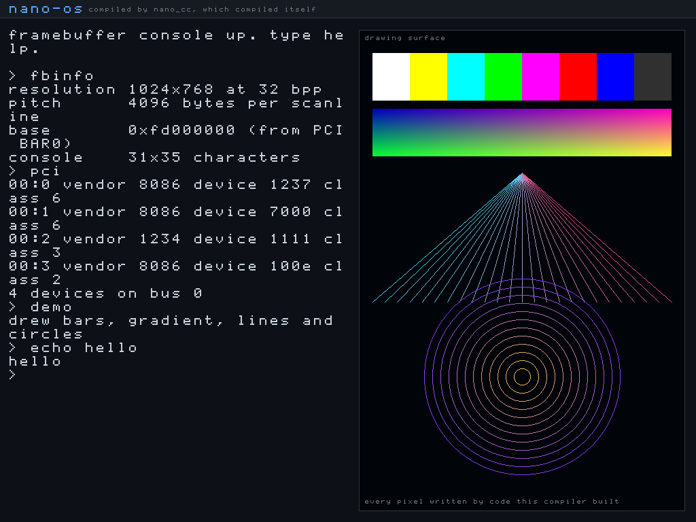

# nano_cc mini-OS — a bare-metal shell compiled by simpleC++

This directory boots a tiny interactive shell **on bare metal** (under QEMU),
where the shell itself is compiled by our own compiler, `nano_cc`. It proves
two things end to end:

1. `keyboard_getchar()` is a **real hardware read** — it polls the i8042 PS/2
   controller (status port `0x64`, data port `0x60`) for scancodes.
2. The **bitwise operators** and **variadic functions** added to the compiler
   generate correct machine code with no OS underneath it — the shell's output
   goes through a `printf()` that is itself compiled by `nano_cc`.


It also boots into a **real graphics mode** — 1024x768x32, with a framebuffer
console, a bitmap font and drawing primitives, all written pixel by pixel:



## Quick start

```sh
make            # build kernel.elf, the VGA-text shell
make test       # headless self-test of that shell
make run        # boot it with a window (needs a display)
make shot       # boot, type into it, save vga.png

make gshell     # build gshell.elf, the same shell in graphics mode
make gshelltest # headless: keyboard, PCI scan and drawing
make gshellrun  # boot it with a window
make gshellshot # boot, type into it, save gshell.png

make gfx        # a non-interactive framebuffer bring-up demo
make gfxtest    # headless check that a mode was set and pixels read back
make gfxshot    # save gfx.png
```

`make test` needs no display; it drives real keystrokes through QEMU's
emulated keyboard and confirms the shell echoed them and produced the right
output.

## How the boot works

`nano_cc` emits **64-bit** code, but a Multiboot loader (QEMU's `-kernel`)
hands control to a **32-bit** entry point. So the image is built in two layers:

```
  QEMU -kernel  ->  boot32 (32-bit)  ->  long_mode_start (64-bit)  ->  main()
                    |                     |                            (shell.c,
                    |                     |                             compiled
                    |                     |                             by nano_cc)
                    |                     +- set data segs + stack, call main
                    +- Multiboot header
                    +- identity-map first 1 GiB (2 MiB pages)
                    +- enable PAE + long mode (EFER.LME) + paging
                    +- load 64-bit GDT, far-jump to 0x101000
```

- **`boot32.s`** (`as --32`) — Multiboot header + the 32-bit → 64-bit long-mode
  bring-up. Page tables sit at fixed free low RAM (`0x1000/0x2000/0x3000`), the
  stack at `0x90000`.
- **`boot64.s`** (`as --64`) — `long_mode_start` (linked first, at `0x101000`)
  plus the `inb`/`outb` port-I/O primitives.
- **`shell.c`** — the shell, compiled by `nano_cc --kernel`.
- **`nano-kernel.h`** — freestanding runtime compiled by `nano_cc`: VGA text
  driver (writes cells at `0xB8000`), a COM1 serial mirror (so it's testable
  headlessly), `print_int`/`puts`/`strcmp`, and the PS/2 keyboard driver.
- The 64-bit half is linked at `0x101000`, flattened with `objcopy -O binary`,
  and embedded into the 32-bit Multiboot image via `.incbin` (`blob.s`). See
  `kernel64.ld` and `final.ld`.

Because `nano_cc --kernel` places globals in `.data` (zero-filled in the file)
rather than `.bss`, the flat image needs no separate zero-fill step.

## The `--kernel` flag

`nano_cc --kernel in.c out.s` differs from the hosted mode in two ways only:
it does **not** emit the Linux `_start`/`exit` stub (the boot stub provides the
entry and calls `main`), and it emits globals in `.data`. Everything else — the
full language subset — is identical.

## Shell commands

- `help`  — list commands
- `clear` — clear the VGA screen
- `ver`   — print a version line (via `printf`)
- `bits`  — run a few bitwise operations and print the results with `printf`
  (proves the `& | ^ << >>` codegen works at runtime)
- `echo <text>` — print the rest of the line back

Note: `ld` may print `LOAD segment with RWX permissions` — that is a normal,
harmless note for a flat kernel image.

---

## Graphics mode

There is no BIOS left to call once the CPU is in long mode, and QEMU's
Multiboot 1 `-kernel` path does not hand a kernel a framebuffer. So the mode is
set, and the framebuffer found, entirely by hand:

1. **Set the mode.** QEMU's default `-vga std` is the Bochs adapter, whose
   registers sit behind an index/data pair at ports `0x1CE`/`0x1CF`. Writing
   width, height and depth there — with the adapter disabled while they change
   — gives a linear 32-bit framebuffer.

2. **Find it.** The adapter reports its own base address in PCI configuration
   space, so `pci_find_framebuffer()` walks bus 0 through the configuration
   ports at `0xCF8`/`0xCFC`, looks for class `0x03` (display controller), and
   reads BAR0. Hard-coding `0xFD000000` would work on this QEMU build and
   quietly draw into nothing on the next one.

Three things had to be right, and each fails in a way that does not say so:

* **The identity map had to grow from 1 GiB to 4 GiB.** The framebuffer
  aperture is around `0xFD000000`, far outside the original mapping, so the
  first pixel write would page-fault — and with no IDT installed a page fault
  is a triple fault, which shows up as a silent reboot loop rather than an
  error.
* **The geometry is read back, not assumed.** The adapter clamps what it was
  asked for to what its video memory can hold. Drawing at the requested size
  rather than the granted size runs off the end of every scanline.
* **The pitch is the adapter's virtual width, not the visible width.** They are
  usually equal and occasionally not; using the visible width shears the whole
  image diagonally.

`fbinfo` prints all of it, so the values are visible rather than assumed:

```
> fbinfo
resolution 1024x768 at 32 bpp
pitch      4096 bytes per scanline
base       0xfd000000 (from PCI BAR0)
console    31x35 characters
```

### The font

`nano-font.h` is an 8x8 bitmap font covering ASCII 32..126, **designed for this
project** rather than lifted from an existing font file, so there is no licence
to carry around. It is generated by `tools/genfont.py`, which holds the glyphs
as readable ASCII art — edit that, not the header.

Glyph rows 0..6 hold the character and row 7 is the descender line, used by
`g j p q y` and the underscore. The console adds two pixels of leading per row
so those tails do not land on the next line.

### Drawing

`nano-fb.h` provides `fb_pixel`, `fb_fill`, `fb_rect`, `fb_line` (Bresenham),
`fb_circle` (midpoint), `fb_glyph`, `fb_text`, and a scrolling console confined
to a rectangle so it can sit beside artwork without disturbing it. All integer
arithmetic — this compiler has no floating point, and there would be no FPU
state set up for it if it did.

`shell` commands: `help clear ver fbinfo pci demo bars grad lines circles font`
and `echo <text>`.

### 32-bit stores

`nano_cc` has no 32-bit integer type, so it cannot express a 32-bit store: an
8-byte store would write the neighbouring pixel too, and four 1-byte stores are
four times the bus traffic. `mmio_write32` and `mmio_read32` in `boot64.s` are
the two instructions that gap needs, alongside `inw`/`outw` for the VBE
registers and `inl`/`outl` for PCI configuration space, which are word and
dword ports respectively and do not work a byte at a time.
