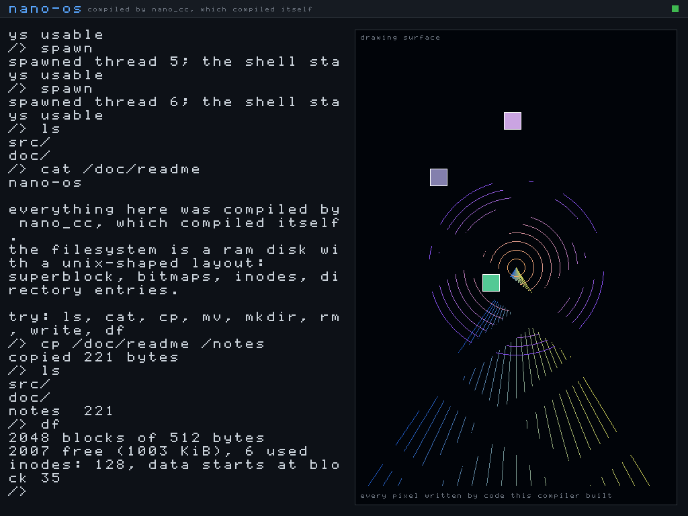

# nano_cc mini-OS — a bare-metal shell compiled by simpleC++

This directory boots a tiny interactive shell **on bare metal** (under QEMU),
where the shell itself is compiled by our own compiler, `nano_cc`. It proves
two things end to end:

1. `keyboard_getchar()` is a **real hardware read** — it polls the i8042 PS/2
   controller (status port `0x64`, data port `0x60`) for scancodes.
2. The **bitwise operators** and **variadic functions** added to the compiler
   generate correct machine code with no OS underneath it — the shell's output
   goes through a `printf()` that is itself compiled by `nano_cc`.


It also boots into a **real graphics mode** — 1024x768x32, with a framebuffer
console, a bitmap font and drawing primitives, all written pixel by pixel:



## Quick start

```sh
make            # build kernel.elf, the VGA-text shell
make test       # headless self-test of that shell
make run        # boot it with a window (needs a display)
make shot       # boot, type into it, save vga.png

make gshell     # build gshell.elf, the same shell in graphics mode
make gshelltest # headless: keyboard, PCI scan and drawing
make gshellrun  # boot it with a window
make gshellshot # boot, type into it, save gshell.png

make gfx        # a non-interactive framebuffer bring-up demo
make gfxtest    # headless check that a mode was set and pixels read back
make gfxshot    # save gfx.png

make intr       # interrupts: IDT, PIC, timer, idle, exception reporting
make intrtest   # headless: the timer ticks, the core halts, faults report
make acpi       # ACPI: find the tables, read the FADT/MADT, idle the CPU
make acpitest   # headless: tables read, PM timer runs, core idles

make mm         # memory: frame allocator, 4 KiB paging, kernel heap
make mmtest     # headless: frames, mapping, heap reuse, unmap really unmaps

make threads    # preemptive threads, locking, thread-safe heap
make threadstest # headless: preemption, joins, a real race, a mutex

make srv        # servers, heartbeats, a supervisor that restarts them
make srvtest    # headless: a crash and a hang, both recovered

make fs         # a RAM disk with a Unix-shaped filesystem
make fstest     # headless: indirect blocks, rename, delete, concurrency
```

`make test` needs no display; it drives real keystrokes through QEMU's
emulated keyboard and confirms the shell echoed them and produced the right
output.

## How the boot works

`nano_cc` emits **64-bit** code, but a Multiboot loader (QEMU's `-kernel`)
hands control to a **32-bit** entry point. So the image is built in two layers:

```
  QEMU -kernel  ->  boot32 (32-bit)  ->  long_mode_start (64-bit)  ->  main()
                    |                     |                            (shell.c,
                    |                     |                             compiled
                    |                     |                             by nano_cc)
                    |                     +- set data segs + stack, call main
                    +- Multiboot header
                    +- identity-map first 1 GiB (2 MiB pages)
                    +- enable PAE + long mode (EFER.LME) + paging
                    +- load 64-bit GDT, far-jump to 0x101000
```

- **`boot32.s`** (`as --32`) — Multiboot header + the 32-bit → 64-bit long-mode
  bring-up. Page tables sit at fixed free low RAM (`0x1000/0x2000/0x3000`), the
  stack at `0x90000`.
- **`boot64.s`** (`as --64`) — `long_mode_start` (linked first, at `0x101000`)
  plus the `inb`/`outb` port-I/O primitives.
- **`shell.c`** — the shell, compiled by `nano_cc --kernel`.
- **`nano-kernel.h`** — freestanding runtime compiled by `nano_cc`: VGA text
  driver (writes cells at `0xB8000`), a COM1 serial mirror (so it's testable
  headlessly), `print_int`/`puts`/`strcmp`, and the PS/2 keyboard driver.
- The 64-bit half is linked at `0x101000`, flattened with `objcopy -O binary`,
  and embedded into the 32-bit Multiboot image via `.incbin` (`blob.s`). See
  `kernel64.ld` and `final.ld`.

Because `nano_cc --kernel` places globals in `.data` (zero-filled in the file)
rather than `.bss`, the flat image needs no separate zero-fill step.

## The `--kernel` flag

`nano_cc --kernel in.c out.s` differs from the hosted mode in two ways only:
it does **not** emit the Linux `_start`/`exit` stub (the boot stub provides the
entry and calls `main`), and it emits globals in `.data`. Everything else — the
full language subset — is identical.

## Shell commands

- `help`  — list commands
- `clear` — clear the VGA screen
- `ver`   — print a version line (via `printf`)
- `bits`  — run a few bitwise operations and print the results with `printf`
  (proves the `& | ^ << >>` codegen works at runtime)
- `echo <text>` — print the rest of the line back

Note: `ld` may print `LOAD segment with RWX permissions` — that is a normal,
harmless note for a flat kernel image.

---

## Graphics mode

There is no BIOS left to call once the CPU is in long mode, and QEMU's
Multiboot 1 `-kernel` path does not hand a kernel a framebuffer. So the mode is
set, and the framebuffer found, entirely by hand:

1. **Set the mode.** QEMU's default `-vga std` is the Bochs adapter, whose
   registers sit behind an index/data pair at ports `0x1CE`/`0x1CF`. Writing
   width, height and depth there — with the adapter disabled while they change
   — gives a linear 32-bit framebuffer.

2. **Find it.** The adapter reports its own base address in PCI configuration
   space, so `pci_find_framebuffer()` walks bus 0 through the configuration
   ports at `0xCF8`/`0xCFC`, looks for class `0x03` (display controller), and
   reads BAR0. Hard-coding `0xFD000000` would work on this QEMU build and
   quietly draw into nothing on the next one.

Three things had to be right, and each fails in a way that does not say so:

* **The identity map had to grow from 1 GiB to 4 GiB.** The framebuffer
  aperture is around `0xFD000000`, far outside the original mapping, so the
  first pixel write would page-fault — and with no IDT installed a page fault
  is a triple fault, which shows up as a silent reboot loop rather than an
  error.
* **The geometry is read back, not assumed.** The adapter clamps what it was
  asked for to what its video memory can hold. Drawing at the requested size
  rather than the granted size runs off the end of every scanline.
* **The pitch is the adapter's virtual width, not the visible width.** They are
  usually equal and occasionally not; using the visible width shears the whole
  image diagonally.

`fbinfo` prints all of it, so the values are visible rather than assumed:

```
> fbinfo
resolution 1024x768 at 32 bpp
pitch      4096 bytes per scanline
base       0xfd000000 (from PCI BAR0)
console    31x35 characters
```

### The font

`nano-font.h` is an 8x8 bitmap font covering ASCII 32..126, **designed for this
project** rather than lifted from an existing font file, so there is no licence
to carry around. It is generated by `tools/genfont.py`, which holds the glyphs
as readable ASCII art — edit that, not the header.

Glyph rows 0..6 hold the character and row 7 is the descender line, used by
`g j p q y` and the underscore. The console adds two pixels of leading per row
so those tails do not land on the next line.

### Drawing

`nano-fb.h` provides `fb_pixel`, `fb_fill`, `fb_rect`, `fb_line` (Bresenham),
`fb_circle` (midpoint), `fb_glyph`, `fb_text`, and a scrolling console confined
to a rectangle so it can sit beside artwork without disturbing it. All integer
arithmetic — this compiler has no floating point, and there would be no FPU
state set up for it if it did.

`shell` commands: `help clear ver fbinfo pci demo bars grad lines circles font`
and `echo <text>`.

### 32-bit stores

`nano_cc` has no 32-bit integer type, so it cannot express a 32-bit store: an
8-byte store would write the neighbouring pixel too, and four 1-byte stores are
four times the bus traffic. `mmio_write32` and `mmio_read32` in `boot64.s` are
the two instructions that gap needs, alongside `inw`/`outw` for the VBE
registers and `inl`/`outl` for PCI configuration space, which are word and
dword ports respectively and do not work a byte at a time.

---

## Interrupts

Before this existed, every fault was a **triple fault**: the CPU could not find
a handler, could not fault on that either, and reset. Under QEMU that looks
like the machine silently rebooting — no message, no register dump, nothing to
go on. Turning that into a page of text is most of the value here.

```
> fault
touching unmapped memory on purpose...

*** EXCEPTION 14: page fault
error 0x2  rip 0x109728  cs 0x8
rflags 0x246  rsp 0x8ff40  ss 0x10
faulting address 0x7ffffffff000
cause: page not present, on a write, from kernel mode
rax 0x1  rbx 0x6003  rcx 0x7ffffffff000
...
halted.
```

`isr.s` holds 256 stubs, because the CPU arrives at a handler with a stack
frame it expects to leave with `iretq`, which no C function can do. Two things
the stubs exist to even out:

* **Only some vectors push an error code** — 8, 10–14, 17, 21, 29, 30. The rest
  do not. Without a zero pushed in its place, the stack layout differs by eight
  bytes depending on which fault happened, and every field in the report is
  off by one.
* **The vector number is nowhere in the hardware frame.** The only thing that
  knows which interrupt fired is the stub that was entered.

Dispatch is by **number**, not through a table of function pointers, because
`nano_cc` does not have function pointers. `isr_table` is a plain array of
addresses that C reads to fill in the IDT.

The 8259 PICs are remapped off vectors 8–15, where they collide with the CPU's
own exception numbers — unremapped, a timer tick arrives looking exactly like a
double fault. IRQ0 is the PIT at 100 Hz and IRQ1 is the keyboard, which now
fills a ring buffer instead of being polled.

Two details that are easy to get wrong and produce a hang rather than an error:

* `cpu_idle` is `sti` then `hlt`, in that order. `sti` does not take effect
  until after the *next* instruction, which is what makes the pair atomic —
  written the other way round an interrupt can slip between them and leave the
  core halted with nothing left to wake it.
* IRQ7 and IRQ15 can fire with no device behind them. The primary PIC's
  spurious interrupt must **not** be acknowledged, or a real interrupt later
  has its EOI consumed by this one.

## ACPI

`make acpitest` reads the firmware's tables and uses what they describe:

```
RSDP  at 0xf5290, revision 0
root  at 0x7fe1c52 (RSDT), 4 tables
tables: FACP APIC HPET WAET
MADT  at 0x7fe1b7a, 1 usable CPUs
PM timer port 0x608, 24-bit
P_LVL2 latency 4095 us, P_LVL3 latency 4095 us
idle state chosen: C1 (hlt)
  C2 not offered by this firmware (latency > 100us)
PM timer moved 692924 counts in ~200ms
over 100 ticks (1s): 100 idle entries
  C1 100, C2 0
idle ok: the core stopped between interrupts
```

**What this does and does not do.** It reads the *static* tables — the RSDP,
the RSDT/XSDT directory, the FADT and the MADT. Those are plain structures at
fixed offsets and can be read honestly.

It does **not** interpret AML. Most of what ACPI can tell you, including the
`_CST` method that describes a processor's real C-states, is bytecode in the
DSDT, and running it needs an interpreter — a project, not a feature. The one
AML thing done here is scanning the DSDT for the fixed-form `Processor`
declaration (opcode `5B 83`), which carries the P_BLK address at a known offset
inside it. That is a byte scan of a known encoding, and the result is
sanity-checked as an I/O port before it is believed.

So the C-state actually entered is decided from what the firmware says, not
from what would sound impressive:

| state | how | condition |
|---|---|---|
| C1 | `hlt` | always available |
| C2 | a read from `P_BLK+4` | FADT `P_LVL2_LAT` ≤ 100 µs **and** a P_BLK was found |
| C3 | `P_BLK+5` | `P_LVL3_LAT` ≤ 1000 µs — detected and reported, not entered, because it also needs bus-master traffic quiesced |

Under QEMU both latencies read 4095 µs, which is the specification's way of
saying the state does not exist, and no P_BLK is declared — so what you get is
C1, and the shell says so rather than claiming otherwise.

**The idle measurement is real.** The ACPI power-management timer runs at
3.579545 MHz regardless of what the core is doing, which is exactly why it can
measure a halted core when a CPU-driven clock cannot. Over one second it
advances about 3.55 million counts while the core wakes 101 times — once per
timer tick. A spinning loop would show millions of wake-ups.

---

## Memory

```
$ make mmtest
RAM: 130559 KiB usable, top 0x7fe0000
kernel ends at 0x10b000, bitmap at 0x10b000 (4092 bytes)
frames: 32450 free, 286 used, 32736 total
distinct ok / accounting ok / free ok
64 frames allocated, 0 overlapped the kernel or bitmap
before: 0xc0000000 resolves to 0xc0000000 (identity)
after:  0xc0000000 resolves to 0x161000 (frame 0x161000)
map ok / write-through ok / split ok: neighbours untouched
kmalloc distinct ok / contents ok / kfree returned memory ok
reuse ok: the freed block came back
coalesce ok / heap growth ok
unmap ok: no translation
*** EXCEPTION 14: page fault at 0xc0000000
```

Three layers, each built on the one below.

**Which RAM exists** comes from the Multiboot memory map, not from a guess.
The loader is the only thing that knows, and assuming "128 MiB, probably" is
how a kernel comes to write into a memory hole. `boot32.s` parks the info
pointer at a fixed address before its own page-table setup can clobber EBX.

**The frame allocator** is a bitmap, one bit per 4 KiB page, placed just past
the kernel image — and it marks itself used, because an allocator that can hand
out the memory it is stored in does not last long. It starts with **everything
marked used** and then frees what the map called available. The other way round
— start free, mark the holes — hands out anything the map does not mention, and
firmware tables live in exactly those gaps.

**Paging at 4 KiB** means splitting what `boot32.s` built. That map is made of
2 MiB pages, which cannot express a single 4 KiB mapping at all. `vmm_map`
finds the 2 MiB page covering the address and replaces it with a page table of
512 entries that say the same thing, and only then changes the one entry it
came for. Without the split, mapping one page would silently unmap the other
511. The test checks that explicitly — after mapping `0xC0000000`, the page
below it must still resolve to itself.

`tlb_invlpg` after every change is not optional. The CPU caches page-table
walks, so an edited table keeps using the **old** mapping until something else
happens to evict it, which makes the change appear to work intermittently.

**The heap** is a first-fit free list with coalescing, on pages mapped at
4 GiB — one byte past the identity map, so using it exercises the mapping code
rather than quietly living in memory that was already there. Unlike the
compiler's allocator, this one really frees: a kernel runs forever, and an
allocator that only moves forward runs out. The test proves that rather than
asserting it — free a block, ask for the same size, and require the **same
address** back.

Every block carries a magic number, so `kfree` on something that is not a heap
block says so instead of corrupting the list silently.

### The bug this work found in the compiler

`kmalloc` returns `(char *)block + sizeof(struct Block)` and `kfree` computes
`(char *)ptr - sizeof(struct Block)`. Those disagreed, and the reason was in
the compiler: a cast was parsed with the full expression parser, so

```c
(char *)b + 40
```

became `(char *)(b + 40)`. The addition scaled by `sizeof(*b)` instead of by
one, and the pointer landed forty times too far in. A cast binds to a
*unary-expression*, not to whatever follows it.

It had been there all along and never showed, because the common case is
`(char *)p - 16` on a `void *`, where the element size is 0 or 1 and scaling by
it changes nothing. See `casts.c` in the parent directory — every value there
is checked against gcc.

---

## Threads

```
$ make threadstest
run order: 1 2 3 1 2 3 1 2 3 1 2 3 1 2 3 1 2 3 1 2 3 1 2 3
interleave ok: threads share the CPU
join returned 100 200 300
join ok: return values came back
unlocked: counter 100, expected 200
race ok: the unlocked version lost updates
locked:   counter 300, expected 300
mutex ok: every update landed
concurrent heap: 0 corruptions, 1 blocks in use (was 1)
heap ok: no overlap and nothing leaked
30 ticks with a non-yielding thread: 60 switches
preemption ok: the timer took the CPU back
```

**The whole context switch is one instruction.** By the time the dispatcher
runs, `isr_common` has already pushed every register onto the current thread's
stack — so the entire machine state *is* that stack. The scheduler's only job
is to decide which stack to return, and `mov %rax, %rsp` in `isr.s` does the
rest.

That is also why a brand-new thread is indistinguishable from a preempted one.
`thread_create` builds a stack that looks exactly like a thread caught
mid-interrupt: the fifteen registers `isr_common` pushes, then a vector and
error code, then the five words the CPU pushes for `iretq`. Get that order
wrong and a new thread starts with garbage in its registers and jumps
somewhere arbitrary.

A voluntary `thread_yield` is a software interrupt on a vector of its own, not
a direct call into the scheduler — so a yield and a timer preemption arrive by
exactly the same path with exactly the same stack layout. One code path to get
right instead of two.

### The test that would otherwise prove nothing

The counter test runs the same increment twice, once without a lock and once
with, and **requires the unlocked version to lose updates**. A concurrency test
that only checks the locked case passes just as happily on a kernel where the
threads never actually interleave. Each increment opens a deliberate window
between the read and the write, so the race is forced rather than hoped for —
200 increments produce 100.

There is a matching test for preemption itself: a thread that never yields at
all, which only the timer can take the CPU away from.

### Locking, and what is honest about it

**One CPU.** The MADT reports one processor and there is no local APIC bring-up
here, so this is concurrency, not parallelism.

That has a consequence worth stating rather than hiding: with preemption
arriving only from the timer, **masking interrupts is mutual exclusion** —
nothing else can be running to contend. It is both correct and cheaper than any
spin loop. On more than one core it stops being true and each lock needs a real
atomic test-and-set; those places are marked in `nano-thread.h`, and the `held`
field is already there for it.

Two kinds of lock, because they are not interchangeable:

* `spin_lock` masks interrupts. Short critical sections only — nothing can run,
  including the timer.
* `mutex_lock` can be held across a yield, so interrupts stay on and the holder
  can be preempted. When it is contended it **yields rather than spins**: on one
  core, spinning burns the rest of a slice that the holder needs in order to
  release the lock.

The frame allocator, the page-table walker and the heap all take a lock now.
Each had a window where it was half-updated — the bitmap between testing a bit
and setting it, the tables between allocating a page table and installing it,
the free list between unlinking a block and relinking it.

### Two details that bite

**A thread cannot free the stack it is standing on.** `thread_exit` leaves the
stack alone and `thread_join` reclaims it, because the joiner is the first
point at which the stack is provably idle. The consequence is that a thread
which is never joined leaks its stack — the same bargain pthreads makes, and
the reason `detach` exists.

**The EOI has to happen before the context switch.** Acknowledge the timer
after switching away and this interrupt is never acknowledged at all, so the
timer never fires again and the machine freezes with the scheduler apparently
working perfectly.

Each stack carries a canary at its low end, checked on every switch, so a
thread that runs off the bottom is named rather than corrupting whatever the
heap put there and failing somewhere else entirely.

### In the shell

`spawn` starts a box bouncing around the drawing panel from its own thread, and
the prompt stays usable while it runs — the two know nothing about each other.
`ps` lists the threads with their slice counts, `stopall` ends them.

```
> ps
id state   slices name
0  running 367 shell
1  ready   368 anim
2  ready   230 anim
3  ready    92 anim
1076 context switches so far
```

### pthreads

`pthread_create`, `pthread_join`, `pthread_self`, `pthread_exit`,
`pthread_mutex_init/lock/trylock/unlock` are there with their usual meanings.
That is the core of the API and **not** the whole of it — detach,
cancellation, condition variables, barriers, thread-local storage and
attributes are not implemented, and calling this "pthreads" without saying so
would be a lie.

---

## Servers and supervision

```
$ make srvtest
-- all three servers up --
name      state    thr restarts faults hangs beats
ticker    running  2   0        0      0     11
crasher   running  3   0        0      0     11
hanger    running  4   0        0      0     11

-- making the crasher dereference a null pointer --
*** EXCEPTION 14: page fault ... faulting address 0x0
thread 3 (crasher) faulted
thread killed; the rest of the system continues
supervisor: crasher died, restarting

ticker    running  2   0        0      0     40      <- kept counting
crasher   running  3   1        1      0     28      <- back up

-- making the hanger stop answering (still scheduled) --
supervisor: hanger stopped answering, restarting
```

Named services with their own threads, a registry, heartbeats, and a
supervisor that restarts anything which dies or goes quiet. A fault inside a
server now kills **that server**, not the machine.

### What this contains, and what it does not

| failure | contained? | how |
|---|---|---|
| a server crashes | yes | the exception handler kills the thread and the supervisor restarts it |
| a server hangs | yes | its heartbeat goes stale and the supervisor restarts it |
| a server **corrupts another's memory** | **no** | it keeps answering its health check perfectly while the damage is already done |

That third row is the whole reason real microkernels give each server its own
address space and run them unprivileged. Everything here is ring 0 in one
address space, so a wild pointer in one service lands in another's data and
nothing detects it. **Health checks catch crashes and hangs; only address
spaces catch corruption.** Calling this fault-tolerant without saying which of
the three it handles would be a lie.

There is also a dependency nobody can design away: **a supervisor cannot
restart the thing it needs in order to restart anything.** This one allocates a
stack from the heap, so it can restart a filesystem or a driver, and it could
not restart the memory manager. MINIX 3 has the same problem and handles its VM
server specially for exactly that reason. Restarting the HAL is worse again —
it owns the interrupt controller, so during the restart there is no timer to
run the supervisor with.

### Two things that make the test worth running

**A healthy server has to keep counting throughout.** A recovery test with
nothing else running proves the machine survived; it does not prove the *rest
of the system* did. The ticker's count going from 11 to 40 across the crash is
the actual claim.

**The hang case is separate from the crash case on purpose.** The hanging
server has not crashed — its thread is alive and being scheduled normally.
Only the missing heartbeat gives it away, and a supervisor that only watches
for dead threads misses it entirely.

### Null now faults

`mm_protect_null()` unmaps the first page at boot. Without it, writing through
a null pointer lands in the interrupt vector table and **succeeds** — the whole
first 4 GiB is identity-mapped. The most common bug in C silently corrupting
low memory and surfacing later as something unrelated is not a good default.

It has to be called *after* anything that reads the BIOS data area, because the
ACPI RSDP search reads the EBDA segment from `0x40E`, which is in that page.

### In the shell

`srv` lists the services; `crash` asks one to dereference a null pointer so the
recovery can be watched rather than described. The green square in the title
bar is a supervised service blinking — if it stops, you can see that it
stopped.

### A trap in the kernel printf

The kernel's `printf` handles `%d %x %c %s %%` and **nothing else** — no flags,
no field width. Writing `"%-9s"` does not pad: it prints `%-9s` literally and
then reads the *next* argument for the following conversion, so every column
after it is one argument out. It looks like a formatting problem and is
actually a wrong-data problem. Pad by hand, or use `nano-libc.h`, which has the
full formatter.

---

## Filesystem

```
$ make fstest
formatted: 2048 blocks, 128 inodes, data starts at 35
read/write ok
big file: wrote 6000, size 6000, used 13 blocks
indirect block ok
/src contains: . .. kernel main.c util.c
deleting big.bin returned 13 blocks
unlink freed the blocks ok / reused space ok
inode before 2, after 2 -> rename moved the name, not the data
refused to remove a non-empty directory ok
three concurrent writers: 0 errors
```

The classic Unix layout on a RAM disk — superblock, inode bitmap, block
bitmap, inode table, then data. **Not FAT16**, deliberately: FAT is the
interoperable choice and it is three times the code for the same
demonstration (BPB parsing, cluster chains, 8.3 names, long-name entries, two
copies of the table to keep in step). This one supports real directories and
hard links naturally and can be read top to bottom.

Every on-disk field is 8 bytes wide, which is wasteful and worth explaining:
`nano_cc` has no 16- or 32-bit integer type, so a struct with mixed field
widths cannot be declared correctly at all. That is the same limit that blocks
uACPI, seen from the other side.

### The tests that a plausible-but-wrong implementation would fail

* **A file past the direct blocks.** Eight direct pointers reach 4 KiB, so the
  test writes 6000 bytes — the indirect block is genuinely used rather than
  merely present. A 1 KiB test file leaves that path completely unexercised.
* **Deleting has to give the blocks back**, and the space has to be *reusable*,
  not merely counted. The test frees a file, writes another over the same
  blocks and reads it back.
* **Rename must not copy.** The inode number is checked before and after: it
  has to be the same one, because a rename that copies is a rename that takes
  a second per megabyte and runs out of disk halfway.
* **Removing a non-empty directory must be refused**, or its contents are
  orphaned and their blocks are lost with no way to find them again.
* **Three threads writing at once.** Before the filesystem took a lock, two of
  them inside `balloc` at the same time walked away with the same block.

### Shell tools

`ls cat mkdir rm touch cp mv write append cd pwd df`, with a working directory
in the prompt.

`cp` reads and writes every byte. `mv` does not: it is a directory operation,
so a large file renames in the time it takes to rewrite two 32-byte entries.
That difference is the reason both exist.

### The keyboard grew punctuation

The map had letters, digits, space, enter and backspace — and no `/`. A shell
that cannot type a path can only name things in the current directory, so the
symbol row and a shift table are in now. Shift is handled as *state*: its
release matters as much as its press, which is why the release codes are
checked before the "is this a press" test.

### A compiler bug this found

`(char)129` is `-127`. Until this work, the cast was a **no-op** — it relabelled
the value without converting it — so

```c
buf[0] = (char)((i * 7 + 3) & 255);
buf[0] == (char)((i * 7 + 3) & 255)     // false
```

The stored byte came back sign-extended as `-127`; the cast produced `129`. It
surfaced here as a filesystem test reporting corruption when the data on disk
was perfectly correct — the comparison was wrong, not the bytes. A cast has to
*convert*. See `casts.c` in the parent directory.

### What this is not, yet

The filesystem is a **library the shell calls directly**, not a server reached
by message passing. Its state and locking are arranged so it can become one,
but a genuine server needs IPC, and IPC only buys anything once each server has
its own address space. Registering it as a supervised heartbeat thread that
does no actual serving would look like progress and would be theatre.
